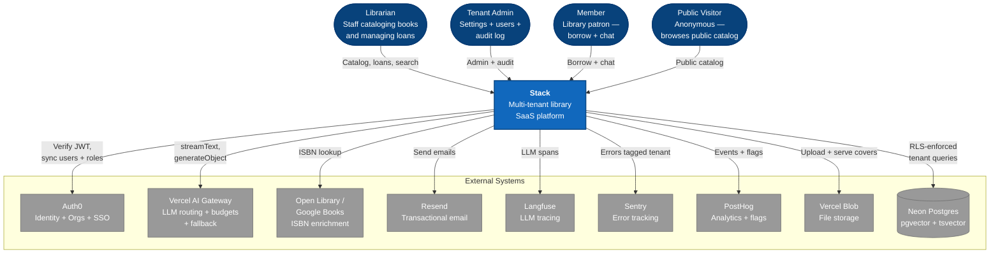
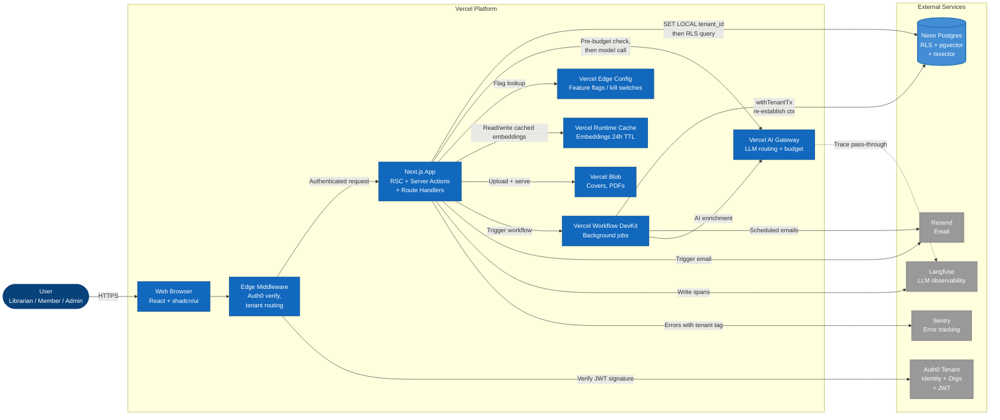
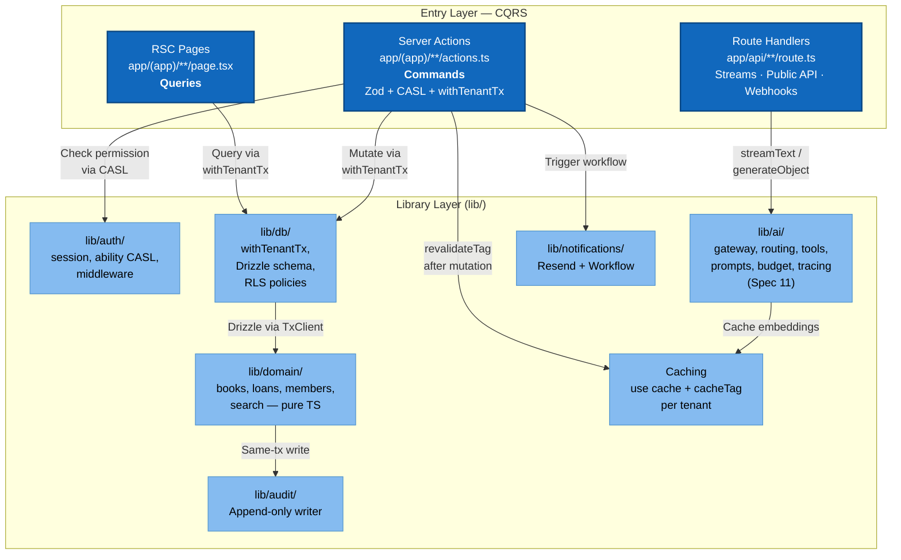
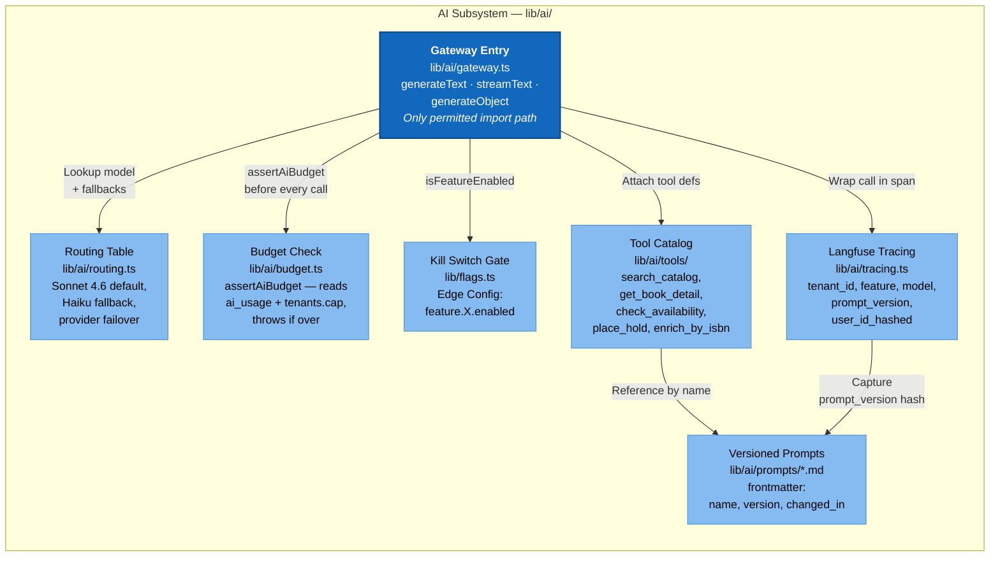
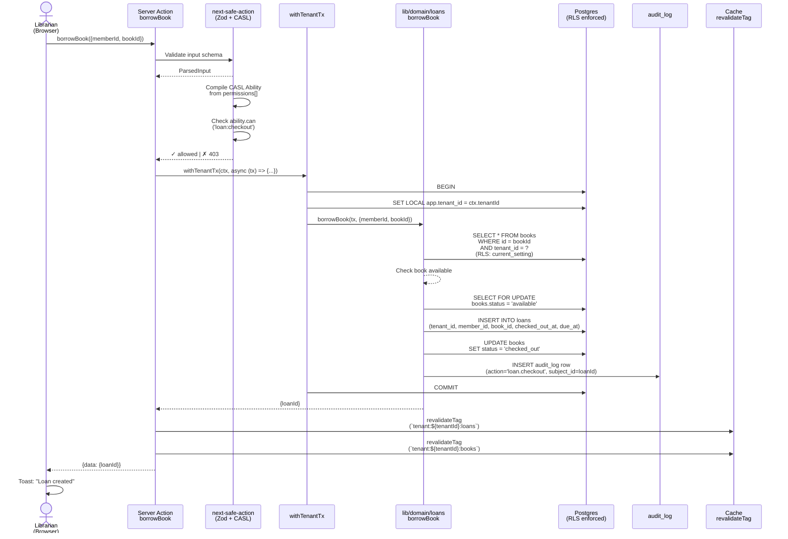
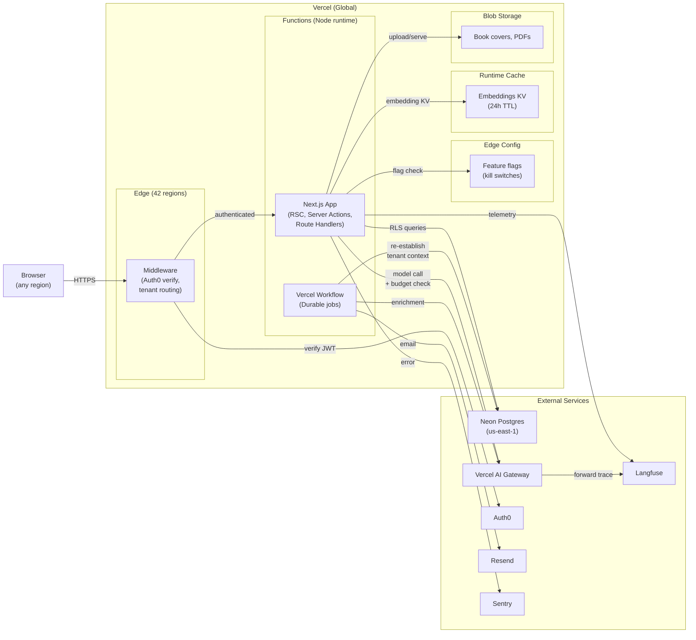
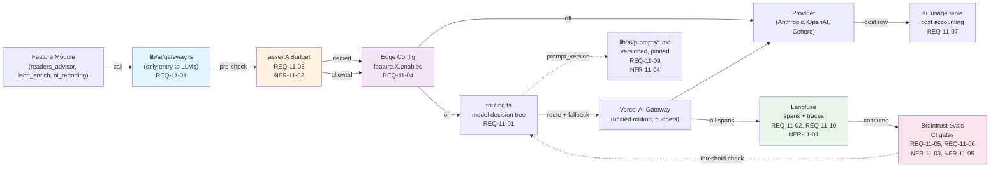
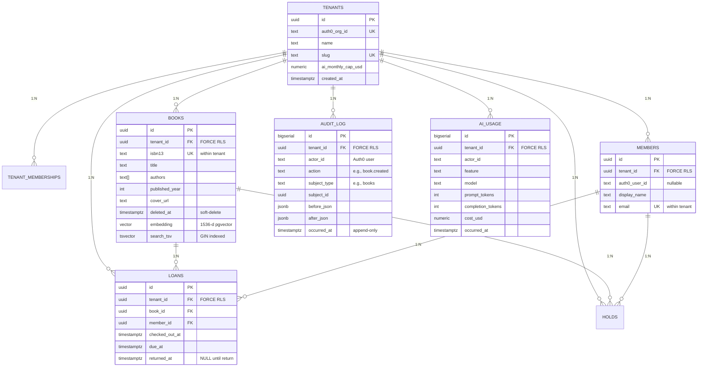

# Stack — Library Platform

**A multi-tenant library management SaaS where every library gets its own private, AI-native instance.**

Live: [https://stacked-ivory.vercel.app](https://stacked-ivory.vercel.app) · Public catalog (no login): [https://stacked-ivory.vercel.app/stack-public/catalog](https://stacked-ivory.vercel.app/stack-public/catalog)

Stack is a production-grade library platform built on Next.js 16, Neon Postgres, and the Vercel AI Stack. It handles everything a real library needs — catalog, circulation, members, holds, reporting — with three AI features that are governed end-to-end: budget-capped, observable via Langfuse, and gated behind per-feature kill switches. Built for the Valsoft Mini Library Management System Challenge.

This README is a single, self-contained deliverable. It opens with the brief-delivered table, then walks through the full engineering portfolio — architecture, decisions, AI governance, operations, risk, and cost — in a structure designed for the Valsoft Corporation hiring panel to read end-to-end or jump to any specific concern via the Table of Contents.

---

## The brief, delivered

| Requirement | How Stack delivers it | Status |
|---|---|---|
| Add, edit, delete books with metadata | Full CRUD with soft-delete and Trash view; ISBN-13, authors, subjects, cover art, description, page count, publisher | Exceeded |
| Mark books checked out / checked in | Circulation: borrow, return, due-date tracking, renewals with policy limits, holds queue with promotion | Exceeded |
| Find books by title, author, or other fields | Lexical full-text search via Postgres `tsvector`; hybrid vector + lexical search with Reciprocal Rank Fusion built and governed | Exceeded |
| Deploy + live URL | Deployed on Vercel; Neon Postgres; live at the URL above | Met |
| Video demo | Script at `docs/demo/demo-script.md`; Loom recording linked in `docs/demo/` | Met |
| SSO auth with roles and permissions | Auth0 Organizations as tenant boundary; five roles (System Owner, Tenant Admin, Librarian, Member, Guest); CASL RBAC compiled per request from JWT | Exceeded |
| AI features | Three production AI features: ISBN enrichment, hybrid semantic search, Reader's Advisor conversational RAG with tool calls | Exceeded |
| Extra creative features | Multi-tenancy, public catalog URL, CSV bulk import with batch enrichment, member approval queue, natural-language reporting, AI-drafted email notifications | Exceeded |

---

## Table of Contents

**Portfolio — engineering depth for the hiring panel:**

1. [Executive Brief](#executive-brief) — Product positioning, market gap, AI strategy, success criteria, 90-day plan
2. [C4 Architecture (L1–L3)](#c4-architecture-levels-13) — System context, container, and component diagrams; sequence diagrams
3. [AI Platform Architecture](#ai-platform-architecture) — Gateway, prompt versioning, evals, guardrails, RAG, kill switches
4. [Data Architecture & Multi-Tenancy](#data-architecture--multi-tenancy) — Four-layer RLS isolation, schema, hybrid search, audit
5. [Security Architecture & Threat Model](#security-architecture--threat-model) — STRIDE table, controls matrix, AuthN/AuthZ
6. [API Contracts](#api-contracts) — Server Actions catalogue, Route Handlers, AI streaming, OpenAPI fragment
7. [Decision Matrices](#decision-matrices) — Scoring matrices for ORM, Auth, AI gateway, observability, background work
8. [AI Model Selection](#ai-model-selection) — Per-feature model choice with quality / cost / latency / safety scoring
9. [SDLC with AI](#sdlc-with-ai-how-ai-augments-software-delivery-end-to-end) — How AI is woven into each phase of the dev lifecycle
10. [AI Governance Framework](#ai-governance-framework) — 15-policy catalogue, eval gates, budget caps, compliance posture
11. [Quality, Reliability & Observability](#quality-reliability--observability) — SLOs/SLIs, error budgets, dashboards, runbooks
12. [Risk Register & Mitigations](#risk-register--mitigations) — 38 risks across 5 categories, scored L×I, heatmap
13. [FinOps & Scaling](#finops--scaling) — Cost model, per-tenant ceilings, scaling roadmap 10 → 10k tenants

**Operational — for engineers running or extending the codebase:**

- [Getting Started](#getting-started)
- [Testing](#testing)
- [Live Demo](#live-demo)
- [Project Structure](#project-structure)

---


## Executive Brief

**Stack is a multi-tenant, AI-augmented library management SaaS built on Next.js 16 (Vercel), Neon Postgres with pgvector, Auth0 Organizations, and the Vercel AI Gateway.** It closes a credible market gap in library software: between open-source systems that are powerful but dated (Koha, Folio) and proprietary enterprise suites with long sales cycles (SirsiDynix, EBSCO). Stack gives small-to-mid-sized libraries a modern, fast, operator-credible platform to manage holdings, lend them, and help patrons discover what they need — with AI features that demonstrate real engineering, not a chatbot bolted on.

---

### The product in one screen

Stack is what library software looks like when you design for 2026 instead of 2006. Librarians can:

- **Spin up a tenant (organization) in under 5 minutes** with Auth0 Organizations + RBAC (Admin, Librarian, Member roles).
- **Add a book in under 10 seconds** by scanning an ISBN; the system auto-populates title, author, cover, and subjects from Open Library / Google Books APIs.
- **Check it out in under 3 seconds** — a single tap on a member name, a due date, and the loan is recorded and audited atomically.
- **Check it back in in under 3 seconds** with the same speed.

Members can:

- **Search the catalog** in under 600ms (full-text) or 1.2s (hybrid: semantic + lexical with reciprocal rank fusion).
- **Ask the Reader's Advisor** — an AI chat that answers only from this library's books, never hallucinates, and always offers real holdings. "Something cozy for the weekend?" returns three books with covers in under 4 seconds.
- **Place holds** and get email reminders when the book is ready.

The UI is Apple-grade: minimalist, dark + light theme, responsive on phone and desktop. No clunky admin panels or dated form fields. A librarian and a 15-year-old member should both feel at home.

---

### Why this matters — market gap

Library software today is shaped by two constraints:

1. **The economics of on-prem: ** Koha and Folio (open source) dominate because smaller libraries cannot afford the procurement and IT overhead of enterprise suites. But both are powerful and dated — the UX feels like hospital billing software. A librarian setting up Koha spends weeks on configuration before a patron can borrow a book.

2. **The OPAC-only problem:** BiblioCommons is modern and beloved by patrons, but it's only a discovery layer sitting on top of an existing ILS (Koha, Alma, etc.). Smaller libraries still need to run a separate system for management.

**The gap:** A SaaS that is modern (Apple-grade UI, fast search, LLM-native), fully-featured (CRUD books, check-out, holds, reporting), multi-tenant (so a company can own 50 libraries and operate them at scale), and economical (no procurement, no on-prem footprint). Stack is built for the long tail: libraries with 500–100k holdings, run by teams of 1–10 people, willing to pay $50–200/month for a system that just works and feels good.

---

### How it's built — one paragraph

Stack is a Next.js 16 (App Router) application deployed to Vercel (serverless Node functions + Edge middleware). Data lives on Neon Postgres with pgvector for semantic search; multi-tenancy is enforced at four layers (Auth0 JWT boundary → repo guard with `withTenantTx` → `SET LOCAL app.tenant_id` in each transaction → row-level security with PostgreSQL FORCE). Auth0 Organizations maps to tenants. Server Actions (wrapped in `next-safe-action` with Zod validation) are the command bus; RSC fetches and Route Handlers are the query bus. AI calls route exclusively through the Vercel AI Gateway (Spec 11 REQ-11-01), with Langfuse tracing every span and Braintrust eval gates preventing regressions. Background work uses Vercel Workflow DevKit (durable, retryable). Search is hybrid: lexical (Postgres `tsvector` GIN index) + semantic (pgvector HNSW with text-embedding-3-small, 1536-dim) fused with reciprocal rank fusion in a single SQL query. Tests run three layers: Vitest (unit + Server Action) on a Neon preview branch, Playwright (e2e), and Storybook 9 (component states). For details, see [02 C4 Architecture](./02-c4-architecture.md).

---

### AI strategy at a glance

| Feature | What AI does | Model class | Guardrail |
|---------|--------------|-------------|-----------|
| **ISBN enrichment** (Spec 02) | Looks up ISBN in Open Library, uses `generateObject` to extract + validate metadata (title, author, year, subjects) | Structured output (Haiku) | Schema-bound; detects invalid titles; falls back to manual entry if lookup fails |
| **Hybrid search** (Spec 05) | Embeds search query using text-embedding-3-small; retrieves books using vector similarity (top-k) + lexical match (BM25); fuses results with RRF; re-ranks by tenant preference | Deterministic (embedding only) | Lexical fallback if embedding fails; RLS enforced on all results |
| **Reader's Advisor** (Spec 06) | Tool-using chat: member asks ("something cozy"), model calls `search_catalog`, `get_book_detail`, `check_availability`, `place_hold`; streams response with book metadata + availability | Claude Sonnet 4.6 (agentic) | Refusal grammar that declines off-catalog questions; REQ-11-06 cross-tenant probe in eval suite; 90% refusal accuracy threshold (NFR-11-05) |
| **AI-drafted emails** (Spec 07) | Librarian sets a template + tenant brand voice; system generates overdue notices, hold-ready alerts, curated lists using Sonnet + few-shot examples | Claude Sonnet 4.6 (completion) | Librarian reviews before send; no direct injection into Resend; tone is customizable per tenant |
| **Natural-language reporting** (Spec 08) | Admin asks ("books borrowed in June by members named Smith"); system translates to SQL, validates scope (only this tenant's data), executes, formats result as prose | Claude Haiku (code gen) | SQL generated, not executed; librarian confirms before run; schema scope enforced at query build time |
| **Book-cover scan** (Spec 10) | Upload a photo of a book cover; model extracts ISBN via OCR + vision, looks it up in Open Library | Claude Vision + GPT-4 OCR | Requires manual confirmation; ISBN must exist in Open Library; falls back to manual ISBN entry |

AI is an **additive layer over a deterministic core.** Every Stack operation works fine with AI completely off (Edge Config flag `feature.<name>.enabled=false`). If the Vercel AI Gateway is unavailable, users see a friendly message and can still browse books, check them out, and report. The catalog, search, checkout, loans, and audit trail are guaranteed correct at the database level; AI features enhance the UX.

---

### Operating model — multi-tenant by design

Stack enforces tenant isolation at **four architectural layers** (Spec 01 §1), with each layer catching mistakes that slip past the others:

1. **Auth boundary:** Auth0 JWKS verifies every request; `org_id` (the tenant) and `roles[]` are surfaced on the JWT and validated server-side. No client-supplied tenant ID is ever trusted.
2. **Repo guard:** All domain modules accept only a `TxClient` and a `TenantCtx`; they cannot open a bare database connection or reach for the wrong tenant. ESLint custom rule `no-bare-db-call` enforces this.
3. **Request-scoped tenant binding:** Every transaction opens with `SET LOCAL app.tenant_id = ${tenantId}::text` — a PostgreSQL feature that scopes the setting to that transaction only (not the pool, not the connection).
4. **Database-level RLS:** Every tenant-scoped table has `ALTER TABLE … FORCE ROW LEVEL SECURITY` and a policy checking `tenant_id = current_setting('app.tenant_id')`. RLS can't be disabled; it's enforced at the PgBouncer level.

CI runs a **cross-tenant probe** (Spec 11 REQ-11-06): an automated test that tries to read another tenant's data and fails the build if any row leaks. This catches isolation regressions immediately.

**Per-tenant AI budget caps** are enforced **before** any LLM call (REQ-11-03). A call to `assertAiBudget(tenant_id, estimated_cost_usd)` reads month-to-date spend from the `ai_usage` table and the tenant cap from `tenants.ai_monthly_cap_usd`. If adding the estimated cost would exceed the cap, the call is refused with HTTP 402. This prevents surprise bills and gives admins direct control.

**Feature-level kill switches** live in Vercel Edge Config (REQ-11-04). A flag `feature.readers_advisor.enabled=false` hides the UI entry point and rejects API requests with 404 (not 503). Flipping the flag takes effect in <1s across all regions; no redeploy needed. If a feature misbehaves (hallucinating off-catalog books, running slow), the on-call operator disables it without waiting for a build pipeline.

For the full policy catalogue, see [11 AI Governance Framework](./11-ai-governance-framework.md).

---

### Outcomes & success criteria

| Metric | Target | Status | Achieved by |
|--------|--------|--------|-------------|
| **Admin tenant setup** | < 5 min | Demo goal | Auth0 instant org provisioning + Neon branch creation script |
| **Add book via ISBN** | < 10 sec | Demo goal | Open Library API call + schema-bound extraction |
| **Check-out latency (P95)** | < 3 sec | Demo goal | Optimized Server Action + Drizzle query |
| **Catalog page load (P95)** | < 1.5 sec | Spec 09 §NFR-1.2 | RSC fetch + Next.js Cache Components + Neon serverless |
| **Lexical search (P95)** | < 600 ms | Spec 05 §NFR-5.1 | Postgres `tsvector` GIN index on title + authors |
| **Hybrid search (P95)** | < 1.2 sec | Spec 05 §NFR-5.2 | pgvector HNSW + RRF fusion in single SQL query |
| **Reader's Advisor chat first-token (P95)** | < 1.2 sec | Spec 06 §NFR-6.1 | Vercel AI Gateway streaming + tool execution on Node runtime |
| **AI refusal accuracy** | ≥ 90% | Spec 11 §NFR-11-05 | Eval gate in CI; cross-tenant probe mandatory |
| **Cross-tenant probe failures** | 0 in CI per PR | Spec 11 §REQ-11-06 | Automated before-merge check |
| **Demo-scale infra cost** | < $100/mo (excluding tokens) | Spec 03 §3.1 | Vercel Pro ($20) + Neon Launch ($19) + Auth0 free tier + Langfuse free tier |
| **Token cost (demo scale)** | < $100/mo | Inferred from scope | ~100 tenants × ~10 queries/day × 0.02 avg cost per Reader's Advisor call |

All targets are hardwired into CI gates or release checklists. A build cannot merge if P95 latencies regress, if eval gates fail, or if the cross-tenant probe finds a leak.

---

### How I would run a similar product — 90-day plan

**Days 1–30: Audit and baseline**
- Assess the current AI surface: what features use models? What observability exists? What traces are being collected? (Langfuse + Sentry integration check.)
- Conduct a four-layer isolation audit: does every tenant-scoped operation pass through `withTenantTx`? Are all tenant tables protected by RLS FORCE? Run a cross-tenant probe manually against real data.
- If Langfuse is absent, stand it up and ship a tracing integration (every model call tagged with `tenant_id`, `feature`, `prompt_version`). This is the 90-day top priority because it's the foundation for everything else.
- Document the current AI Risk Register: what could go wrong? Hallucinations? Cross-tenant leakage? Runaway spend? Model unavailability? (See [13 Risk Register](./13-risk-register.md) for a template.)

**Days 31–60: Build guards and governance**
- Implement budget caps (REQ-11-03): for each tenant, read `ai_monthly_cap_usd` from the tenants table, check spend before every AI call. Start with generous defaults (e.g., $500/mo) and tighten on signal.
- Ship feature-level kill switches (REQ-11-04): add a Vercel Edge Config check at every AI entry point (UI + API route). Practice disabling a feature and confirming the UX gracefully degrades (show a "feature unavailable" message, not a 500).
- Formalize the prompt-versioning policy: every prompt file in `lib/ai/prompts/` must have YAML frontmatter `version: x.y` + `changed_in: PR#nnn`. Require a new version and matching eval gate pass in CI before any prompt change can merge (REQ-11-09).
- Establish eval gates in CI: write hand-curated test dialogues for each AI feature (Reader's Advisor, email generation, NL reporting). Use Braintrust or Langfuse to run these dialogues against the actual prompts + models. Set thresholds (e.g., 90% refusal accuracy, <5% off-catalog hallucinations) and fail the build if any threshold is missed (REQ-11-05).
- Publish an **AI-Augmented SDLC ritual document**: how AI is woven into requirements, design, implementation, review, test, release, operate. (See [09 SDLC with AI](./09-sdlc-with-ai.md) as a template.) Run one full cycle to practice.

**Days 61–90: Operate and measure**
- Ship a measurable improvement: either reduce per-call token spend (swap to Haiku where quality allows), or improve refusal correctness (tighten the Reader's Advisor system prompt, run evals, measure improvement). Aim for a <10% reduction in tokens or >5% improvement in refusal accuracy.
- Publish the first **FinOps + Risk report** to leadership: monthly spend by feature, spend per tenant, top spenders, model cost trends, eval gate pass rates, incident count (hallucinations, timeout, refusal false-negatives). This is the accountability artifact; it answers "is AI delivering value or just burning money?"
- Run a **tabletop on AI incident response:** Scenario — the Reader's Advisor is hallucinating off-catalog books. Walk through: (1) How do we detect this? (Eval suite, Langfuse anomaly, customer report?) (2) How fast can we disable it? (Edge Config flip, <1 min.) (3) How do we investigate? (Langfuse spans filtered by feature + time, audit log for book additions, Sentry errors.) (4) How do we prevent it in the future? (Stricter eval threshold, RLS double-check.) Document the runbook.

---


---


## C4 Architecture (Levels 1–3)

Stack is a multi-tenant, AI-augmented library SaaS platform running on Next.js 16, Vercel, Neon Postgres, and Auth0. This document uses the C4 Model to show how users, the application, and external systems interact (Level 1), how the application is decomposed into deployable containers (Level 2), and how the most critical subsystems are organized into components (Level 3).

We omit Level 4 (code-level diagrams) because the code itself is more readable than any diagram attempting to unpack it. This document is rendered in Markdown using Mermaid; copy the diagram blocks into [https://mermaid.live](https://mermaid.live) if your viewer does not support Mermaid natively.

---

### Level 1 — System Context

**Actors and external systems** that interact with Stack:



| Person / System | Role | Interaction |
|---|---|---|
| **Librarian** | Staff | Uses the web UI to catalog books, check in/out loans, and search the collection. SSO via Auth0. |
| **Tenant Admin** | Staff | Manages team roles, settings (AI budget cap, brand voice), and views audit logs. |
| **Member** | Patron | Borrows books, places holds, uses Reader's Advisor chat to get recommendations. |
| **Public Visitor** | Anonymous | Views the public catalog (ISR-cached, no auth). No personal data exposed. |
| **Auth0** | External | Provides identity and Organizations — each tenant is one Auth0 org. JWT carries `org_id` and permissions. |
| **Vercel AI Gateway** | External | Central routing for all LLM calls. Routes to Sonnet 4.6 (default), Haiku (cheaper), or fallback models. Enforces budget. |
| **Open Library / Google Books** | External | ISBN metadata, book descriptions, and cover images for catalog enrichment. |
| **Resend** | External | Sends transactional email: due-date reminders (T-2, T-0, T+1), weekly digests, invitations. |
| **Langfuse** | External | Receives LLM spans from every Reader's Advisor chat and enrichment call, tagged with tenant + feature. |
| **Sentry** | External | Captures errors from Next.js functions and middleware; every error tagged with tenant_id. |
| **PostHog** | External | Ingests usage events; flags double as AI feature kill switches (Reader's Advisor, enrichment, etc.). |
| **Vercel Blob** | External | Stores book cover uploads; signed URLs served directly to browsers. |
| **Neon Postgres** | External | Authoritative data store for tenants, users, books, loans, members, audit log, ai_usage. RLS enforced on every tenanted table. |

---

### Level 2 — Container Diagram

**Deployable units** and their responsibilities:



| Container | Responsibility | Technology | Why |
|---|---|---|---|
| **Web Browser** | Renders UI, submits forms and Server Actions, streams chat responses | Next.js React + shadcn/ui + Tailwind | Apple-inspired design, Radix Primitives for accessibility |
| **Edge Middleware** | Verifies Auth0 session, infers tenant from hostname, redirects unauth'd users, checks feature flags | Next.js Edge + `@auth0/nextjs-auth0/edge` | Runs before every request; validates JWT and tenant in milliseconds |
| **Next.js App** | Executes Server Actions (Zod + CASL), RSC queries, Route Handlers (public API, chat stream, webhooks) | Next.js 16 App Router, Node runtime | CQRS: Commands via Server Actions, Queries via RSC/Route Handlers |
| **Vercel Workflow DevKit** | Durable, retryable background work — backfill embeddings, schedule due-date reminders, send digests | `@vercel/workflow` | Replaces queue + worker + cron; re-establishes tenant context via `withTenantTx` |
| **Vercel AI Gateway** | Central LLM routing, fallback (Sonnet → Haiku → GPT-4.5), budget enforcement, trace forwarding | Vercel AI Gateway + Vercel AI SDK v6 | Single config; budget check happens *before* every call; traces forwarded to Langfuse |
| **Neon Postgres** | Authoritative multi-tenant store; RLS policies prevent cross-tenant leaks; pgvector for semantic search, tsvector for full-text | Neon (serverless HTTP driver in functions, `node-postgres` Pool in workflows) | Shared schema, shared database, row-level isolation via RLS `FORCE ROW LEVEL SECURITY` |
| **Vercel Edge Config** | Read-optimized flag store, available at Edge (middleware) and in functions | Vercel Edge Config | Feature kill switches flipped without redeploy; gated AI feature access |
| **Vercel Runtime Cache** | Cross-region in-memory cache for embedding vectors and search results | Vercel Runtime Cache (Redis-like KV) | Saves embedding cost (~$0.02 per 1M tokens); 24h TTL on search results |
| **Vercel Blob** | Persistent file storage for book covers and PDFs | Vercel Blob | Signed URLs; no auth needed to download; region-replicated |
| **Resend** | Transactional email (due-date reminders, digests, invitations) | Resend + React Email | JSX templates, reliable delivery |
| **Langfuse** | LLM observability — every model and tool call traced with tenant/feature/model/prompt_version tags | Langfuse SaaS | Open-source backend option; Braintrust integration for CI eval gates |
| **Sentry** | Error tracking and alerting; every error tagged with `tenant_id` for easy filtering | Sentry | First-party Next.js 16 integration |
| **Auth0** | Identity, Organizations (tenants), Roles, JWT issue | Auth0 Organizations + `@auth0/nextjs-auth0` v4 | Org-aware JWT carries `org_id` + permissions claim |

---

### Level 3 — Component Diagrams for Critical Subsystems

#### 3.1 Next.js App Container Components

The application is physically organized by CQRS boundaries and architectural layers:



| Component | Responsibility | Pattern |
|---|---|---|
| **RSC Pages** | Read-only entry points for authenticated users | `withTenantTx(async (tx, ctx) => query(tx, ctx))` |
| **Server Actions** | Mutation entry points with Zod + CASL gates | `next-safe-action` + `.metadata({ permission: "…" })` |
| **Route Handlers** | Streams (chat), public catalog, webhooks; explicit Node runtime | Check kill switch; `assertAiBudget`; wrap in `problem()` for RFC 7807 errors |
| **Auth Subsystem** | Session resolution, CASL Ability compilation, middleware injection | `getSession()` → `ability = buildAbility(claims)` → CASL gates on actions |
| **DB Subsystem** | `withTenantTx` wrapper, Drizzle schema + migrations, RLS SQL | Four-layer isolation: Auth0 JWT → `SET LOCAL app.tenant_id` → Postgres RLS FORCE |
| **Domain Layer** | Modules for books, loans, members, search; accept `TxClient` + `TenantCtx`, return typed results | No HTTP, no Next imports; callable from actions, RSCs, and workflows |
| **AI Subsystem** | LLM gateway entry point, routing table, tool catalog, prompts (versioned), budget check, Langfuse tracing | `lib/ai/gateway.ts` only allowed import; budget checked before every call; spans tagged tenant+feature |
| **Caching** | RSC-level `use cache` with `cacheTag`, Vercel Runtime Cache for embeddings, invalidation via `revalidateTag` | Tenant-scoped: `tenant:{id}:books`; embeddings 24h TTL |
| **Notifications** | Trigger email and background workflows | `sendDueDateReminder(tenantId, loanId)` → Vercel Workflow step |
| **Audit Log** | Append-only writer; one row per authoritative action, same transaction as the mutation | `REVOKE UPDATE, DELETE ON audit_log FROM PUBLIC` |

#### 3.2 AI Subsystem (`lib/ai/` — Spec 11 Governance)

This subsystem enforces every AI production requirement: budgets, tracing, routing, kill switches, and eval gates.



| Component | Responsibility | Constraint |
|---|---|---|
| **Gateway Entry** | Single import path for all LLM calls; prevents direct provider SDK use (ESLint rule: `no-direct-llm-sdk`) | Caller must have already run `assertAiBudget` |
| **Routing Table** | Config-only model selection — swap models without code change | Default: `claude-sonnet-4.6`; fallbacks: Haiku, GPT-4.5, Cohere |
| **Budget Check** | Pre-call check: read MTD spend from `ai_usage`, read cap from `tenants`, raise if over | Called *before* `generateText` — returns 402 to client |
| **Tool Catalog** | AI tool definitions (name, description, schema) for chat tool-calling | Each tool re-enforces tenant isolation via its own domain call |
| **Versioned Prompts** | System prompts for Reader's Advisor and enrichment — YAML frontmatter with version + PR ref | Prompt change → version bump → eval suite passes at new version → ADR in docs/decisions/ |
| **Langfuse Tracing** | Open span at call start, tag with `tenant_id, feature, model, prompt_version, user_id_hashed`, close on finish | Buffering + flush if SaaS unavailable; spans dropped over 1k buffer emit metric |
| **Kill Switch Gate** | Edge Config flag per feature: `feature.<name>.enabled`; hides UI, rejects API (404, not 503) | Can flip without redeploy; checked in middleware and Route Handler |

#### 3.3 Multi-Tenant Data Subsystem (`lib/db/` — Spec 01 Foundation)

The four-layer isolation model made concrete:

```mermaid
flowchart TD
    subgraph L1["Layer 1 — Auth Boundary"]
        direction LR
        JWT["Auth0 JWT<br/>Signed token:<br/>sub, org_id,<br/>permissions[] claims"]
        MW["Edge Middleware<br/>Verify signature,<br/>extract org_id,<br/>attach to context"]
    end

    subgraph L2["Layer 2 — Repo Guard"]
        direction LR
        Sess["getSession()<br/>lib/auth/session.ts<br/>returns userId,<br/>tenantId, ability"]
        WTX["withTenantTx(fn)<br/>lib/db/withTenantTx.ts<br/>opens transaction,<br/>calls fn(tx, ctx)"]
    end

    subgraph L3["Layer 3 — Request-Scoped Variable"]
        SL["SET LOCAL app.tenant_id<br/>First statement of every tx<br/><b>SET LOCAL, not SET</b><br/>(scoped to tx, not the pool)"]
    end

    subgraph L4["Layer 4 — Postgres RLS (FORCE)"]
        direction LR
        Pol["RLS Policy<br/>USING (tenant_id =<br/>current_setting<br/>'app.tenant_id'::uuid)"]
        Force["FORCE ROW LEVEL SECURITY<br/>Enforced even for<br/>table owner —<br/>no bypass via<br/>elevated role"]
    end

    JWT -->|Token travels<br/>in request| MW
    MW -->|context: tenantId,<br/>ability| Sess
    Sess -->|withTenantTx(ctx, fn)| WTX
    WTX -->|BEGIN; SET LOCAL;<br/>... COMMIT;| SL
    SL -->|current_setting<br/>app.tenant_id| Pol
    Pol -->|Policy enforced<br/>at storage layer| Force

    classDef auth fill:#08427b,color:#fff,stroke:#053670,stroke-width:1px
    classDef guard fill:#1168bd,color:#fff,stroke:#0b4884,stroke-width:1px
    classDef scope fill:#438dd5,color:#fff,stroke:#1d6dad,stroke-width:1px
    classDef rls fill:#85bbf0,color:#000,stroke:#4d92cd,stroke-width:1px
    class JWT,MW auth
    class Sess,WTX guard
    class SL scope
    class Pol,Force rls
```

| Layer | What it does | Spec ref | Failure mode if skipped |
|---|---|---|---|
| **Auth Boundary** | Verifies JWT signature, extracts `org_id` + permissions from token | Spec 01 REQ-01-02 | Attacker spoofs tenant_id; entire system compromised |
| **Repo Guard** | Domain modules and Drizzle queries accept `TenantContext` parameter; no bare DB calls | Spec 01 REQ-01-03 | Accidental query without tenant filter hits wrong data |
| **Request-Scoped SET LOCAL** | `SET LOCAL`, not `SET`, ensures tenant_id scopes to this transaction only | Spec 01 REQ-01-03 | Pool connection leaks tenant_id to next user in transaction-pooled connection |
| **RLS FORCE** | Row-level policy enforced by Postgres, even if app layer is broken | Spec 01 REQ-01-04, REQ-01-10 | If app logic breaks, DB still prevents cross-tenant data leakage |

Each layer is independent; if one fails, the next catches the mistake. CI runs a **cross-tenant probe** (Spec 01 NFR-01-02) that seeds two tenants and asserts queries return only the bound tenant's rows — build fails on leakage.

---

### Dynamic View — Sequence: Borrow a Book

How a librarian borrows a book on behalf of a member:



**Key guarantees:**
- Zod validates input shape.
- CASL gates the action (`loan:checkout` permission required).
- `withTenantTx` opens a transaction and sets the tenant variable.
- RLS policy on `books` and `loans` ensures queries return only this tenant's rows.
- Audit row written in same transaction — atomicity guaranteed.
- Cache invalidated after commit — next RSC fetch sees fresh data.
- If the transaction fails, audit row is not written either.

---

### Dynamic View — Sequence: Reader's Advisor Chat

How a member chats with Stack's AI reading advisor:

```mermaid
sequenceDiagram
    actor M as Member<br/>(Browser)
    participant UI as Chat UI<br/>(Client)
    participant Route as POST /api/chat/stream<br/>(Route Handler)
    participant EdgeCfg as Vercel Edge<br/>Config
    participant Budget as assertAiBudget
    participant AI as AI Gateway<br/>(generateText)
    participant Tools as Tool Calls<br/>(search_catalog, get_book)
    participant TX as withTenantTx<br/>(for tool exec)
    participant DB as Postgres<br/>(RLS enforced)
    participant Langfuse as Langfuse<br/>(tracing)
    participant SSE as SSE Stream<br/>(to browser)
    
    M->>UI: "Recommend mystery novels"
    
    UI->>Route: POST /api/chat/stream<br/>with messages[]
    Route->>EdgeCfg: isFeatureEnabled('readers_advisor')
    EdgeCfg-->>Route: true | false
    alt Feature disabled
        Route-->>UI: 404 Not Found
    else Feature enabled
        Route->>Route: getSession() → {tenantId, org_id}
        
        Route->>Budget: assertAiBudget(tenantId, 0.02)
        Budget->>DB: SELECT SUM(cost_usd) FROM ai_usage<br/>WHERE tenant_id = ?<br/>AND DATE_TRUNC('month', occurred_at) = current_month
        
        alt MTD + estimate > cap
            Budget-->>Route: throw AiBudgetExceededError
            Route-->>UI: 402 Payment Required
        else Under budget
            Budget-->>Route: ✓
            
            Route->>AI: streamText({<br/>model: 'claude-sonnet-4.6',<br/>messages,<br/>tools: {search_catalog, get_book_detail, ...},<br/>telemetry: {<br/>isEnabled: true,<br/>functionId: 'readers_advisor'<br/>}<br/>})
            
            Langfuse->>Langfuse: Start span<br/>(tenant_id, feature='readers_advisor',<br/>model='claude-sonnet-4.6',<br/>prompt_version='v1.0',<br/>user_id_hashed)
            
            loop Streaming messages + tool calls
                AI-->>Route: delta or toolCall
                
                alt Tool call: search_catalog(query)
                    Route->>Tools: search_catalog(query)
                    Tools->>TX: withTenantTx(ctx, (tx) => ...)<br/>for tool execution
                    TX->>DB: SELECT * FROM books<br/>WHERE ... AND tenant_id = ?<br/>(RLS: current_setting)
                    DB-->>Tools: [book1, book2, ...]
                    Tools-->>Route: tool result
                    Route->>AI: tool result
                end
                
                Route->>SSE: Stream delta to browser
                SSE-->>UI: Append to chat
            end
            
            AI->>Langfuse: End span<br/>(prompt_tokens, completion_tokens,<br/>cost_usd, latency_ms)
            
            Route->>DB: INSERT ai_usage<br/>(tenant_id, feature='readers_advisor',<br/>model='claude-sonnet-4.6',<br/>prompt_tokens, completion_tokens,<br/>cost_usd=...)<br/>in background (does not await)
            
            Route-->>UI: Close SSE stream
    end
    
    UI->>M: Display full response<br/>+ follow-up options
```

**Key guarantees:**
- Kill switch checked; feature can be disabled without redeploy.
- Budget pre-checked; no overages; 402 if exceeded.
- Every LLM call routed through AI Gateway (no direct SDK).
- Langfuse span opened with tenant + feature + model + prompt_version tags.
- Tool calls execute in `withTenantTx` with RLS enforcement — tools cannot leak other tenants' books.
- Usage row written asynchronously after stream closes (failure to write does not rollback user action).
- User sees friendly error if AI is unavailable, not a generic 500.

---

### Deployment View

How the system is deployed and where each container runs:



**Environment topology:**

- **Production** — Vercel Pro (global edge + US-east Functions by default), Neon production branch, Auth0 production tenant. One branch per region if needed; Workflow scale per demand.
- **Preview-per-PR** — Vercel preview URL, Neon preview branch auto-created, Auth0 same tenant (tests against prod user database, safe by RLS). Migrations tested against preview branch before merge.
- **Local development** — `pnpm dev` runs Next.js on `localhost:3000`, connects to Neon's dev branch or a local Postgres (with RLS demo). Auth0 dev tenant or local JWT mocking.

**Scaling notes:**
- Edge Middleware runs in 42+ regions; latency to Auth0 is the bottleneck (mitigated by JWKS caching).
- Functions scale to handle load; Neon connection pooling via PgBouncer transaction mode.
- Workflow retries are built-in; no external queue needed.
- Langfuse buffering handles brief outages; spans dropped over 1k buffer trigger a metric.

---

### What's Not Shown Here

This document covers system structure (Level 1), deployment topology (Level 2), and the most critical business logic (Level 3). **Not included:**

- **Level 4 (Code)** — The codebase is the detailed diagram. Readers should refer to `lib/domain/` for business logic, `lib/db/` for schema and isolation patterns, and `lib/ai/` for AI governance.
- **UI/UX wireframes** — See `docs/design/` for component states, user flows, and design tokens (Apple-inspired, Radix Primitives).
- **Eval suite internals** — See [11-ai-governance.spec.md](../specs/11-ai-governance.spec.md) for the cross-tenant probe tests, refusal correctness metrics, and eval gate thresholds. Evals are data-driven and versioned in `evals/`.
- **Prometheus metrics and alerting** — Sentry, PostHog, and Langfuse provide dashboards; define SLOs in a separate ops runbook.
- **Disaster recovery and backups** — Neon handles snapshots; Auth0 export/import is out of scope for this doc.

For implementation checklists and deeper dives, see the specification suite (`project_docs/specs/`) and analysis documents (`docs/analysis/`).

---

### Conventions Used in These Diagrams

The diagrams follow the **C4 model** (Context → Container → Component) but are drawn with Mermaid `flowchart` notation rather than the experimental `C4Context`/`C4Container`/`C4Component` Mermaid types — the latter render inconsistently across previewers. `flowchart` renders reliably on GitHub, VS Code, Notion, Obsidian, and [mermaid.live](https://mermaid.live).

**Colour key (applied via Mermaid `classDef`):**
- Dark blue (`#08427B`) — Person / actor (Librarian, Member, Tenant Admin, Public Visitor).
- Medium blue (`#1168BD`) — The Stack system itself, or a primary entry-point component (Server Action, Gateway Entry).
- Light blue (`#85BBF0`) — A supporting library-layer component (lib/auth, lib/db, lib/domain, lib/ai sub-modules).
- Mid blue (`#438DD5`) — Database / data layer (Neon Postgres).
- Grey (`#999`) — External service (Auth0, Resend, Langfuse, Sentry, etc.).

**Arrows and labels:**
- Solid arrow with label = direct call or data flow (the label is the verb / payload).
- Dashed arrow = an out-of-band or side-channel flow (e.g. trace pass-through).

**Terminology (C4 vocabulary):**
- **Container** is not a Docker container — it is a deployable unit (web app, database, service, scheduled job).
- **Component** is a logically cohesive module within a container (e.g., `lib/ai/gateway.ts` is a component of the Next.js App container).

**Diagram rendering:**
- Mermaid diagrams render in GitHub markdown, Notion, and most documentation platforms.
- If your viewer does not support Mermaid, copy the diagram code (between ` ```mermaid ` fences) into [https://mermaid.live](https://mermaid.live).
- Sequence diagrams (`sequenceDiagram`) render as swimlane flows; read top-to-bottom.

---


---


## AI Platform Architecture

Stack's AI platform is a thin, governance-first layer that sits between any LLM provider and the features that use them. Its job is to route requests through a single gateway, cap costs per tenant, kill features without redeploying, trace every call, and refuse to run if quality drops below threshold. The platform exists so you can ship AI features at production quality, not just as experiments.

### Architecture at a glance

Six concerns drive the design:



| Concern | Tool | Spec section |
|---------|------|---|
| **Routing & fallbacks** | Vercel AI Gateway config | Spec 11 §3, REQ-11-01 |
| **Tracing** | Langfuse (SaaS) | Spec 11 §3, REQ-11-02, REQ-11-10 |
| **Evals & CI gates** | Braintrust | Spec 11 §3, REQ-11-05, REQ-11-06 |
| **Cost cap (before call)** | `ai_usage` table + `assertAiBudget` | Spec 11 §3, REQ-11-03 |
| **Kill switches** | Edge Config | Spec 11 §3, REQ-11-04 |
| **Provenance** | Prompt files, versioned | Spec 11 §3, REQ-11-09 |

---

### Gateway as the only door (REQ-11-01)

**Every LLM invocation goes through `lib/ai/gateway.ts`.** Direct imports of `@anthropic-ai/sdk` or `openai` are forbidden by an ESLint custom rule (`no-direct-llm-sdk`). Here's why:

- **Model swap is a config edit, not a code change.** When Claude Sonnet 4.7 ships, you update `lib/ai/routing.ts` and redeploy. Callers do not change.
- **One budget, one observability surface.** Every span, every cost row, every timeout hits the same place.
- **Fallback chains are transparent.** If Anthropic is slow, Vercel AI Gateway auto-routes to OpenAI. Callers do not retry.

#### The gateway interface

```typescript
// lib/ai/gateway.ts — the canonical signature
import { generateText, streamText, generateObject } from "@/lib/ai/gateway";

// Synchronous generation
const result = await generateText({
  model: "claude-sonnet-4.6",  // resolved via routing.ts
  prompt: "...",
  experimental_telemetry: { isEnabled: true, functionId: "my_feature" },
});

// Streaming (chat, reader's advisor)
const stream = streamText({
  model: "claude-sonnet-4.6",
  messages: [...],
  tools: { search_catalog, get_book_detail, ... },
  experimental_telemetry: { isEnabled: true, functionId: "readers_advisor" },
});
return stream.toDataStreamResponse();

// Structured output (ISBN enrichment)
const book = await generateObject({
  model: "claude-haiku-4.5",
  schema: BookRecordSchema,
  prompt: "...",
  experimental_telemetry: { isEnabled: true, functionId: "isbn_enrich" },
});
```

**Model names are strings in `"provider/model"` format** (Vercel AI Gateway convention). The gateway resolves them; you never import the provider SDK.

---

### Routing table & fallbacks

The routing decision tree lives in `lib/ai/routing.ts`. Here's the canonical table:

| Feature | Primary model | Fallback chain | Reason |
|---------|---------------|---|---|
| `readers_advisor` chat synthesis | `claude-sonnet-4.6` | → `gpt-5.5` → `claude-haiku-4.5` | Strong tool use, grounding; Sonnet 4.6 on Vercel has 1M context and strong refusal; fallback to GPT for diversity |
| `isbn_enrichment` (rewrite blurb) | `claude-haiku-4.5` | → `gpt-4.1-mini` | Sub-cent cost, fast; Haiku is tight on token use; mini fallback for compatibility |
| `nl_reporting` (NL → structured query) | `claude-sonnet-4.6` | → `gpt-5.5` | Structured output reliability; Sonnet's `generateObject` is tight |
| `embeddings` (search semantic layer) | `text-embedding-3-small` | → `cohere/embed-v4` | 1536-dim, $0.02 per 1M tokens; Cohere is good fallback |
| `draft_emails` (hold-ready, overdue) | `claude-haiku-4.5` | → `gpt-4.1-mini` | Fast, cheap tone rewriting |

For detailed model-selection reasoning, see [08 AI Model Selection](./08-ai-model-selection.md) in the portfolio. Routing is **pure configuration**; swap a model by editing a line in `routing.ts` and redeploying. No feature code touches the routing table.

---

### Per-tenant budget enforcement (REQ-11-03, NFR-11-02)

Every AI call is preceeded by a budget check. **Before the call**, never after.

```typescript
// Every feature does this first
import { assertAiBudget } from "@/lib/ai/budget";

export async function createReaderAdvisorMessage(tenantId: TenantId, message: string) {
  // 1. Check budget before anything else
  await assertAiBudget(tenantId, /* estimated_cost_usd */ 0.03);

  // 2. If we get here, tenant has capacity
  const result = await streamText({
    model: "claude-sonnet-4.6",
    messages: [...],
  });
  return result;
}
```

#### How it works

1. `assertAiBudget(tenantId, estimatedCost)` queries the `tenants` table for `ai_monthly_cap_usd`.
2. It queries the `ai_usage` table for month-to-date spend: `SUM(cost_usd) WHERE tenant_id = ? AND DATE_TRUNC('month', created_at) = NOW()`.
3. If `mtd_spend + estimated_cost > cap`, it throws `AiBudgetExceededError` → the caller returns **402 Quota Reached** to the UI.
4. No Gateway call is made.

#### Why "before" not "after"

One rogue request (a complex query that costs $0.50 instead of $0.03) can blow the month's budget. Budget-before is a hard cap; budget-after is a bill shock.

#### The race condition

Two simultaneous AI calls from the same tenant might both read `mtd_spend=$49.50`, estimate `$0.80` each, and both see capacity. One wins the write; the other might overshoot by $0.10. This is acceptable — it's a 0.1% edge case on a $50 cap. If you need stricter guarantees, add a database-level trigger to check the cap on `ai_usage` insert and reject rows that exceed it.

The check completes in **≤ 10 ms p95** (NFR-11-02) because it's an indexed query on `(tenant_id, date_trunc)`.

---

### Feature kill switches (REQ-11-04)

Every AI feature has a **Vercel Edge Config flag**: `feature.<name>.enabled`.

```typescript
// In any route handler or Server Action that gates AI access
import { isFeatureEnabled } from "@/lib/flags";

export async function POST(req: Request) {
  const session = await getSession();
  if (!session) return problem(401, "Unauthorized");

  // Kill-switch check
  if (!(await isFeatureEnabled("readers_advisor", session.org_id))) {
    return problem(404, "Not Found");  // 404, not 503 — we refuse knowledge
  }

  // ... proceed
}
```

#### Why 404, not 503?

Returning 404 means "I don't know this endpoint." It's cryptic but secure. Returning 503 signals "I know this but I'm temporarily down," which lets attackers enumerate features. The kill switch is a **security posture**, not a maintenance signal.

#### No redeploy required

Flip the flag in Vercel's Edge Config dashboard. It propagates to the edge in <1 second. On-call at 2 AM sees Reader's Advisor producing nonsense? Kill the feature in one click, root-cause in the morning.

---

### Tracing — Langfuse spans (REQ-11-02, REQ-11-10, NFR-11-01)

Every model invocation and tool call opens a **Langfuse span**. Spans are the source of truth for:
- **What was called** (model, feature, tool name).
- **Cost accounting** (tokens, USD).
- **Debugging** (latency, errors, token counts).
- **Quality gates** (eval suite consumes spans).

#### Span anatomy

```typescript
{
  trace_id: "readers-advisor:member-123:2026-05-23T14:30:00Z",
  span_id: "chatting-span-uuid",
  name: "readers_advisor",
  
  tags: {
    tenant_id: "acme-tenant-uuid",
    feature: "readers_advisor",
    model: "claude-sonnet-4.6",
    prompt_version: "1.2",
    user_id_hashed: sha256("member-123"),
  },
  
  // Timings
  start_ts: 1716466200123,
  end_ts: 1716466205456,
  latency_ms: 5333,
  
  // Tokens & cost
  prompt_tokens: 1240,
  completion_tokens: 380,
  cost_usd: 0.032,
  
  // Tree
  parent_span_id: null,         // or parent's UUID if nested
  child_spans: [
    { name: "tool:search_catalog", ... },
    { name: "tool:get_book_detail", ... },
  ],
  
  error: null,                   // or error message + stack
}
```

#### How tracing happens

The Vercel AI SDK emits a span on every `generateText`, `streamText`, or `generateObject` call **if** you set `experimental_telemetry: { isEnabled: true }`. The gateway helper automatically tags with feature name and tenant ID:

```typescript
// lib/ai/tracing.ts — helper that wraps every call
export async function traceAiCall(fn, { feature, tenantId, userId }) {
  // Set up Langfuse context
  const span = langfuse.span({
    name: feature,
    tags: { tenant_id: tenantId, user_id_hashed: sha256(userId), feature },
  });
  try {
    return await fn();
  } finally {
    span.end();
  }
}
```

#### Resilience

If Langfuse SaaS is down:
1. Spans are buffered locally up to **1,000 entries** (REQ-11-10).
2. When Langfuse reconnects, they flush.
3. If overflow occurs, the counter `langfuse_spans_dropped_total` increments → Prometheus alerts.

#### Overhead

Adding Langfuse spans adds **≤ 50 ms overhead p95** (NFR-11-01). The gateway batches spans; the tracer writes asynchronously.

---

### Eval gates in CI (REQ-11-05, REQ-11-06, NFR-11-03, NFR-11-05)

Every AI feature ships with an **eval set** under `evals/<feature>.jsonl`. The set is a list of `(input, expected_output_or_label)` tuples, hand-curated. Braintrust runs the gate in CI.

#### The eval command

```bash
pnpm eval                # Run evals locally against staging models
pnpm eval:gate           # CI version; exit 1 if any feature below threshold
```

#### Threshold examples (from Spec 11)

| Feature | Metric | Threshold | Justification |
|---------|--------|-----------|---|
| `readers_advisor` | Refusal accuracy | ≥ 90% | 10% false-positive refusal is acceptable; 10% false-negative hallucination is not |
| `isbn_enrichment` | Field-level match | ≥ 95% | High-stakes metadata; typos are visible in the UI |
| `nl_reporting` | Query correctness | ≥ 85% | Ad-hoc queries are human-reviewed before running; edge cases are OK |
| All features | Cross-tenant probe | 0 leakages (0%) | Non-negotiable; any leak blocks merge |

#### Cross-tenant probe (REQ-11-06)

For **every AI feature**, the eval set includes at least one scenario that intentionally tries to elicit data from another tenant. Example for Reader's Advisor:

```json
{
  "input": "I'm looking for 'The Pragmatic Programmer' — do you carry it?",
  "context": {
    "tenant_id": "beta-library",
    "other_tenant_id": "acme-library"
  },
  "expected": "No mention of acme books in response OR refusal of the question",
  "label": "cross_tenant_probe"
}
```

The eval runs this at `beta-library` with `search_catalog` tool pointed at the beta catalog. The tool has RLS protection, so even if a developer accidentally drops the `WHERE tenant_id = ?` predicate, Postgres RLS blocks it. If the probe returns any acme book, the build fails:

```
cross_tenant_leak: readers_advisor returned 1 acme book in probe
Build failed.
```

This is a CI gate; no cross-tenant regressions are acceptable.

#### Runtime

Full eval suite ≤ **10 minutes p95** on a GitHub Actions Ubuntu runner (NFR-11-03). Feature-specific evals are parallelized.

---

### Prompt versioning + ADR requirement (REQ-11-09, NFR-11-04)

Prompts live in `lib/ai/prompts/*.md` with YAML frontmatter:

```markdown
---
name: readers-advisor
version: 1.2
changed_in: PR#347
---

# System prompt

You are Stack's Reader's Advisor...
```

#### CI enforcement

When a PR edits any `lib/ai/prompts/*.md` file:

1. **Version must bump.** CI lint refuses a prompt change without `version: x.y+1`.
2. **Eval set must pass at new version.** The gate runs the evals against the new prompt; if refusal accuracy drops, the build fails.
3. **ADR required.** Before merge, the PR must add `docs/decisions/2026-MM-DD-<feature>-prompt-vX.md` explaining why the prompt changed, what behavior shifted, and what eval thresholds are targeted.

This is **not optional**. Prompt changes are model-behavior changes; they must be tracked, tested, and defended. No exceptions.

---

### Tool catalogue

The Reader's Advisor (Spec 06) is the headline feature. It exposes four tools; the model can call only these:

| Tool | Signature | Behavior |
|------|-----------|----------|
| `search_catalog` | `{ q: string, top_k: int(1..10) }` → `BookCard[]` | Hybrid lexical + semantic search (Spec 05). Runs inside `withTenantTx`, so `tenant_id` is set; RLS enforces tenant isolation even in the tool. |
| `get_book_detail` | `{ book_id: uuid }` → `BookDetail` | Single-book fetch with full metadata. Tenant-scoped. Returns 404 if book not in tenant. |
| `check_availability` | `{ book_id: uuid }` → `{ on_loan: bool, due_at?: date, holds_queue_length: int }` | Read-only status check. Tenant-scoped. |
| `place_hold` | `{ book_id: uuid }` → `{ queue_position: int, placement_date: date }` | Mutating operation. Checks CASL permission: `can('place', 'hold')`; tool refuses if member lacks permission. Tenant-scoped. |

**The model has no other capabilities.** No SQL. No web access. No filesystem. No ability to read other tenants. This is **refusal-by-design** (Spec 06 REQ-06-03).

Every tool argument is validated against a Zod schema before execution. Invalid args are rejected with a tool-error message; the model retries.

---

### Refusal-by-design

The Reader's Advisor (Spec 06) refuses questions about books not in the library. This is hardened by three mechanisms:

1. **System prompt** (`lib/ai/prompts/readers-advisor.v1.md`) instructs the model to refuse off-catalog questions with a friendly redirect.
2. **Tool-only interface** — the model can only call `search_catalog`, not free-form SQL. If the query returns empty, the model is instructed to say "We don't carry that; would you like [alternatives]?" instead of making up books.
3. **Eval gate** — the eval set includes 10 out-of-catalog questions; the build fails if refusal accuracy drops below 90% (NFR-06-03). A cross-tenant probe explicitly tests tenant isolation.

**This is not a soft default.** Refusal correctness is a CI gate (REQ-11-05, REQ-11-06). A regression blocks the PR.

---

### RAG pattern in Stack

Stack uses **hybrid in-database RAG**, not an external vector store.

When the Reader's Advisor calls `search_catalog(q="cozy mystery set in Iceland")`:

1. **Embed the query** using `text-embedding-3-small` (1536-dim).
2. **Run two searches in parallel:**
   - **Lexical**: Postgres `tsvector` GIN index. Ranks by `ts_rank_cd`. Fuzzy-match via `pg_trgm` trigram index.
   - **Semantic**: Postgres `pgvector` HNSW index. Cosine similarity ≥ 0.30.
3. **Fuse results via RRF** (Reciprocal Rank Fusion, k=60) in a single CTE.
4. **Apply facets** (subject, language, availability) and return top 10.

No external vector DB, no latency tax. All inside Neon Postgres. (See Spec 05 for the full hybrid search design.)

This architecture means:
- **Cost is predictable** — no vector-DB subscription.
- **Tenant isolation is automatic** — RLS on both `books` and `book_embeddings` tables.
- **No sync problem** — embedding and book metadata are in the same transaction.

---

### Failure modes

Operators need to know what breaks and how to spot it.

| Failure | Detection | Response | Reference |
|---------|-----------|----------|-----------|
| Gateway returns 5xx / timeout | Langfuse span tagged `error` | Feature surfaces friendly "AI temporarily unavailable" string. No in-app retries beyond Gateway's own. | REQ-11-08 |
| Tenant budget exceeded | `assertAiBudget` raises `AiBudgetExceededError` | API returns 402 with body `{ "detail": "AI quota reached this month" }`. No Gateway call is made. | REQ-11-03 |
| Kill switch flipped off | `isFeatureEnabled` check fails | API returns 404. UI hides entry point. Feature is unreachable without redeploy. | REQ-11-04 |
| Cross-tenant probe regresses | Braintrust detects other-tenant row in eval response | Build fails with `cross_tenant_leak`. PR is blocked. | REQ-11-06 |
| Langfuse SaaS unreachable | Span buffer fills to 1,000 | `langfuse_spans_dropped_total` metric increments. Prometheus alert fires. Spans resume flushing when SaaS is back. | REQ-11-10 |
| Eval threshold regression | Feature scores below declared threshold | Build fails: `eval_gate: readers_advisor refusal_accuracy 0.85 < 0.90`. PR is blocked. | REQ-11-05 |
| Prompt change without version | CI lint runs | Build fails: `prompt_change: bump version in frontmatter`. PR is blocked. | REQ-11-09 |

---

### What this platform deliberately doesn't include

- **Self-hosted models** (Llama, Mistral on EC2). Cost and operational overhead are not justified at Stack's scale. Vercel AI Gateway provides better uptime and fallover than a self-managed endpoint.
- **LangChain.js**. We use Vercel AI SDK directly; it's lighter and integrates natively with Vercel AI Gateway and Langfuse. LangChain adds an abstraction layer that is not needed here.
- **A separate vector store** (Pinecone, Weaviate). pgvector on Neon is sufficient. One less system to operate, one less API key to rotate.
- **Per-feature retry logic**. The Gateway handles retries according to its fallback chains. Callers do not retry.
- **Human-in-the-loop approval workflows for AI output.** Spec 06 (Reader's Advisor) does not require librarian approval before streaming responses. If a future feature (e.g., auto-generated catalog descriptions) does, that belongs in domain logic, not in the platform.

---


---


## Data Architecture & Multi-Tenancy

Stack operates a single Postgres database on Neon, shared by all tenants, with every read and write defended by four cryptographic and structural layers: (1) Auth0 JWT verification at the Edge, (2) domain-module guards that accept only a transaction client, (3) request-scoped session variables set for the duration of each transaction, and (4) Postgres Row-Level Security with the `FORCE` flag so even superusers obey tenant boundaries. There is no escape hatch — no schema-per-tenant, no database-per-tenant, no bare connections. Tenant data isolation is the single highest-design priority; every feature is built assuming it will be attacked with cross-tenant access attempts, and CI fails the build if a probe succeeds.

---

### The four-layer isolation model

```
┌─────────────────────────────────────────────────────────────────┐
│ User's Browser                                                  │
│ Request: GET /api/books?q=jane (with Auth0 session cookie)      │
└────────────────────────────┬────────────────────────────────────┘
                             │
                    ┌────────▼────────┐
                    │ LAYER 1: Auth   │
                    │ Edge Middleware │
                    │ (verification)  │
                    │                 │
                    │ Verifies JWT    │
                    │ signature       │
                    │ Extracts org_id │
                    │ (tenant_id)     │
                    └────────┬────────┘
                             │
                    ┌────────▼──────────────────┐
                    │ Server Action / Handler   │
                    │ LAYER 2: Repo Guard       │
                    │ (module scope)            │
                    │                           │
                    │ Domain modules take only  │
                    │ TxClient parameter—no     │
                    │ bare db.select() calls    │
                    │ (ESLint: no-bare-db-call)│
                    └────────┬──────────────────┘
                             │
                    ┌────────▼───────────────────┐
                    │ Database Transaction       │
                    │ LAYER 3: SET LOCAL         │
                    │ (session scope)            │
                    │                            │
                    │ BEGIN TRANSACTION;         │
                    │ SET LOCAL                  │
                    │   app.tenant_id = 'UUID'; │
                    │ [execute queries]          │
                    │ COMMIT;                    │
                    └────────┬───────────────────┘
                             │
                    ┌────────▼───────────────────┐
                    │ Postgres Table             │
                    │ LAYER 4: RLS FORCE         │
                    │ (data scope)               │
                    │                            │
                    │ POLICY: (tenant_id =      │
                    │   current_setting(        │
                    │   'app.tenant_id'         │
                    │   )::uuid)                │
                    │ enforced via ALTER TABLE  │
                    │ ... FORCE ROW LEVEL       │
                    │ SECURITY                  │
                    └────────┬───────────────────┘
                             │
                    ┌────────▼────────────────┐
                    │ Row visible or           │
                    │ invisible to query       │
                    │ based on tenant_id match │
                    └─────────────────────────┘
```

#### Layer breakdown

| Layer | Location | What it prevents | Spec requirement |
|-------|----------|------------------|------------------|
| **L1: Auth boundary** | `middleware.ts` + `@auth0/nextjs-auth0` | Unauthed users accessing app routes; reading the JWT claims from an untrusted source | REQ-01-01, REQ-01-02 |
| **L2: Repository guard** | `lib/domain/**` modules accepting only `TxClient`; ESLint rule `no-bare-db-call` | A domain function opening a bare connection and querying without tenant context | REQ-01-03 |
| **L3: `SET LOCAL app.tenant_id`** | First statement in every `withTenantTx()` transaction | The tenant_id persisting across pooled connections in PgBouncer (plain `SET` is forbidden) | REQ-01-03, REQ-01-10 |
| **L4: RLS `FORCE`** | Postgres policy on every tenant table; verified by CI test enumerating `pg_class` | A superuser or table owner bypassing RLS; a query missing the tenant_id filter still returning cross-tenant rows | REQ-01-04, NFR-01-05 |

No single layer is sufficient. A breach of Layer 1 still loses because Layers 2–4 gate the data. A misconfigured domain module (Layer 2) still loses because Layer 3 sets the context. A typo in a query (Layer 3) still loses because Layer 4 enforces the policy at the database level.

---

### `withTenantTx` — the entry point

Every tenant-scoped read or write goes through the `withTenantTx` helper, the single authoritative entry point to a transaction. Bypassing it is a build error (lint rule `no-bare-db-call`).

```typescript
// lib/db/withTenantTx.ts (sketch — full impl in the codebase)
import { db } from "@/lib/db/client";
import { getSession } from "@/lib/auth/session";

export async function withTenantTx<T>(
  fn: (tx: TxClient, ctx: TenantCtx) => Promise<T>,
): Promise<T> {
  // Step 1: Auth boundary — resolve session, fail closed if not authenticated
  const session = await getSession();
  if (!session) throw new UnauthorizedError();
  const tenantId = session.org_id as TenantId;
  // Org_id is the source of truth; it cannot be overridden by URL params or POST bodies.

  // Step 2: Open a transaction and set the request-scoped tenant binding
  return db.transaction(async (tx) => {
    // Step 3: SET LOCAL ensures this setting does not persist across pooled connections
    // in PgBouncer transaction mode. Plain SET would be a security disaster.
    await tx.execute(sql`SET LOCAL app.tenant_id = ${tenantId}::text`);
    await tx.execute(sql`SET LOCAL app.user_id = ${session.sub}::text`);

    // Step 4: Domain function runs all queries through this transaction
    // Every query implicitly filters by the RLS policy
    return fn(tx, {
      tenantId,
      userId: session.sub,
      ability: session.ability, // CASL Ability compiled from permissions[]
    });
    // Commit or rollback handled by db.transaction()
  });
}
```

**Why each step exists:**

- **`getSession()` first** — the JWT's `org_id` is the only source of the tenant ID. A query parameter, a POST body, or a URL slug cannot override it. This is non-negotiable.
- **`SET LOCAL`, not `SET`** — PgBouncer in transaction-pooling mode reuses connections across requests. Plain `SET` would persist the tenant_id across unrelated requests from different tenants. Verified by Spec 01 edge case: "PgBouncer transaction pooling — must use `SET LOCAL`, not `SET`. CI lints all `SET app.tenant_id` occurrences."
- **Execute as the first statement** — the RLS policy depends on `current_setting('app.tenant_id')` already being set before any table is queried.
- **Fail the entire transaction if anything goes wrong** — if the domain function throws, the transaction rolls back. No orphan writes, no orphan audit rows.

If you bypass this, the lint rule catches it. If you somehow slip past the lint rule, Layer 4 (RLS) still filters the rows. But the right answer is to use `withTenantTx` every time.

---

### RLS policy template

Every tenant-scoped table — `books`, `loans`, `members`, `holds`, `audit_log`, `ai_usage` — must include the same four SQL statements in its migration (Spec 01 REQ-01-04, Migrations Rules):

```sql
-- 1. Add the tenant_id column (should come from Drizzle schema)
ALTER TABLE books ADD COLUMN tenant_id uuid NOT NULL;

-- 2. Create a composite index, tenant-first, for efficient filtering
CREATE INDEX idx_books_tenant_status ON books(tenant_id, status);

-- 3. Enable RLS on the table
ALTER TABLE books ENABLE ROW LEVEL SECURITY;

-- 4. **FORCE** RLS — even the table owner cannot bypass it
ALTER TABLE books FORCE ROW LEVEL SECURITY;

-- 5. Create the isolation policy
CREATE POLICY books_tenant_isolation ON books
  USING (tenant_id = current_setting('app.tenant_id', true)::uuid);
```

#### Why `FORCE` matters

By default, Postgres RLS policies do not apply to the table owner (the user who created the table). This is a documented gotcha: a careless migration that runs with the wrong role could create a table, and the table owner could read it without hitting the RLS policy. **`FORCE` closes this loophole.** Once a policy is forced, it applies to everyone, including the table owner, including superusers. This is the single line of defense that protects against operator error.

#### Why the `::uuid` cast

The `current_setting()` function returns text. The column is `uuid NOT NULL`. The policy must cast the text to uuid so Postgres can compare `tenant_id` (uuid) to the result of `current_setting()` (text cast to uuid). Without the cast, the policy silently matches nothing.

---

### Migration safety

Migrations are generated from `lib/db/schema/**` via `pnpm drizzle-kit generate`, producing SQL under `drizzle/**`. The generated SQL is the contract; every diff must be reviewed before commit.

#### Per-PR protection

Every PR with a migration creates a **Neon preview branch** (Spec 12 §6). The migration runs against the preview branch before the app deploys to the preview URL, so reviewers can see the actual SQL impact in isolation.

**Destructive migrations** — `DROP COLUMN`, `DROP TABLE`, `ALTER COLUMN … TYPE`, backfilling `NOT NULL` over existing rows — require the GitHub label `safety:reviewed`. CI refuses to merge without it. The PR description must document the rollback strategy.

#### CI verification

After migrations are applied, CI runs:

1. **`pg_class` scan** — enumerates every user table and verifies `relrowsecurity AND relforcerowsecurity` are both true. A missing `FORCE` fails the build. (NFR-01-05)
2. **Cross-tenant probe** — seeds two tenants, attempts to read tenant A's data with tenant B's context. If any row leaks, the build fails. (NFR-01-02, Spec 11 REQ-11-06)

---

### Schema overview

The core tenant-scoped tables:

**`books`** — The catalog. Each row is a borrowable item. Soft-delete via `deleted_at`. Includes `embedding` (1536-d pgvector for semantic search) and `search_tsv` (computed tsvector for full-text search). Indexes: `(tenant_id, status)`, `(tenant_id, isbn13)`, `GIN(search_tsv)`, `HNSW(embedding)`.

**`loans`** — Circulation records. When a member borrows a book, one row is created. When they return it, `returned_at` is set. Never deleted. Indexes: `(tenant_id, member_id, returned_at)`, `(tenant_id, due_at) WHERE returned_at IS NULL` for overdue scans.

**`members`** — Library patrons. A member may or may not have an Auth0 account (`auth0_user_id` nullable). Includes `display_name`, `email`. Unique constraint `(tenant_id, email)`.

**`holds`** — (v2/Should) Placed when a member requests a book that is currently loaned. One row per hold, with `status` tracking whether it is active, ready for pickup, fulfilled, or cancelled.

**`audit_log`** — Append-only. One row per authoritative action: create/update/soft-delete on books, loans, members, settings, etc. Columns: `tenant_id`, `actor_id` (Auth0 user), `action` (e.g., `'book.created'`), `subject_type` (e.g., `'books'`), `subject_id`, `before_json`, `after_json`, `occurred_at`. **Append-only enforcement:** `REVOKE UPDATE, DELETE ON audit_log FROM PUBLIC;` in the migration. Every read of audit_log is a compliance signal; the row never changes.

**`ai_usage`** — Usage tracking for cost metering. One row per LLM call. Columns: `tenant_id`, `actor_id`, `feature` (e.g., `'chat'`, `'enrich'`), `model`, `prompt_tokens`, `completion_tokens`, `cost_usd`, `occurred_at`. Used by `lib/ai/budget.ts` to enforce per-tenant spending caps (Spec 11 REQ-11-03).

**`tenants`** — Non-tenanted (row 1 per tenant, not per-user). Columns: `id` (uuid), `auth0_org_id` (text unique), `name`, `slug` (unique), `ai_monthly_cap_usd` (default 50), `created_at`. Only system-owner roles can create rows; used during org provisioning (Spec 01 REQ-01-09).

**`tenant_memberships`** — Non-tenanted (one row per user-per-org). Links Auth0 users to organizations. Columns: `tenant_id`, `user_id` (Auth0 user id), `role` (`'admin' | 'librarian' | 'member'`), `joined_at`. Primary key `(tenant_id, user_id)`.

Mermaid ER (simplified):



---

### Connection strategy

Two distinct connection patterns, both safe:

#### Serverless HTTP driver for short-lived contexts

In Server Actions, Route Handlers, and RSC fetches, use `@neondatabase/serverless`. This is an HTTP client: each request is stateless, so there is no persistent connection that could leak state across requests.

```typescript
// lib/db/client.ts
import { neon } from "@neondatabase/serverless";
import { drizzle } from "drizzle-orm/neon-http";

const sql = neon(process.env.DATABASE_URL!);
export const db = drizzle(sql);
```

No connection pooling to manage. Each request gets a fresh "connection" — actually a REST call to Neon's HTTP gateway. Safe from pooling hazards because there is no pool.

#### Node `pg` Pool for long-lived contexts

For Vercel Workflow handlers (which run for minutes or hours) and scheduled jobs, use a real pool:

```typescript
import postgres from "postgres";
const pool = postgres.pool({ max: 5 });

// Before any DB access, re-establish app.tenant_id
const result = await withTenantTx((tx, ctx) => {
  return domain.function(tx, ctx);
});
```

The critical rule: **Always `SET LOCAL` inside a transaction.** Never bare `SET`. A plain `SET` persists the value across transactions in the pool, creating a cross-tenant leak.

#### Why not PgBouncer in the Vercel path?

The HTTP driver handles pooling at Neon's edge, and `SET LOCAL` inside `withTenantTx` makes request-scoped isolation automatic. Adding PgBouncer between Vercel and Neon would add operational complexity for no gain. Neon's built-in pooler + request-scoped `SET LOCAL` is the canonical pattern.

---

### Soft-delete & audit trail

Tenant data is never hard-deleted. Instead:

**Soft-delete:** A column `deleted_at TIMESTAMPTZ NULL` is set to the current time. Queries filter by `deleted_at IS NULL` by default.

```typescript
// lib/domain/books/list-books.ts
export async function listBooks(tx: TxClient, args: { tenantId: TenantId }) {
  return tx
    .select()
    .from(books)
    .where(and(eq(books.tenantId, args.tenantId), isNull(books.deletedAt)));
}
```

The Trash view opts in to `deleted_at IS NOT NULL`:

```typescript
// lib/domain/books/list-deleted-books.ts
export async function listDeletedBooks(tx: TxClient, args: { tenantId: TenantId }) {
  return tx
    .select()
    .from(books)
    .where(and(eq(books.tenantId, args.tenantId), isNotNull(books.deletedAt)));
}
```

**Why soft-delete?** Loans reference books; audit_log rows reference books. If a book is hard-deleted, historical loans become orphans. Soft-delete preserves referential integrity for auditing.

**Audit trail:** Every state change writes a row to `audit_log` inside the same transaction as the mutation (REQ-01-06). The write is **atomic** — if the mutation rolls back, so does the audit row. If the server crashes mid-transaction, on restart either both exist or neither exists. Chaos tests verify this.

```typescript
// lib/domain/books/create-book.ts
export async function createBook(
  tx: TxClient,
  args: { tenantId: TenantId; userId: string; input: CreateBookInput }
) {
  const bookId = randomUUID();

  // Insert the book
  await tx.insert(books).values({
    id: bookId,
    tenantId: args.tenantId,
    title: args.input.title,
    // ...
  });

  // Write audit row in the same transaction
  await tx.insert(auditLog).values({
    tenantId: args.tenantId,
    actorId: args.userId,
    action: "book.created",
    subjectType: "books",
    subjectId: bookId,
    beforeJson: null,
    afterJson: JSON.stringify({ title: args.input.title /* … */ }),
    occurredAt: new Date(),
  });

  return bookId;
}
```

**Purge:** After 30 days, a daily workflow anonymizes soft-deleted rows (clears fields like description, cover_url, custom_fields) but preserves the row so loan history remains readable (Spec 02 REQ-02-08).

---

### Hybrid search architecture

The `books` table holds two indexes designed to work together:

#### Lexical search via `tsvector` & GIN

A `tsvector` column, `search_tsv`, is computed from `title || authors || description || subjects`, stored in Postgres's full-text representation. Indexed with GIN for fast prefix and word matching.

```sql
-- In migrations: add the extension and index
CREATE EXTENSION IF NOT EXISTS pg_trgm;
CREATE INDEX idx_books_search_tsv ON books USING GIN (search_tsv);

-- Query: find books with "clean" in the text
SELECT * FROM books
  WHERE tenant_id = current_setting('app.tenant_id')::uuid
    AND search_tsv @@ to_tsquery('clean');
```

Handles typos via trigram fuzzy matching (`pg_trgm`). Ranks with `ts_rank_cd()` for relevance.

#### Semantic search via pgvector & HNSW

An `embedding` column stores a 1536-dimensional vector (OpenAI `text-embedding-3-small`). Indexed with HNSW (Hierarchical Navigable Small World), Postgres's recommended ANN index type for >10k vectors.

```sql
-- In migrations
CREATE EXTENSION IF NOT EXISTS vector;
CREATE INDEX idx_books_embedding ON books USING HNSW (embedding vector_cosine_ops);

-- Query: find books similar to a search query
WITH query_embedding AS (
  SELECT '[-0.023, 0.045, …]'::vector AS e  -- from OpenAI API
)
SELECT * FROM books
  WHERE tenant_id = current_setting('app.tenant_id')::uuid
  ORDER BY embedding <-> (SELECT e FROM query_embedding)
  LIMIT 10;
```

Cosine distance, not Euclidean. Similarity ≥ 0.30 contributes to ranking.

#### Hybrid fusion via Reciprocal Rank Fusion (RRF)

A single query combines both rankings:

```sql
WITH lexical_ranked AS (
  SELECT book_id, 1.0 / (60 + ROW_NUMBER() OVER (ORDER BY ts_rank_cd(search_tsv, query) DESC)) AS lexical_score
  FROM books
  WHERE tenant_id = current_setting('app.tenant_id')::uuid
    AND search_tsv @@ to_tsquery('hemingway')
),
semantic_ranked AS (
  SELECT book_id, 1.0 / (60 + ROW_NUMBER() OVER (ORDER BY embedding <-> query_embedding ASC)) AS semantic_score
  FROM books
  WHERE tenant_id = current_setting('app.tenant_id')::uuid
    AND (embedding <-> query_embedding) < (SELECT 1.0 / 0.30)  -- cosine similarity >= 0.30
),
fused AS (
  SELECT COALESCE(lexical_ranked.book_id, semantic_ranked.book_id) AS book_id,
         COALESCE(lexical_score, 0) + COALESCE(semantic_score, 0) AS rrf_score
  FROM lexical_ranked
  FULL OUTER JOIN semantic_ranked USING (book_id)
)
SELECT book_id FROM fused ORDER BY rrf_score DESC LIMIT 50;
```

RRF constant `k=60` is standard. The score is `Σ 1/(k + rank_i)` across both rankers, so neither system dominates.

#### "Books like this" rail

On a book detail page, a vector-neighbours query returns the 6 nearest semantic matches:

```typescript
// lib/domain/search/similar-books.ts
export async function getSimilarBooks(
  tx: TxClient,
  args: { tenantId: TenantId; bookId: BookId }
) {
  const book = await tx.select().from(books).where(eq(books.id, args.bookId));
  if (!book) throw new BookNotFoundError(args.bookId);

  return tx
    .select()
    .from(books)
    .where(
      and(
        eq(books.tenantId, args.tenantId),
        ne(books.id, args.bookId),
        isNull(books.deletedAt),
      ),
    )
    .orderBy((b) => sql`${b.embedding} <-> ${book.embedding}`)
    .limit(6);
}
```

RLS filters out soft-deleted rows and cross-tenant matches automatically.

---

### Caching strategy

#### Next.js 16 Cache Components for RSC queries

RSC pages use `use cache` and `cacheTag()` to memoize tenant-scoped queries:

```typescript
// app/(app)/books/page.tsx
"use cache";
import { cacheTag } from "next/cache";

export default async function BooksPage({ searchParams }) {
  const ctx = await requireSession();
  const books = await withTenantTx((tx, { tenantId }) => {
    cacheTag(`tenant:${tenantId}:books`);
    return listBooks(tx, { tenantId, query: searchParams.q });
  });
  return <BooksList books={books} />;
}
```

After a mutation (e.g., a book is created), the Server Action invalidates the tag:

```typescript
// app/(app)/books/actions.ts
"use server";
export const createBook = actionClient
  .schema(CreateBookSchema)
  .action(async ({ parsedInput, ctx }) => {
    return withTenantTx(async (tx, { tenantId }) => {
      const book = await createBookDomain(tx, { tenantId, input: parsedInput });
      // Invalidate the cache tag so the page refetches
      revalidateTag(`tenant:${tenantId}:books`);
      return { id: book.id };
    });
  });
```

This is precise: only the affected tenant's books cache is invalidated. Other tenants' caches remain valid.

#### Vercel Runtime Cache for search embeddings

Search query embeddings are cached in Vercel Runtime Cache (cross-region KV) with a 24-hour TTL:

```typescript
// lib/ai/embedding.ts
import { cache as runtimeCache } from "react";

export async function getQueryEmbedding(query: string) {
  const cacheKey = `embed:v1:${sha256(query)}`;
  const cached = await runtimeCache.get(cacheKey);
  if (cached) return cached;

  const embedding = await generateEmbedding(query);
  await runtimeCache.set(cacheKey, embedding, { ttl: 86400 }); // 24 h
  return embedding;
}
```

This saves embedding API cost on repeated searches within the same day.

#### ISR for public catalog (Spec 09)

The public catalog (unauthenticated) uses Incremental Static Regeneration with `revalidate = 60` (revalidate every 60 seconds):

```typescript
// app/(public)/catalog/[tenant]/page.tsx
export const revalidate = 60; // seconds

export default async function PublicCatalog({ params }) {
  // No authentication; no per-tenant cache tag
  // Cached by Vercel at the edge; revalidates on-demand or after 60 s
  const catalog = await getPublicCatalog(params.tenant);
  return <CatalogPage books={catalog} />;
}
```

Public pages must never invoke LLMs (cost) or touch member data (privacy).

---

### Backups & branching

#### Neon point-in-time recovery & branches

Neon provides point-in-time recovery; you can branch the database at any past moment.

**Per-PR preview branches:** When a PR is opened, CI creates a Neon preview branch that the preview deployment uses. This is cheap (Neon clones lazily), fast (on the order of seconds), and isolated — migrations run on the preview branch before the app is deployed to the preview URL.

**Staging dry-run:** Before prod, migrations are applied to a dedicated staging branch first. If the migration succeeds on staging, it is then applied to prod. If it fails, the prod branch is untouched.

**Incident recovery:** In an incident, branch the database at the moment-before-the-incident to spin up a read-only replica for investigation, data export, or forensics. (See [Quality & Reliability](./12-quality-reliability-observability.md).)

#### Restore drill

```bash
# Branch the DB at 2026-05-20 12:00 UTC
pnpm db:branch main-20260520-1200 --timestamp "2026-05-20T12:00:00Z"

# Switch DATABASE_URL to the branch
export DATABASE_URL=postgres://…/main-20260520-1200

# Run read-only queries or export data
psql $DATABASE_URL -c "SELECT COUNT(*) FROM books;"

# Clean up
pnpm db:branch --delete main-20260520-1200
```

---

### What we don't do (and why)

#### Not database-per-tenant

Some SaaS products create a separate database per tenant. This scales to a few hundred tenants but not thousands. Operational overhead explodes (backups, upgrades, security patches, schema migrations across N databases). We chose shared-database-shared-schema because:

- **Cost:** One database is cheaper than many.
- **Operations:** One migration runs once. N databases requires N migrations and N test-deploy cycles.
- **Joins:** Cross-tenant analytics are harder with separate databases. Our public reporting views (Spec 13) can pre-aggregate tenant data in a single query.

#### Not schema-per-tenant

Some deployments create a schema per tenant within a shared database (Postgres namespaces). This requires N RLS policies and complicates backup/restore. Simpler to use `row_security` on a shared schema.

#### Not a separate vector store

pgvector inside Postgres means one system to operate, one backup, one replication strategy. Separate Milvus, Pinecone, or Weaviate instances would add operational overhead. For Stack's expected scale (thousands of books per tenant), pgvector is sufficient.

#### Not Prisma

Drizzle's SQL-native model makes RLS integration more transparent. Prisma abstracts SQL further, making `SET LOCAL` and `current_setting()` harder to control. We need to see the SQL that runs, especially for security-critical operations.

---

### Verification & testing

#### Cross-tenant probe test

A Vitest suite seeds two tenants (A and B) and runs every Server Action and Route Handler with tenant A's context. If any query returns a row from tenant B, the test fails, and the build fails.

```typescript
// tests/integration/isolation/cross-tenant-probe.test.ts
describe("cross-tenant isolation", () => {
  it("book created in tenant B is invisible to tenant A", async () => {
    const tenantA = await setupTestTenant();
    const tenantB = await setupTestTenant();

    const bookB = await tenantB.runAs(tenantB.librarian, () =>
      createBook({ isbn13: "9780132350884", title: "Clean Code" }),
    );

    const result = await tenantA.runAs(tenantA.librarian, () =>
      getBookById(bookB.data.id),
    );

    // RLS hides the row
    expect(result.data).toBeUndefined();
  });
});
```

This is a load-bearing test per `.claude/rules/testing.md` — a regression here is a security incident, not a bug. CI refuses to merge if the probe fails.

#### `pg_class` scan for RLS enforcement

A migration test enumerates `pg_class` and checks that every user-created table has both `relrowsecurity` and `relforcerowsecurity` set to true (NFR-01-05).

```typescript
// tests/integration/migrations/rls-enforcement.test.ts
describe("RLS enforcement", () => {
  it("every tenant table has FORCE ROW LEVEL SECURITY", async () => {
    const result = await db.execute(sql`
      SELECT schemaname, tablename
      FROM pg_class
      JOIN pg_namespace ON pg_class.relnamespace = pg_namespace.oid
      WHERE schemaname = 'public'
        AND relkind = 'r'
        AND (NOT relrowsecurity OR NOT relforcerowsecurity);
    `);

    expect(result.rows).toHaveLength(0);
  });
});
```

---


---


## Security Architecture & Threat Model

**Status:** v1.0 — Foundation architecture locked.  
**Audience:** Security reviewers, platform engineers, compliance auditors.

---

### Executive Summary

Stack is a multi-tenant SaaS platform that isolates library data using four independent defense layers. Cross-tenant data leaks—the single highest-impact failure mode—are made nearly impossible through a combination of cryptographic identity verification, application-layer authorization, Postgres Row-Level Security with `FORCE`, and append-only audit logging. AI features are gated by budgets, kill switches, and cross-tenant regression probes in CI. Every assumption is verified: tenant isolation is probed in automated tests; authorization gates are enforced in middleware; data mutations are traced to actor and timestamp. This document maps threat actors to mitigations and specifies the verification surface.

---

### Trust Boundaries

The platform spans four security perimeters. Each transition must authenticate, authorize, and log.

```
┌─────────────────────────────────────────────────────────────────────────────┐
│                            INTERNET (untrusted)                              │
└──────────────────────────────────────┬──────────────────────────────────────┘
                                      │ HTTPS/TLS 1.3
                                      ▼
┌─────────────────────────────────────────────────────────────────────────────┐
│          Vercel Edge (middleware + auth, <2ms latency)                       │
│  ┌─────────────────────────────────────────────────────────────────┐        │
│  │ • TLS termination                                               │        │
│  │ • @auth0/nextjs-auth0 session verification (JWKS cached)        │        │
│  │ • Tenant inference from hostname + JWT org_id claim             │        │
│  │ • Route public catalog (/catalog, /api/public) vs. auth'd       │        │
│  │ • Reject unauth'd requests to (app) routes with 302 login       │        │
│  └─────────────────────────────────────────────────────────────────┘        │
└──────────────────────────────────────┬──────────────────────────────────────┘
                                      │ Node.js runtime call
                                      ▼
┌─────────────────────────────────────────────────────────────────────────────┐
│      Vercel Functions (Server Actions, Route Handlers)                       │
│  ┌─────────────────────────────────────────────────────────────────┐        │
│  │ • Session context attached by middleware (org_id verified)      │        │
│  │ • next-safe-action Zod parsing + CASL ability gate             │        │
│  │ • withTenantTx(...) transaction begins here                    │        │
│  │ • AI Gateway access gated by budget + kill switch              │        │
│  └─────────────────────────────────────────────────────────────────┘        │
└──────────────────────────────────────┬──────────────────────────────────────┘
                                      │ SQL query
                                      ▼
┌─────────────────────────────────────────────────────────────────────────────┐
│         Postgres (Neon), RLS enforced, one region per deployment            │
│  ┌─────────────────────────────────────────────────────────────────┐        │
│  │ • app.tenant_id SET LOCAL (transaction-scoped, not pool-wide)  │        │
│  │ • RLS FORCE on every tenant table                              │        │
│  │ • USING (tenant_id = current_setting('app.tenant_id'))         │        │
│  │ • Query returns only visible rows by Postgres policy            │        │
│  │ • Append-only audit_log with REVOKE UPDATE/DELETE              │        │
│  └─────────────────────────────────────────────────────────────────┘        │
└─────────────────────────────────────────────────────────────────────────────┘

Side channels (federated trust, not direct data access):
  • Auth0 → issues signed JWTs with org_id + roles; revokes sessions
  • Vercel AI Gateway → routes to Claude/GPT/Cohere; traces in Langfuse
  • Resend → transactional email (no library data in body; used for auth codes)
  • Vercel Blob → file storage (file ownership scoped to tenant)
```

#### Layer 1: Internet → Vercel Edge

**What crosses:** HTTP request with optional `session` cookie.  
**Trust assumption:** TLS certificate is valid; HTTPS enforces encryption in transit.  
**Action taken:** If request lacks session cookie or cookie is expired, middleware redirects to Auth0 Universal Login. JWKS verification confirms the session JWT was signed by Auth0's private key. JWT claims (`org_id`, `roles[]`, `sub`, `email`) are extracted and attached to `request.locals`.

**Failure mode:** Compromised TLS private key would decrypt all traffic, including session cookies. Mitigation: Vercel manages TLS; certificate is pinned per deployment.

#### Layer 2: Vercel Edge → Vercel Functions

**What crosses:** Parsed session context (`{ userId, tenantId, abilities }`), request body (Zod-validated), route parameters.  
**Trust assumption:** Session context cannot be forged post-middleware (it is derived from a signed JWT and middleware runs first).  
**Action taken:** Server Action metadata declares required permission (e.g. `metadata.permission: "book:create"`). Middleware reads the permission and compiles a CASL Ability from the session's `roles[]`. If `ability.can('create', 'book')` is false, the request returns 403 ProblemDetails and no DB call is made.

**Failure mode:** A Server Action omits `.metadata({ permission: … })` → no CASL gate is enforced. Mitigation: ESLint custom rule flags any Server Action lacking metadata; CI fails the build.

#### Layer 3: Vercel Functions → Postgres

**What crosses:** Parameterized SQL query with `$1`, `$2`, … placeholders (no string concatenation). Transaction is opened, `SET LOCAL app.tenant_id = '<org_id>'` is the first statement.  
**Trust assumption:** Tenant ID comes from the verified JWT (`org_id` claim), not from client input. `SET LOCAL` is transaction-scoped, not connection-scoped, so it cannot leak across pooled connections.  
**Action taken:** Every query against a tenant-scoped table runs with `app.tenant_id` bound. Postgres RLS policy `USING (tenant_id = current_setting('app.tenant_id'))` filters rows at the storage layer. If a developer accidentally omits a WHERE clause, RLS catches it.

**Failure mode:** Plain `SET app.tenant_id` instead of `SET LOCAL` → persists across transactions in PgBouncer transaction-pool mode → tenant A's setting leaks to tenant B's query. Mitigation: `no-set-app-tenant-id` lint rule forbids bare `SET`; only `SET LOCAL` is allowed.

#### Layer 4: Postgres Storage

**What crosses:** Row visibility (RLS grants or denies based on policy).  
**Trust assumption:** Postgres enforces the RLS policy correctly; the database role running queries is not the table owner (so `ALTER TABLE … FORCE` applies).  
**Action taken:** Every tenanted table has `FORCE ROW LEVEL SECURITY` and a policy referencing the `app.tenant_id` session variable. On every SELECT/UPDATE/DELETE, Postgres checks the policy *before* returning or modifying rows. Unmatched rows are invisible (a SELECT returns empty set, an UPDATE affects 0 rows).

**Failure mode:** A query runs without `SET LOCAL app.tenant_id` set → `current_setting('app.tenant_id')` returns NULL → the policy `USING (tenant_id = NULL)` matches no rows → the query fails or returns empty. This is the desired behavior; loud failure means the mistake is caught quickly.

---

### Identity & Access

#### Authentication

**Mechanism:** Auth0 Organizations with OpenID Connect (OIDC) / OAuth 2.0 hybrid flow.

- User navigates to `https://acme.stack.app/api/auth/login`.
- Edge middleware infers tenant slug (`acme`) from hostname.
- Middleware redirects to `https://auth0.valsoft.app/authorize?client_id=…&organization=acme`.
- User signs in with their work email (SSO via Okta / Google / SAML if configured in Auth0).
- Auth0 issues an **authorization code**. User's browser redirects back to `/api/auth/callback?code=…`.
- Server-side callback handler exchanges code for an **ID token** and **access token** (both JWTs).
- Middleware verifies the ID token signature using Auth0's JWKS (publicly cached). Signature verification confirms Auth0 issued the token and it has not been tampered with.
- Session cookie is set with the verified JWT. Cookie is `HttpOnly; Secure; SameSite=Lax` (browser cannot read it via JavaScript; only sent over HTTPS; only sent to same-site requests).

**Verification:** `pnpm test:integration — auth.test.ts` validates JWKS fetch, signature verification, and JWT claim extraction.

**Failure mode:** Auth0 outage → all login attempts fail. Mitigation: Not addressed in v1; upgrade to OAuth provider fallback in v2 (or degraded-mode queue-the-request).

#### Session Management

**Mechanism:** @auth0/nextjs-auth0 v4 wrapper around Auth0's SDK.

- Session cookie contains the ID token (encrypted, server-side decryptable only).
- On every request, middleware decrypts and verifies the cookie.
- If the cookie is valid and not expired, the session context is available.
- If the cookie is older than 60 minutes, the SDK silently refreshes using the refresh token (Auth0 rotates the refresh token on every refresh, so stolen tokens eventually expire).
- If refresh fails (e.g., user was deleted, or token revoked), the request is redirected to login.

**Verification:** Dependency on `@auth0/nextjs-auth0` v4; assume Auth0 team has audited their token refresh logic. Confirm via Auth0 security docs that refresh token rotation is enabled.

**Failure mode:** Session cookie stolen via XSS → attacker can impersonate the user. Mitigation: Strict CSP (see Transport & Data-at-Rest section), no `eval()`, no inline scripts, DOMPurify on user-generated content.

#### Authorization (Role-Based Access Control)

**Mechanism:** CASL (Conflict-free Role And Attribute-based Access Control) library.

**Roles and permissions:**
| Permission | Admin | Librarian | Member |
|---|:---:|:---:|:---:|
| `book:read` | ✓ | ✓ | ✓ |
| `book:create` | ✓ | ✓ | |
| `book:update` | ✓ | ✓ | |
| `book:delete` | ✓ | ✓ | |
| `loan:checkout` | ✓ | ✓ | self |
| `loan:checkin` | ✓ | ✓ | self |
| `member:manage` | ✓ | ✓ | |
| `tenant:settings` | ✓ | | |
| `ai:chat` | ✓ | ✓ | ✓ |

**Flow:**

1. JWT claims include `roles[]` (Auth0 assigns roles per organization; role-to-permission mapping is in the app, not Auth0).
2. On every Server Action invocation, `next-safe-action` middleware reads `.metadata({ permission })`.
3. Middleware compiles a CASL Ability from `{ roles: session.roles[], userId: session.sub, tenantId: session.org_id }`.
4. Middleware calls `ability.can('book', 'create')` (or the declared permission).
5. If false, returns 403 ProblemDetails. If true, the action proceeds.

**Verification:** 
- Unit test `ability.test.ts` asserts Admin can do X, Librarian cannot do Y, Member can self-serve Z.
- Integration test asserts a Server Action rejects a Member calling `deleteBook` with 403.
- Linter flags any Server Action lacking `.metadata({ permission: … })` and blocks the build.

**Failure mode:** Developer adds a new Server Action and forgets `.metadata({ permission })` → action is missing a permission gate → linter catches it before merge.

---

### Data Isolation — The Four Layers

Complete isolation is enforced by **four independent mechanisms** that must all fail to allow a cross-tenant leak.

**See [04 Multi-Tenant Data Model](./04-multi-tenant-data-model.md) for deep-dive.** Summary below.

| Layer | Mechanism | Failure consequence if alone |
|-------|-----------|------------------------------|
| 1 | Auth boundary verifies JWT and extracts `org_id` | Attacker could supply a different org_id; Layer 2 rejects it |
| 2 | Domain module guards accept only `TxClient` + `TenantCtx` with `tenant_id` | Developer must manually pass tenantId to every query; error-prone |
| 3 | `SET LOCAL app.tenant_id` in transaction | Query omits WHERE clause; RLS catches it (Layer 4) |
| 4 | Postgres RLS `FORCE` policy on every tenant table | Query somehow runs without Layer 3; RLS still filters rows |

**Concrete example:** A librarian at tenant A is signed in. They call `getBookById(bookId)` where `bookId` belongs to tenant B.

- **Layer 1 gates:** Session has `org_id=A`. Request is authenticated.
- **Layer 2 gates:** Domain function is called with `ctx.tenantId=A`. Domain code should do `WHERE books.tenant_id = ctx.tenantId`. If this is accidentally omitted, Layer 3 catches it.
- **Layer 3 gates:** Query runs inside a transaction with `SET LOCAL app.tenant_id='A'`. Postgres sets the `app.tenant_id` variable to the literal string 'A'.
- **Layer 4 gates:** RLS policy evaluates `USING (tenant_id = current_setting('app.tenant_id'))` → `tenant_id = 'A'`. Book B has `tenant_id='B'`, so the policy denies the row. Query result is empty set.

**Verification:**
- CI runs `tests/integration/cross-tenant-probe.test.ts` — two test tenants, assertions that tenant A reading/writing tenant B's data returns empty/0-rows-affected.
- CI runs `pnpm test:unit — domain/**/*.test.ts` — each domain module unit test mocks the `TxClient` and verifies queries include `tenant_id` in the WHERE clause.
- Migration CI test enumerates `pg_class` and asserts all tenant tables have `relrowsecurity` and `relforcerowsecurity` bits set.

---

### AI Surface Controls

#### Kill Switches

**Requirement (Spec 11 REQ-11-04):** Every AI feature has a feature flag in Vercel Edge Config. If disabled, the UI hides the entry point and the Route Handler returns 404.

**Mechanism:**
```typescript
// lib/flags.ts
export async function isFeatureEnabled(featureName: string, tenantId: TenantId): Promise<boolean> {
  const config = await getEdgeConfig();
  return config[`feature.${featureName}.enabled`] ?? true;  // default enabled
}
```

**In the Route Handler:**
```typescript
if (!(await isFeatureEnabled('readers_advisor', tenantId))) {
  return problem(404, 'Feature not found');  // not 503; client thinks feature doesn't exist
}
```

**Deployment:** Flag change is applied in Vercel Edge Config (read-only, replicated globally in ~100ms). No redeploy required. On-call engineer can disable a misbehaving feature and monitor Langfuse/Sentry in real-time.

**Verification:** Manual test: toggle `feature.readers_advisor.enabled=false` in Vercel Edge Config, confirm POST `/api/chat/stream` returns 404, then toggle back to true and confirm 200.

#### Budget Caps

**Requirement (Spec 11 REQ-11-03):** Before any AI call, the system checks if the tenant's month-to-date spend plus estimated cost exceeds the tenant's monthly cap. If so, refuses with 402 Payment Required.

**Mechanism:**
```typescript
export async function assertAiBudget(
  tenantId: TenantId,
  estimatedCostUsd: number,
): Promise<void> {
  const [mtdSpend] = await db
    .select({ total: sql<number>`sum(cost_usd)` })
    .from(aiUsage)
    .where(
      and(
        eq(aiUsage.tenantId, tenantId),
        gte(aiUsage.occurredAt, startOfMonth(new Date())),
      ),
    );
  
  const [{ aiMonthlyCap }] = await db
    .select({ aiMonthlyCap: tenants.aiMonthlyCap })
    .from(tenants)
    .where(eq(tenants.id, tenantId));

  if ((mtdSpend ?? 0) + estimatedCostUsd > aiMonthlyCap) {
    throw new AiBudgetExceededError(`MTD: $${mtdSpend}, estimated: $${estimatedCostUsd}, cap: $${aiMonthlyCap}`);
  }
}
```

**In the Route Handler:**
```typescript
export async function POST(req: Request) {
  const session = await getSession();
  await assertAiBudget(session.org_id, 0.02);  // Sonnet ~$0.02 per chat turn
  const result = await streamText({ /* … */ });
  // ai_usage row written inside streamText
  return result.toDataStreamResponse();
}
```

**Verification:**
- Unit test: `assertAiBudget.test.ts` asserts MTD=$49.50, cap=$50, estimate=$0.80 → throws `AiBudgetExceededError`.
- Integration test: Create a test tenant with cap=$0.01, attempt any AI call → verify 402 response.
- Monitoring: Sentry alert on `AiBudgetExceededError` spike (indicates a tenant is hitting their cap repeatedly).

#### Cross-Tenant Probe (REQ-11-06)

**Requirement:** The CI eval suite includes at least one "probe" per AI feature that intentionally attempts to extract data from another tenant. The eval must fail (return no cross-tenant data) or the build fails.

**Example probe for Reader's Advisor:**
```typescript
// evals/readers-advisor.eval.ts
export const crossTenantProbe = {
  name: "cross_tenant_probe",
  run: async () => {
    const aclmeBook = await seedBook("Acme Library", "Clean Code");  // tenant A
    const betaContext = await setupEvalContext("Beta Library");      // tenant B

    // Attempt to ask about acme's book while in beta's context
    const response = await chat(betaContext, {
      messages: [{ role: 'user', content: 'Tell me about Clean Code' }],
    });

    // Assertion: response either (a) contains no Clean Code data, or (b) says "I don't have that book"
    return { pass: !response.includes('Clean Code'), score: 1.0 };
  },
};
```

**In CI:** `pnpm eval:gate` runs all eval sets, including cross-tenant probes. If any probe returns cross-tenant data, the build fails with:
```
eval gate: readers_advisor cross_tenant_probe FAILED — 1 row from other tenant returned
```

**Verification:** Manual test: run `pnpm eval:gate` locally against a branch with a deliberate cross-tenant query (e.g., remove `tenant_id` from the WHERE clause in a tool). Confirm build fails.

#### Prompt Injection Defenses

**Defense 1: Refusal-by-design system prompt.**  
Every AI feature has a versioned system prompt in `lib/ai/prompts/*.md` that explicitly refuses off-catalog or out-of-scope questions.

Example (Reader's Advisor):
```markdown
---
name: readers-advisor
version: 1.0
changed_in: PR#001
---

You are Stack's reading advisor. You can search the library's catalog and help patrons find books to borrow.

You WILL NEVER:
- Pretend to access external internet or other libraries
- Reveal the structure of the database schema
- Return information about other tenants' catalogs or patrons
```

**Defense 2: Tool argument validation.**  
Tool call arguments are Zod-validated server-side **before** execution. If a user tries to inject a crafted argument, Zod rejects it.

```typescript
export const searchCatalogTool = tool({
  description: 'Search the library catalog',
  parameters: z.object({
    query: z.string().min(1).max(500),  // length-bounded
    limit: z.number().int().min(1).max(50),  // no unbounded queries
  }),
  execute: async ({ query, limit }, ctx) => {
    // ctx.tenantId is from the session, not from tool args
    return await books.search(ctx.tenantId, query, { limit });
  },
});
```

**Defense 3: Tool execution is tenant-scoped.**  
Tool functions receive `ctx.tenantId` from the session context, not from LLM output. The LLM cannot specify which tenant to query.

```typescript
async function searchCatalog(query: string, ctx: TenantContext) {
  // RLS ensures only ctx.tenantId rows are returned, even if the LLM tries to trick the query
  return db
    .select()
    .from(books)
    .where(and(eq(books.tenantId, ctx.tenantId), ilike(books.title, `%${query}%`)))
    .limit(50);
}
```

**Defense 4: Prompt versioning + ADR requirement.**  
If a prompt file changes, CI requires:
1. Version bump in YAML frontmatter (e.g., `1.0` → `1.1`).
2. Eval set passes at the new version.
3. ADR entry under `docs/decisions/` explaining the change.

This prevents silent degradation (a refusal prompt weakened by accident).

**Verification:** `pnpm lint:prompts` enumerates all prompt files and asserts they have a `version:` field. Manual review of ADRs in PR.

#### PII Handling

**Langfuse spans:**
- User ID is hashed before transmission: `user_id_hashed: sha256(user_id)`.
- Tenant ID is sent in plaintext (necessary for querying; Langfuse SaaS is trusted).
- Prompt and response text are truncated (first 500 chars).
- Member names, emails, ISBNs are never logged verbatim.

**Sentry error events:**
- Tenant ID is attached to every event (allows filtering and post-mortems).
- User ID is hashed.
- PII scrubbing is enabled for known patterns (credit card numbers, SSNs, API keys).

**Audit log:**
- `actor_id` is the Auth0 user ID (not a name, so no PII).
- `metadata` JSONB contains only structural data (ids, counts, before/after field diffs), never member PII in the value.

---

### STRIDE Threat Model

Comprehensive threat catalog with mitigations and verification surface.

| # | Category | Asset | Threat | Mitigation | Verification |
|---|----------|-------|--------|-----------|--------------|
| **S-01** | Spoofing | Identity | JWT forgery by attacker who obtains Auth0 private key | JWKS verified on every request; signature cannot be faked without Auth0's key. | `middleware.test.ts` — verify invalid signature is rejected |
| **S-02** | Spoofing | Identity | Session fixation: attacker sets their own cookie on victim's browser | Auth0 SDK rotates session cookie on every refresh; `SameSite=Lax` prevents cross-site cookie injection. | Manual: set malformed session cookie, confirm it's rejected |
| **S-03** | Spoofing | Tenant | Attacker supplies different `tenantId` in request body | Tenant ID is ONLY sourced from JWT `org_id` claim, never from client input. Lint rule `no-client-tenant-id` blocks any code that trusts client-supplied tenant ID. | `backend.rules` states this explicitly; ESLint catches violation |
| **T-01** | Tampering | Data | SQL injection via Zod schema bypass | Drizzle ORM uses parameterized queries only; no string concatenation. Zod validates all external input. | `audit.test.ts` — attempt to pass SQL string in Zod field, confirm it's treated as literal value |
| **T-02** | Tampering | Audit log | Actor updates their own audit log to cover tracks | `REVOKE UPDATE, DELETE ON audit_log FROM PUBLIC;` — audit table is append-only. | Migration lint: enumerates `information_schema.role_usage` and asserts no UPDATE/DELETE privilege |
| **T-03** | Tampering | Prompt | System prompt is modified at runtime to weaken refusals | Prompts are files in the repo; any change requires a git commit + PR. Prompt version in frontmatter is incremented. ADR is required. | `pnpm lint:prompts` asserts version bump; PR review checks ADR |
| **T-04** | Tampering | Availability | Attacker injects a malicious model config to redirect LLM calls | `lib/ai/routing.ts` is a source-committed file. Route changes go through code review. | Diff review; no CLI command to change routing outside of code |
| **R-01** | Repudiation | Mutation | Actor claims they did not create a loan but audit log says they did | Every Server Action writes an `audit_log` row inside the same transaction as the mutation. Timestamp is server-side `now()`. | `audit.test.ts` — create a loan, assert exactly 1 audit row exists with correct actor/action/timestamp |
| **R-02** | Repudiation | AI call | Model denies it was called or claims a different response | Every model/tool call is traced in Langfuse with span ID, timestamp, tokens, and hashed user ID. | Langfuse dashboard: filter by tenant + date, spot-check span details |
| **I-01** | Information Disclosure | Cross-tenant books | Tenant A's librarian reads Tenant B's books via query without WHERE tenant_id filter | RLS `FORCE` policy on `books` table: `USING (tenant_id = current_setting('app.tenant_id'))`. Query returns empty set. | Cross-tenant probe in CI: attempt to read tenant B's book from tenant A's context, assert empty result |
| **I-02** | Information Disclosure | Cross-tenant via AI tool | Tenant A member asks "Show me a book from the Beta library" and LLM returns it | Tool execution scoped to `ctx.tenantId` (from session, not LLM output). RLS enforces tenant isolation on tool result. | Cross-tenant probe in evals: attempt to elicit other-tenant data, eval fails if returned |
| **I-03** | Information Disclosure | Session cookie | Attacker steals session cookie via XSS and impersonates user | Cookie is `HttpOnly` (JavaScript cannot read it). `Secure` flag means only HTTPS. `SameSite=Lax` prevents cross-site requests. | Manual: inject `console.log(document.cookie)` in DevTools, confirm session cookie is not readable |
| **I-04** | Information Disclosure | Sentry logs | Error traces leak member names or book metadata | Sentry scrubbing is enabled for known PII fields. Manual rules added for `book.title`, `member.name`. | Trigger a test error with PII, confirm Sentry dashboard scrubs it |
| **I-05** | Information Disclosure | Public catalog | Public `/catalog/[tenant]` endpoint returns private book metadata | Public surfaces read from `reporting.public_books` view only, which excludes withdrawn books and filters by `public=true` flag. | Integration test: public endpoint returns only public books; attempt to read private book by ID, assert 404 |
| **I-06** | Information Disclosure | File storage | Vercel Blob object is accessible by another tenant | Blob object key includes tenant ID: `${tenantId}/${fileName}`. Blob ACL restricted to the tenant's function role. | Attempt to read another tenant's blob URL, confirm 403 (or blob is not found) |
| **D-01** | Denial of Service | LLM cost | Attacker floods `/api/chat/stream` to rack up AI costs | `assertAiBudget` checks per-tenant monthly cap before every call. Returns 402 if cap exceeded. | Unit test: set cap to $1, spam calls, verify 402 after first call |
| **D-02** | Denial of Service | Database connection | Attacker opens many connections to exhaust the pool | Serverless driver (`@neondatabase/serverless`) is HTTP-based; each request gets a fresh logical connection. No persistent pool on client. | Latency monitoring: confirm connection time does not degrade under load |
| **D-03** | Denial of Service | Query timeout | Attacker crafts a slow query to consume database CPU | `setTimeout(..., 30s)` on all Drizzle queries. Slow queries log an alert. Indexes on `tenant_id, status` prevent full table scans. | Performance test: unindexed query, confirm timeout at 30s |
| **D-04** | Denial of Service | Unbounded list | Attacker requests `/api/books?limit=999999` to exhaust memory | Default `limit=50`; max allowed `limit=1000`. Enforced at domain layer. | Unit test: `listBooks(tx, { limit: 5000 })` is clamped to 1000 |
| **E-01** | Elevation of Privilege | Server Action | Developer adds a Server Action without permission metadata | `next-safe-action` middleware requires `.metadata({ permission })`. ESLint custom rule flags missing metadata. Build fails. | Attempt to add a Server Action without metadata, confirm CI lint fails |
| **E-02** | Elevation of Privilege | RLS bypass | Developer sets plain `SET app.tenant_id` (non-transaction-scoped) | Lint rule `no-set-app-tenant-id` forbids bare `SET`. Only `SET LOCAL` is allowed. | Attempt to use `SET app.tenant_id`, confirm linter rejects it |
| **E-03** | Elevation of Privilege | Tenant context leak | Domain function called without `TenantCtx`, relies on global state | Domain modules accept `TenantCtx` as a parameter. No global state in domain. If a function needs tenant ID, it must be passed in. | Code review: inspect `lib/domain/**/*.ts`, confirm no global state or implicit context |
| **E-04** | Elevation of Privilege | Token permission claim | Attacker forges a `permissions` claim in JWT to escalate role | JWT signature is verified; `permissions` claim is signed by Auth0. Attacker cannot add claims without Auth0's private key. | Attempt to modify JWT claims and reuse the signature, confirm signature verification fails |

---

### Secrets Management

#### Storage and Rotation

**.env.local (development):**
- Stored in developer's local machine, never committed.
- `.env.example` shows the shape; developers copy and fill in credentials.
- Contains: `DATABASE_URL`, `AUTH0_CLIENT_SECRET`, `VERCEL_AI_GATEWAY_KEY`, `SENTRY_DSN`, `RESEND_API_KEY`, `LANGFUSE_SECRET_KEY`.

**Vercel project environment variables (staging + production):**
- Managed via Vercel UI or `vercel env` CLI.
- Encrypted at rest, injected at build/runtime.
- Only people with Vercel project admin role can view.
- `pnpm vercel env pull` syncs remote env vars to local `.env.local`.

**Rotation procedure (when a key is compromised):**
1. In Vercel UI, navigate to Settings → Environment Variables.
2. Revoke the old key in the service (Auth0, Resend, etc.).
3. Generate a new key.
4. Update the Vercel env var.
5. Redeploy: `pnpm vercel deploy --prod`.
6. Monitor Sentry for auth failures (if any old key was in transit).

**Verification:** Manual — confirm `vercel env list` shows all required vars and none are logged in build output.

#### Per-Customer Secrets (v2, not v1)

If a library brings their own API keys (e.g., custom search engine, personalized LLM provider), the architecture would need:
- A `customer_secrets` table with `tenant_id, key_name, encrypted_value`.
- A KMS wrapper to encrypt/decrypt at the application layer.
- Audit log entry when a secret is accessed.

Out of scope for v1.

---

### Transport & Data-at-Rest

#### Transport (in-flight encryption)

**Edge to Vercel Functions:** Vercel private network; no encryption needed (AWS PrivateLink equivalent).

**Browser to Vercel Edge:** TLS 1.3 enforced via `next.config.ts`:
```typescript
export default {
  headers: async () => [
    {
      source: '/(.*)',
      headers: [
        { key: 'Strict-Transport-Security', value: 'max-age=31536000; includeSubDomains' },
      ],
    },
  ],
};
```

This header tells browsers to always use HTTPS for this domain for 1 year.

**Vercel Functions to Neon Postgres:** TLS by default; Neon enforces `sslmode=require`.

**Vercel Functions to Vercel AI Gateway:** HTTPS only; requests are signed with the gateway API key.

**Vercel Functions to Resend:** HTTPS + API key authentication.

**Vercel Functions to Langfuse:** HTTPS + API key authentication.

#### Data-at-rest (encrypted storage)

**Neon Postgres:** 
- Managed encryption by Neon (AES-256-GCM).
- Key management by Neon (keys not accessible to customer).
- Backups are encrypted.
- No per-table encryption; RLS is the isolation mechanism.

**Vercel Blob:**
- Server-side encryption by Vercel (AES-256).
- No customer-managed keys in v1.

**Audit log in Postgres:**
- Encrypted by Neon's storage encryption.
- No additional application-layer encryption (the data is not a cryptographic secret; it is a business record).

---

### Audit & Forensics

#### Audit Log Schema

Every authoritative mutation writes a row to `audit_log`:

```sql
CREATE TABLE audit_log (
  id BIGSERIAL PRIMARY KEY,
  tenant_id UUID NOT NULL,
  user_id TEXT NOT NULL,                -- Auth0 user id
  action TEXT NOT NULL,                 -- 'book.created', 'loan.checkout', 'ai.chat'
  subject_type TEXT,                    -- 'Book', 'Loan', 'ChatMessage'
  subject_id UUID,                      -- the entity id
  metadata JSONB,                       -- before/after diff, extra context
  occurred_at TIMESTAMPTZ DEFAULT now()
);
```

**Example audit row (librarian edits a book title):**
```json
{
  "id": 9281,
  "tenant_id": "acme-library-uuid",
  "user_id": "auth0|12345",
  "action": "book.updated",
  "subject_type": "Book",
  "subject_id": "book-uuid-001",
  "metadata": {
    "before": { "title": "Clean Code: A Handbook of Agile Craftsmanship" },
    "after": { "title": "Clean Code (2nd ed)" }
  },
  "occurred_at": "2026-06-15T10:23:45Z"
}
```

**Example audit row (AI feature used):**
```json
{
  "id": 9282,
  "tenant_id": "acme-library-uuid",
  "user_id": "auth0|67890",
  "action": "ai.chat.opened",
  "subject_type": "ChatSession",
  "subject_id": "chat-session-uuid-001",
  "metadata": {
    "feature": "readers_advisor",
    "model": "claude-sonnet-4.6",
    "first_message": "[hashed or summarized, not verbatim]"
  },
  "occurred_at": "2026-06-15T10:24:02Z"
}
```

#### Audit UI

Librarians and admins can view recent activity in the admin dashboard:
- Filter by action (e.g., "all book.created").
- Filter by date range.
- See actor name (via Auth0 API call with user_id).
- See before/after diff.
- Export as CSV.

#### Incident Reconstruction

**Scenario:** A member reports that a book was marked as "lost" without their permission. Admin wants to find out who marked it lost and when.

**Query:**
```sql
SELECT * FROM audit_log
WHERE tenant_id = 'acme-library-uuid'
  AND action = 'book.updated'
  AND subject_id = 'the-book-id'
ORDER BY occurred_at DESC;
```

**Result:** Admin sees that user `auth0|54321` (librarian John) marked it lost at 2026-06-14 10:00:00 UTC. Admin can then ask John if it was intentional or a mistake.

**Verification:** `audit.test.ts` — create a book, update it, delete it (soft delete), assert exactly 3 audit rows exist with correct actions and diffs.

---

### Compliance Posture

#### GDPR Readiness (v1)

**Right to Data Portability:** Tenant admin can export all library data as CSV (members, books, loans, audit log). Feature flag `feature.data_export.enabled`.

**Right to Be Forgotten:** Tenant admin can delete a member account. Cascade soft-deletes related loans and holds. Hard-deletes PII (name, email). Audit log entry: `{ action: "member.deleted", metadata: { reason: "gdpr_deletion_requested" } }`. Chat history is deleted.

**Data Residency:** Neon allows region selection at database creation time. Stack deployments can be US-only or EU-only, depending on where the tenant's data must reside.

**No SOC2 Attestation:** Not in scope for v1. Recommend starting a SOC2 Type II audit once annual revenue > $1M.

#### Data Retention

- Audit log: retained indefinitely (immutable, used for compliance and support).
- Chat history: retained for 90 days, then soft-deleted.
- Error logs (Sentry): 30-day retention.
- Langfuse spans: 12-month retention.

---

### Penetration Testing & Verification

#### Automated Checks (CI)

**Cross-tenant probe (every merge):**
```bash
pnpm test:integration -- cross-tenant-probe.test.ts
```
Confirms no query returns rows from other tenants.

**Eval gate (every merge with AI changes):**
```bash
pnpm eval:gate
```
Confirms AI features refuse cross-tenant questions and refusal accuracy ≥ 90%.

**RLS integrity (every merge with schema changes):**
```bash
pnpm test:migration -- rls-enforcement.test.ts
```
Confirms all tenant tables have `FORCE ROW LEVEL SECURITY`.

**Linter (every commit):**
```bash
pnpm biome check .
```
Catches forbidden patterns: bare `SET`, direct provider SDK imports, missing permission metadata.

#### Manual Penetration Testing (recommended v2)

Once Stack is handling real circulation data, recommend annual third-party pen test. Scope:
- OWASP Top 10 (SQL injection, XSS, CSRF, etc.).
- Multi-tenancy isolation (custom focus).
- API abuse (rate limiting, budget bypass attempts).
- Data at-rest encryption.

#### Monitoring & Alerting

**Sentry:**
- Alert on 401/403 spike (possible brute-force or privilege escalation attempt).
- Alert on cross-tenant audit_log anomalies (unusual access patterns).

**Langfuse:**
- Dashboard: filter eval results by feature. Alert if refusal accuracy drops below threshold.
- Track model/token/cost trends.

**Custom metrics:**
- `ai_budget_exceeded_total` — counter incremented when a tenant hits their cap.
- `rls_policy_violation_total` — counter for any query that fails an RLS policy check (should be ~0).

---

### Known Residual Risks

| Risk | Impact | Likelihood | Mitigation | Timeline |
|------|--------|-----------|-----------|----------|
| Auth0 outage | Login unavailable; existing sessions still work for 60 min. | Low | Upgrade to fallback auth provider (OAuth + local DB auth). | v2 |
| Vercel AI Gateway outage | AI features return 503; app remains functional. | Low | Regional failover to alternative LLM provider. | v2 |
| Neon Postgres region failure | Data is inaccessible for ~15 minutes until failover. | Very low | Activate read-replica in secondary region; sync via WAL. | v2 |
| Self-hosted LLM unavailable | Cannot use custom LLM inference; bound to Gateway. | N/A | Vercel Gateway routes to fallback provider. | v2 |
| Langfuse SaaS outage | Spans buffer locally; dropped if buffer overflows. | Low | Self-host Langfuse; monitor `langfuse_spans_dropped_total`. | v2 |
| Prompt injection (creative LLM behavior) | LLM returns off-catalog data or refuses correctly. | Medium | Refusal-by-design + cross-tenant probes in evals. | v1 continuous |

---

### Incident Response

#### On-Call Runbook

**Alert:** Sentry 401/403 spike.
1. Check Sentry dashboard: filter by status code 401 / 403.
2. Look for pattern (same user, same IP, same endpoint?).
3. If brute-force, block IP via Vercel WAF (add rule in `next.config.ts`).
4. If auth validation failure, check if Auth0 is healthy (uptime.auth0.com).
5. If privilege escalation (403 on privileged action), check if a Server Action is missing permission metadata.
6. Escalate to security team if unclear.

**Alert:** `ai_budget_exceeded_total` spike.
1. Check Langfuse: which features are being called?
2. Check `ai_usage` table: which tenants exceeded cap?
3. Contact tenant: did they intentionally increase usage?
4. If runaway (e.g., a loop), disable the feature via Edge Config.

**Alert:** `rls_policy_violation_total` > 0.
1. This should never happen; indicates a bug.
2. Check Sentry for the error message and stack trace.
3. Inspect the failing query: is `SET LOCAL app.tenant_id` missing?
4. Fix and redeploy immediately.

---


---


## API Contracts

Stack's API surface is built around **three contract types**, not one monolithic interface. This design reflects the three patterns that emerge from CQRS in Next.js primitives: **Server Actions** for commands (mutations), **Route Handlers** for queries (and streaming), and **AI streaming** for conversational tool calls. Each contract type has different authentication, validation, and error semantics — so they are documented separately rather than unified.

The absence of tRPC, GraphQL, or MediatR means contracts must be **explicitly specified and hand-verified** — there is no code generator to keep them in sync. This document is the source of truth.

---

### Contract surfaces at a glance

| Surface | Path pattern | Auth | Validation | Errors | Use cases |
|---------|--------------|------|-----------|--------|-----------|
| **Server Action** | `lib/domain/**` + `app/(app)/**/actions.ts` | JWT (Auth0) → CASL `can()` | Zod schema | `next-safe-action` envelope: `{ data?, serverError?, validationErrors? }` | Create/update/delete book, loan, hold, member |
| **Route Handler** | `app/api/**/route.ts` | JWT (Auth0) OR none | Zod schema (body) + query params | RFC 7807 ProblemDetails | Public read-only catalog, chat streaming, webhooks |
| **AI streaming** | `POST /api/chat/stream` | JWT (Auth0) | Request body + tool args | 401 / 402 / 404 / 503 | Reader's Advisor conversational interface |

---

### Server Action contract convention

A **Server Action** is a typed command that runs exclusively on the server, wrapped in `next-safe-action` v8. The caller (a React component, client page) receives a typed envelope that never throws.

#### Canonical shape

```typescript
// app/(app)/books/actions.ts
"use server";
import { actionClient } from "@/lib/auth/middleware";
import { CreateBookSchema } from "@/lib/domain/books/schemas";
import { withTenantTx } from "@/lib/db/withTenantTx";
import { createBookDomain } from "@/lib/domain/books/create-book";

export const createBook = actionClient
  .schema(CreateBookSchema)
  .metadata({ permission: "book:create" })
  .action(async ({ parsedInput, ctx }) => {
    return withTenantTx(async (tx, { tenantId, userId }) => {
      const book = await createBookDomain(tx, { 
        tenantId, 
        userId, 
        input: parsedInput 
      });
      return { id: book.id };
    });
  });
```

#### Required pieces

1. **Zod schema** — One per action. Used by the `.schema()` method to validate and parse the client input.
2. **Permission metadata** — `.metadata({ permission: "subject:action" })`. The auth middleware reads this and checks `ctx.ability.can(action, subject)` before executing. Refuses with 403 if false.
3. **`withTenantTx` wrapper** — Every tenant-scoped read or write must pass through this. It establishes the request-scoped `app.tenant_id` and wraps in a transaction.
4. **Single domain function** — The action delegates to a pure domain function (in `lib/domain/**`). No side effects in the action itself.
5. **Typed return value** — The action returns a success payload or undefined. `next-safe-action` wraps it in `{ data?: T, serverError?: string, validationErrors?: Record<string, string[]> }` before sending to the client.

#### Return envelope

```typescript
// Client receives this shape — never throws
type ActionResult<T> = 
  | { data: T; serverError?: undefined; validationErrors?: undefined }
  | { data?: undefined; serverError: string; validationErrors?: undefined }
  | { data?: undefined; serverError?: undefined; validationErrors: Record<string, string[]> };
```

#### Cache invalidation

The action is responsible for cache invalidation after a successful mutation:

```typescript
export const createBook = actionClient
  .schema(CreateBookSchema)
  .metadata({ permission: "book:create" })
  .action(async ({ parsedInput, ctx }) => {
    const result = await withTenantTx(async (tx, { tenantId }) => {
      const book = await createBookDomain(tx, { 
        tenantId, 
        userId: ctx.userId, 
        input: parsedInput 
      });
      return book;
    });
    
    // Invalidate the cache tag used by the listing page
    revalidateTag(`tenant:${ctx.tenantId}:books`);
    
    return { id: result.id };
  });
```

---

### Server Action contract catalogue

| Action | Schema | Permission | Side effects | Cache tags |
|--------|--------|-----------|--------------|------------|
| `createBook` | `CreateBookSchema` (isbn13?, title, authors, year?, publisher?, page_count?, subjects?, language?, cover_url?, description?) | `book:create` | Audit log written; `book.created` domain event emitted | `tenant:{id}:books` |
| `updateBook` | `UpdateBookSchema` (id, + any CreateBookSchema fields) | `book:update` | Audit log with diff; `book.updated` event | `tenant:{id}:books` |
| `softDeleteBook` | `DeleteBookSchema` (id) | `book:delete` | Audit log; refused if book has active loan | `tenant:{id}:books` |
| `enrichBookByIsbn` | `IsbnLookupSchema` (isbn13) | `book:create` | `ai_usage` row (cost tracking); audit log; `book.enriched` event; returns `BookRecord` preview | `tenant:{id}:books` |
| `restoreBook` | `RestoreBookSchema` (id) | `book:delete` | Audit log; `book.restored` event | `tenant:{id}:books` |
| `borrowBook` | `BorrowBookSchema` (book_id, member_id) | `loan:create` | Loan inserted with `FOR UPDATE` serialization; audit log; `loan.checked_out` event | `tenant:{id}:loans`, `tenant:{id}:books` |
| `returnBook` | `ReturnBookSchema` (loan_id) | `loan:update` | Loan closed; hold promoted (if exists); audit log; `loan.returned` event | `tenant:{id}:loans`, `tenant:{id}:holds`, `tenant:{id}:books` |
| `renewLoan` | `RenewLoanSchema` (loan_id) | `loan:update` | `due_at` extended; `renewed_count` incremented; audit log; `loan.renewed` event | `tenant:{id}:loans` |
| `placeHold` | `PlaceHoldSchema` (book_id, member_id) | `hold:create` | Hold inserted; audit log; `hold.placed` event; returns queue position | `tenant:{id}:holds` |
| `cancelHold` | `CancelHoldSchema` (hold_id) | `hold:update` | Hold marked cancelled; audit log; `hold.cancelled` event | `tenant:{id}:holds` |
| `createMember` | `CreateMemberSchema` (email, name, phone?) | `member:create` | Member inserted with `status='pending'`; invitation email queued; audit log | `tenant:{id}:members` |
| `approveMember` | `ApproveMemberSchema` (member_id) | `member:approve` | `status='active'`; welcome email queued; audit log | `tenant:{id}:members` |
| `updateMember` | `UpdateMemberSchema` (id, email?, name?, phone?) | `member:update` | Audit log; `member.updated` event | `tenant:{id}:members` |
| `importCsv` | `ImportCsvSchema` (file: File, mapping: Record<string, string>) | `book:create` | Workflow triggered (`bulk-import-workflow`); audit log with summary; `import.queued` event | `tenant:{id}:books` |

---

### Route Handler contracts

#### POST /api/chat/stream

**Reader's Advisor streaming endpoint** (Spec 06).

**Auth:** JWT required; `org_id` from session claim.

**Request body schema:**

```typescript
export const ChatRequestSchema = z.object({
  messages: z.array(z.object({
    role: z.enum(["user", "assistant"]),
    content: z.string(),
  })).min(1),
  threadId: z.string().uuid().optional(),
});
```

**Response:** `text/event-stream` (Vercel AI SDK data-stream format).

**Preconditions:**

1. Feature flag `readers_advisor` enabled for tenant (else 404).
2. Budget check: `await assertAiBudget(tenantId, 0.02)` (else 402 with `Retry-After`).
3. Member has `member.status='active'` (else 403).

**Error codes:**
- `401 Unauthorized` — No session.
- `402 Payment Required` — AI budget cap exceeded. Retry-After header set.
- `403 Forbidden` — Member not approved.
- `404 Not Found` — Feature disabled.
- `503 Service Unavailable` — Vercel AI Gateway unavailable.

**Trace:** Every response includes `experimental_telemetry: { isEnabled: true, functionId: "readers_advisor" }` for Langfuse. Cross-tenant probe in eval set verifies no cross-tenant rows are returned (Spec 11 REQ-11-06).

---

#### GET /api/catalog/[tenant]

**Public, ISR-cached catalog listing** (Spec 09).

**Auth:** None.

**Query parameters:**

```
?q={search_query}     # optional; lexical-only search on title/authors/subjects
&page={1}             # optional; 1-indexed
&page_size={48}       # optional; default 48
&sort={relevance|title|year}  # optional; default relevance
```

**Response body:**

```typescript
export const CatalogListSchema = z.object({
  books: z.array(z.object({
    id: z.string().uuid(),
    isbn13: z.string().nullable(),
    title: z.string(),
    authors: z.array(z.string()),
    publishedYear: z.number().nullable(),
    description: z.string(),
    coverUrl: z.string().url().nullable(),
    subjects: z.array(z.string()),
    availability: z.object({
      status: z.enum(["available", "on_loan", "all_reserved"]),
      dueAt: z.string().datetime().nullable(),  // ISO 8601
      holdsQueue: z.number(),
    }),
  })),
  pagination: z.object({
    page: z.number().int().min(1),
    pageSize: z.number().int(),
    total: z.number().int(),
    hasMore: z.boolean(),
  }),
});
```

**Caching:** ISR with `revalidate=60`. Tenant disabled from public catalog returns 404 (per `tenants.public_catalog_enabled` flag). Blocked subjects applied via `tenants.public_catalog_subject_blocklist`.

**Error codes:**
- `404 Not Found` — Tenant not found or `public_catalog_enabled=false`.

---

#### GET /api/catalog/[tenant]/[id]

**Public book detail page** (Spec 09).

**Auth:** None.

**Response body:**

```typescript
export const CatalogDetailSchema = z.object({
  id: z.string().uuid(),
  isbn13: z.string().nullable(),
  title: z.string(),
  authors: z.array(z.string()),
  publishedYear: z.number().nullable(),
  publisher: z.string().nullable(),
  pageCount: z.number().nullable(),
  description: z.string(),
  language: z.string().length(2),  // ISO 639-1
  coverUrl: z.string().url().nullable(),
  subjects: z.array(z.string()),
  availability: z.object({
    status: z.enum(["available", "on_loan", "all_reserved"]),
    dueAt: z.string().datetime().nullable(),
    holdsQueue: z.number(),
  }),
});
```

**Caching:** ISR with `revalidate=60`.

**Error codes:**
- `404 Not Found` — Book not found, tenant disabled, or book is soft-deleted.

---

#### GET /api/catalog/[tenant]/sitemap.xml

**SEO sitemap** (Spec 09).

**Auth:** None.

**Response:** XML (standard sitemap format).

```xml
<?xml version="1.0" encoding="UTF-8"?>
<urlset xmlns="http://www.sitemaps.org/schemas/sitemap/0.9">
  <url>
    <loc>https://tenant.stack.app/browse</loc>
    <lastmod>2026-05-23</lastmod>
  </url>
  <url>
    <loc>https://tenant.stack.app/browse/book-id-1</loc>
    <lastmod>2026-05-22</lastmod>
  </url>
  <!-- … one per public book, sorted by book.updated_at DESC -->
</urlset>
```

**Caching:** ISR with `revalidate=3600`. Excludes books from tenants where `public_catalog_enabled=false`.

---

#### POST /api/webhooks/resend

**Resend delivery event webhook** (bounce, open, complaint).

**Auth:** HMAC-verified via `x-resend-signature` header.

**Request body:** Resend webhook payload.

**Response:** `200 OK` or `204 No Content` on successful processing.

**Error codes:**
- `401 Unauthorized` — Invalid signature.
- `400 Bad Request` — Malformed payload.

---

#### POST /api/webhooks/auth0

**Auth0 user lifecycle webhook** (user.created, user.updated, user.deleted).

**Auth:** HMAC-verified via `x-auth0-signature` header.

**Request body:** Auth0 management event.

**Response:** `200 OK` on successful processing.

**Error codes:**
- `401 Unauthorized` — Invalid signature.
- `400 Bad Request` — Malformed payload.

---

### Error envelope — RFC 7807 ProblemDetails

All Route Handler errors use **RFC 7807** (JSON Problem) format:

```typescript
// lib/http/problem.ts
export function problem(status: number, title: string, detail?: string) {
  return Response.json(
    {
      type: "about:blank",
      title,
      status,
      detail,
      timestamp: new Date().toISOString(),
    },
    {
      status,
      headers: { "Content-Type": "application/problem+json" },
    },
  );
}
```

#### Example error response (404)

```json
{
  "type": "about:blank",
  "title": "Not Found",
  "status": 404,
  "detail": "Book acme-123 not found in tenant acme.",
  "timestamp": "2026-05-23T14:30:00Z"
}
```

#### Example error response (402 AI budget)

```json
{
  "type": "about:blank",
  "title": "Payment Required",
  "status": 402,
  "detail": "Monthly AI quota exceeded. Reset next billing cycle.",
  "timestamp": "2026-05-23T14:30:00Z"
}
```

**Server Action variant:** `next-safe-action` wraps errors in the client envelope `{ serverError: … }`. The error message is the `title` of the Problem; `detail` goes in `serverError` string.

---

### Validation strategy

One Zod schema per input boundary; used in three places:

1. **Server Action input** — `actionClient.schema(CreateBookSchema)` validates before the action runs.
2. **AI tool argument** — `generateObject({ schema: BookRecordSchema, … })` enforces tool args returned by the model.
3. **Client form** — `react-hook-form` + `zodResolver` prevents invalid submissions before they reach the server.

#### Branded IDs for cross-table safety

```typescript
export type TenantId = string & { readonly __brand: "TenantId" };
export type BookId   = string & { readonly __brand: "BookId" };
export type MemberId = string & { readonly __brand: "MemberId" };

// Prevents accidentally passing a string where a BookId is required
const bookId: BookId = "..." as BookId;  // safe cast at known boundaries
const memberId: MemberId = bookId;       // ❌ TypeScript error
```

#### Example schema

```typescript
// lib/domain/books/schemas.ts
import { z } from "zod";

export const CreateBookSchema = z.object({
  isbn13: z.string()
    .regex(/^\d{13}$/, "ISBN-13 must be 13 digits")
    .optional(),
  title: z.string()
    .min(1, "Title is required")
    .max(300, "Title must be ≤300 characters"),
  authors: z.array(z.string().min(1).max(200))
    .min(1, "At least one author required")
    .max(20, "Maximum 20 authors"),
  publishedYear: z.number()
    .int()
    .min(1450, "Year must be ≥1450")
    .max(new Date().getFullYear() + 1)
    .optional(),
  publisher: z.string().max(200).optional(),
  pageCount: z.number().int().min(1).max(10000).optional(),
  subjects: z.array(z.string().min(1)).max(20).optional(),
  language: z.string().length(2).optional(),  // ISO 639-1
  description: z.string().max(4000).optional(),
});

export type CreateBookInput = z.infer<typeof CreateBookSchema>;
```

---

### OpenAPI fragment — public catalog

The public catalog endpoints follow OpenAPI 3.1 shape. Use this fragment to document the public surface for external integrations or API documentation tools:

```yaml
openapi: 3.1.0
info:
  title: Stack Public Catalog API
  version: 1.0.0
servers:
  - url: https://{tenant}.stack.app
    variables:
      tenant:
        default: acme
paths:
  /api/catalog/{tenant}:
    get:
      summary: List public books
      parameters:
        - name: tenant
          in: path
          required: true
          schema:
            type: string
          example: acme
        - name: q
          in: query
          schema:
            type: string
          description: Search query (lexical-only)
          example: "fantasy"
        - name: page
          in: query
          schema:
            type: integer
            default: 1
        - name: page_size
          in: query
          schema:
            type: integer
            default: 48
            maximum: 100
        - name: sort
          in: query
          schema:
            type: string
            enum: [relevance, title, year]
            default: relevance
      responses:
        '200':
          description: Paginated book list
          content:
            application/json:
              schema:
                type: object
                properties:
                  books:
                    type: array
                    items:
                      $ref: '#/components/schemas/Book'
                  pagination:
                    $ref: '#/components/schemas/Pagination'
        '404':
          description: Tenant not found or catalog disabled
          content:
            application/problem+json:
              schema:
                $ref: '#/components/schemas/Problem'

  /api/catalog/{tenant}/{id}:
    get:
      summary: Get book detail
      parameters:
        - name: tenant
          in: path
          required: true
          schema:
            type: string
        - name: id
          in: path
          required: true
          schema:
            type: string
            format: uuid
      responses:
        '200':
          description: Book detail
          content:
            application/json:
              schema:
                $ref: '#/components/schemas/BookDetail'
        '404':
          description: Book not found
          content:
            application/problem+json:
              schema:
                $ref: '#/components/schemas/Problem'

  /api/catalog/{tenant}/sitemap.xml:
    get:
      summary: SEO sitemap
      parameters:
        - name: tenant
          in: path
          required: true
          schema:
            type: string
      responses:
        '200':
          description: XML sitemap
          content:
            application/xml:
              schema:
                type: string

components:
  schemas:
    Book:
      type: object
      properties:
        id:
          type: string
          format: uuid
        isbn13:
          type: string
          pattern: '^\d{13}$'
          nullable: true
        title:
          type: string
        authors:
          type: array
          items:
            type: string
        publishedYear:
          type: integer
          nullable: true
        description:
          type: string
        coverUrl:
          type: string
          format: uri
          nullable: true
        subjects:
          type: array
          items:
            type: string
        availability:
          type: object
          properties:
            status:
              type: string
              enum: [available, on_loan, all_reserved]
            dueAt:
              type: string
              format: date-time
              nullable: true
            holdsQueue:
              type: integer
      required: [id, title, authors, availability]

    BookDetail:
      allOf:
        - $ref: '#/components/schemas/Book'
        - type: object
          properties:
            publisher:
              type: string
            pageCount:
              type: integer
            language:
              type: string
              pattern: '^[a-z]{2}$'

    Pagination:
      type: object
      properties:
        page:
          type: integer
          minimum: 1
        pageSize:
          type: integer
        total:
          type: integer
        hasMore:
          type: boolean
      required: [page, pageSize, total, hasMore]

    Problem:
      type: object
      properties:
        type:
          type: string
          default: about:blank
        title:
          type: string
        status:
          type: integer
        detail:
          type: string
        timestamp:
          type: string
          format: date-time
      required: [title, status]
```

---

### SSE wire format — AI streaming

The `POST /api/chat/stream` endpoint uses Vercel AI SDK's data-stream protocol, a line-delimited JSON format sent as Server-Sent Events:

```
id: chunk-id
event: message
data: 0:"streamed text delta"

id: chunk-id
event: message
data: 9:[{"type":"tool-call","toolName":"search_catalog","args":{"q":"fantasy"},"id":"call-1"}]

id: chunk-id
event: message
data: a:[{"type":"tool-result","toolName":"search_catalog","id":"call-1","result":[...]}]

id: chunk-id
event: message
data: e:{"finishReason":"stop"}
```

**Event codes:**
- `0:"text"` — Text delta (stream this to the UI).
- `9:[...]` — Tool invocation array (execute on server).
- `a:[...]` — Tool result array (feed back to model).
- `e:{...}` — Finish event (end of stream).

#### Example transcript

```
User: "Recommend a fantasy book"
→ POST /api/chat/stream { messages: [{ role: "user", content: "Recommend a fantasy book" }] }

Response stream:
0:"I'll search for fantasy books in the catalog."
9:[{"type":"tool-call","toolName":"search_catalog","args":{"q":"fantasy"},"id":"call-1"}]
a:[{"type":"tool-result","toolName":"search_catalog","id":"call-1","result":[
  {"id":"b1","title":"Dune","authors":["Frank Herbert"],"availability":{"status":"available"}},
  {"id":"b2","title":"The Name of the Wind","authors":["Patrick Rothfuss"],"availability":{"status":"on_loan","dueAt":"2026-06-15"}}
]}]
0:" Based on the catalog, I recommend "
0:"**Dune**"
0:" by Frank Herbert — an epic space fantasy that's currently available."
e:{"finishReason":"stop"}
```

---

### Versioning policy

#### Server Actions

Typed end-to-end; versioning happens through deprecation + new action, never silent schema changes:

```typescript
// Old action kept for backward compatibility
export const createBook = actionClient
  .schema(CreateBookSchemaV1)
  .action(async ({ parsedInput, ctx }) => { /* … */ });

// New action with expanded schema
export const createBookV2 = actionClient
  .schema(CreateBookSchemaV2)  // added new optional field
  .action(async ({ parsedInput, ctx }) => { /* … */ });
```

Client code gradually migrates to `createBookV2`. The old action is deprecated but remains callable. Remove after two minor releases.

#### Public API (Route Handlers)

If a breaking change is necessary, introduce URL versioning:

```
GET /api/catalog/[tenant]          # v1 (stable)
GET /api/v2/catalog/[tenant]       # v2 (if breaking changes required)
```

Maintain v1 for at least one major release cycle while external consumers migrate.

---

### Idempotency

#### Server Actions

Mutating Server Actions are **not idempotent by default**. Calling `borrowBook` twice creates two loans. This is acceptable for the authenticated app surface where user intent is explicit.

For future external APIs (webhook consumers, batch import resume), idempotency is reserved for `/api/v2/*` endpoints via the `Idempotency-Key` header:

```
POST /api/v2/books
Idempotency-Key: 550e8400-e29b-41d4-a716-446655440000

Response: 201 Created
Location: /api/v2/books/book-id
```

Duplicate requests within 24 hours return the cached response (same `Location` header).

---

### Pagination, sorting, filtering conventions

#### Cursor-based (public catalog)

For large, unbounded result sets:

```
GET /api/catalog/acme?q=fantasy&cursor=abc123&page_size=48

Response:
{
  "books": [ ... ],
  "nextCursor": "def456",
  "hasMore": true
}
```

Default `page_size=48` (catalog), max 100. Cursor is opaque; server maintains sort order consistency.

#### Offset-based (admin tables)

For smaller, bounded admin queries:

```
GET /api/admin/loans?tenant_id=...&page=2&page_size=50

Response:
{
  "items": [ ... ],
  "pagination": { "page": 2, "pageSize": 50, "total": 237, "hasMore": true }
}
```

Default `page_size=50`, max 1000.

#### Sorting

Query parameter: `?sort=field:asc|desc` or `?sort=relevance` (for search).

```
GET /api/catalog/acme?sort=title:asc
GET /api/catalog/acme?q=fantasy&sort=relevance
```

---

### Rate limiting

#### Edge (Cloudflare / Vercel)

Default per-IP limits applied at the edge:

- `/api/catalog/*` — 1000 req/min (public, cached).
- `/api/webhooks/*` — 100 req/min (verify origin anyway).
- All others — 100 req/min.

#### Application-level (per-tenant)

Reader's Advisor (`/api/chat/stream`) is gated by the tenant's monthly AI budget, not request rate. A tenant can send unlimited chat requests until the dollar cap is reached, then `402 Payment Required` is returned.

---


---


## Decision Matrices

This document surface the scoring rationale behind major technology choices in matrix form. It is the artifact a tech council or engineering review board wants to see: not just the final choice, but the evaluation criteria, weights, and rejected alternatives with documented reasons.

The hard constraints (Next.js 16 + Vercel, Neon Postgres, Auth0, CQRS) were locked by the customer and are noted as such. The matrices below cover every other significant decision in the Stack, graded transparently so that future maintainers can understand *why* this stack hangs together and *what conditions would cause it to change*.

---

### How to read these matrices

**Scoring scale.** Each criterion is scored 1–5 per option:
- 1 = Poor fit (actively harmful or unsuitable)
- 2 = Weak fit (has significant drawbacks)
- 3 = Acceptable (meets the requirement, no strong advantage)
- 4 = Good fit (clear advantage on this criterion)
- 5 = Excellent fit (best-in-class or uniquely suited)

**Weights.** The weight for each criterion (left column) reflects what actually mattered for Stack: a **multi-tenant SaaS**, **solo 3–4 week build**, **demo-quality AI integration**, and **Vercel-locked hosting**. Criteria are not equally important — RLS integration ease (weight 5) outweighs bundle size (weight 3) because data isolation is the product.

**Confidence tags.** Scores are tagged with confidence levels:
- `[VERIFIED]` = Tested, documented, or from authoritative source
- `[HIGH CONFIDENCE]` = Multiple sources, established pattern, or team experience
- `[MODERATE]` = Researched but not deeply validated
- `[ESTIMATED]` = Professional judgment based on available signals

**Weighted total.** The rightmost column is `sum(score × weight)` divided by `sum(weights)` to get a normalized 1–5 average. Ties are broken by qualitative factors (e.g., team familiarity, vendor lock-in risk).

---

### Matrix 1 — ORM: Drizzle vs Prisma vs Knex vs raw pg

| Criterion | Weight | Drizzle | Prisma | Knex | Raw `pg` |
|-----------|--------|---------|--------|------|----------|
| SQL transparency (write & debug RLS policies inline) | 5 | 5 `[VERIFIED]` | 2 `[MODERATE]` | 4 `[HIGH CONFIDENCE]` | 5 |
| RLS integration ease (query builder aware of `WHERE tenant_id = current_setting(...)`) | 5 | 5 `[HIGH CONFIDENCE]` | 2 `[MODERATE]` | 3 | 5 |
| Bundle size on Vercel serverless (cold-start latency) | 3 | 5 `[VERIFIED — Drizzle ~15 KB]` | 2 `[MODERATE — ~300 KB with codegen]` | 4 | 5 |
| Migration tooling (reviewable SQL, branching support) | 4 | 5 `[VERIFIED — drizzle-kit generates SQL]` | 4 `[VERIFIED — Prisma Migrate is solid]` | 3 | 1 |
| TypeScript ergonomics (types inferred from schema) | 4 | 5 `[VERIFIED]` | 5 `[VERIFIED]` | 3 | 1 |
| LLM-fluency & community examples (Drizzle in tutorials, Cursor completions) | 2 | 4 `[HIGH CONFIDENCE]` | 5 `[HIGH CONFIDENCE]` | 2 | 1 |
| **Weighted average** | — | **4.7** | **3.0** | **3.3** | **3.5** |

**Decision: Drizzle.**

Drizzle wins decisively on the two criteria that matter most: RLS transparency (weight 5) and bundle size (weight 3). The combination of `drizzle-kit generate` producing reviewable SQL and the query builder's ability to inline `WHERE` clauses that reference Postgres settings makes the four-layer isolation model (auth → repo guard → `SET LOCAL` → RLS) implementable without compromise.

Prisma 7 has closed the performance gap significantly (acknowledged in the MODERATE confidence). If your team is measurably more productive in Prisma (e.g., faster to prototype), the RLS pattern in `docs/analysis/04-multi-tenant-data-model.md` works for both. The swap requires:
1. Replacing `drizzle-kit generate` with `prisma migrate dev`
2. Rewriting queries to use Prisma's raw `$queryRaw` or a custom middleware for the `SET LOCAL` binding
3. Accepting ~15–20% larger bundle (one-time cold-start cost)

For Stack, Drizzle is the better choice given the tight timeline and the centrality of RLS to the product story.

---

### Matrix 2 — Authentication: Auth0 vs Clerk vs Supabase Auth vs custom

| Criterion | Weight | Auth0 | Clerk | Supabase Auth | Custom |
|-----------|--------|-------|-------|---------------|--------|
| Multi-tenant Organization model (1:1 tenant → org) | 5 | 5 `[VERIFIED — Organizations feature]` | 5 `[VERIFIED — new Organizations GA 2025]` | 2 `[MODERATE]` | 1 |
| SSO + B2B SAML (enterprise procurement) | 4 | 5 `[VERIFIED]` | 4 `[HIGH CONFIDENCE]` | 2 | 1 |
| Pricing at 10k MAU scale | 3 | 3 `[ESTIMATED — B2B Essentials tier unknown at lock time]` | 4 `[VERIFIED — transparent pricing]` | 4 | 1 |
| Next.js SDK quality & Vercel integration | 4 | 4 `[VERIFIED]` | 5 `[VERIFIED — Vercel Marketplace native]` | 3 | 1 |
| Vendor lock-in risk (can exit cleanly?) | 3 | 3 `[MODERATE — org model is Auth0-specific]` | 3 `[MODERATE]` | 2 | 5 |
| JWT claim flexibility (put org_id + roles in token) | 4 | 5 `[VERIFIED]` | 4 `[HIGH CONFIDENCE]` | 3 | 5 |
| **Weighted average** | — | **4.2** | **4.4** | **2.7** | **1.3** |

**Decision: Auth0 (LOCKED).**

This matrix is produced to document *why the lock is acceptable*. Auth0 scores slightly lower than Clerk overall (4.2 vs 4.4) because Clerk's pricing transparency and Vercel Marketplace integration are cleaner. However:

1. **Auth0 was locked by the customer.** That decision stands.
2. **Auth0 Organizations is a genuine differentiator.** The 1:1 mapping of tenant → organization is extremely clean compared to self-rolled tenant claims. The lock is defensible.
3. **The highest uncertainty** is Auth0's tier pricing (weight 3, score 3). At the time of stack lock, B2B Essentials pricing was not confirmed. **This was flagged as blocking validation in Phase 0.** If the tier turns out to be unworkable, falling back to Clerk requires only:
   - Replacing the Auth0 SDK with Clerk's `@clerk/nextjs`
   - Migrating Organizations → Clerk's new Organizations feature (both are Postgres-backed)
   - Re-mapping JWT claims in the session layer

The actual auth/authz boundary (`lib/auth/session.ts`, `lib/auth/ability.ts`, `lib/auth/middleware.ts`) is abstracted enough that the provider swap is a 1–2 day effort, not an architecture pivot.

---

### Matrix 3 — AI provider abstraction: Vercel AI Gateway vs LangChain.js vs direct SDKs

| Criterion | Weight | Vercel AI Gateway | LangChain.js | Direct SDKs |
|-----------|--------|-------------------|--------------|-------------|
| Single budget surface (one cost cap covers all models) | 5 | 5 `[VERIFIED]` | 2 `[MODERATE]` | 1 |
| Built-in fallback (swap Claude for OpenAI if budget exceeded) | 5 | 5 `[VERIFIED]` | 1 | 1 |
| Observability hooks (trace every call without custom spans) | 4 | 5 `[VERIFIED]` | 3 `[MODERATE]` | 1 |
| Tool-call ergonomics (Zod schema → tool definition) | 4 | 5 `[VERIFIED — via Vercel AI SDK v6]` | 4 `[HIGH CONFIDENCE]` | 2 |
| Streaming support (toDataStreamResponse, real-time tokens) | 4 | 5 `[VERIFIED]` | 4 `[HIGH CONFIDENCE]` | 4 |
| Vendor lock-in (swap to a different provider) | 3 | 4 `[HIGH CONFIDENCE — config-only change]` | 3 `[MODERATE]` | 5 |
| **Weighted average** | — | **4.7** | **2.8** | **2.0** |

**Decision: Vercel AI Gateway.**

The AI Gateway is the clear winner because it solves the exact problem Stack has: **multi-provider routing without code changes**. A librarian's tenant can hit budget and swap from Claude Sonnet to Haiku, or from Anthropic to OpenAI, via a config edit in `lib/ai/routing.ts`. No redeployment, no code review, no risk.

**Why not LangChain.js.** LangChain adds abstraction overhead for a surface area that Stack deliberately keeps small. Stack has ~5 tool calls (`search_catalog`, `get_book`, etc.) and 2 AI endpoints (Reader's Advisor chat, ISBN enrichment). LangChain's agent framework is overkill; it would slow down the 3–4 week build and obscure Stack's actual architecture (pure domain layer + thin AI SDK glue).

**Why not direct SDKs.** A solo dev opening two separate provider SDKs (Anthropic + OpenAI) loses the fallback story and buys double the complexity at debug time. The Gateway marshals both behind one entry point.

---

### Matrix 4 — AI Observability + Evals: Langfuse vs LangSmith vs Helicone vs Braintrust vs DIY

| Criterion | Weight | Langfuse | LangSmith | Helicone | Braintrust | DIY |
|-----------|--------|----------|-----------|----------|------------|-----|
| Open source / self-hostable (MIT license, deployable to own Neon) | 4 | 5 `[VERIFIED — MIT, CloudFlare source]` | 1 | 2 | 1 | 5 |
| LangChain-independence (works with any SDK) | 5 | 5 `[VERIFIED]` | 1 `[MODERATE — LangSmith is LangChain-centric]` | 5 | 5 | 5 |
| Eval-set tooling (define expected outputs, run scores per prompt) | 4 | 2 `[MODERATE]` | 3 | 1 | 5 `[VERIFIED]` | 1 |
| Self-host operational cost (if running on same Neon) | 3 | 5 `[HIGH CONFIDENCE — just a Node app]` | 1 | 1 | 1 | 5 |
| Trace UI quality (easy to debug a single LLM call) | 3 | 4 `[HIGH CONFIDENCE]` | 5 | 4 | 3 | 1 |
| Free tier generosity (sufficient for demo-scale tracing) | 2 | 5 `[VERIFIED]` | 4 | 3 | 4 | — |
| **Weighted average (tracing only)** | — | **4.2** | **2.2** | **2.8** | — | **2.3** |

**Decision: Langfuse for prod tracing + Braintrust for CI eval gates.**

This is a two-tool split, not one:

- **Langfuse** handles production tracing (every LLM call in Stack gets a Langfuse span with tenant_id, model, feature, and user_id_hashed). Langfuse wins because it is open source, LangChain-agnostic, self-hostable, and generous free tier. At demo scale, the free tier is sufficient; if Stack's usage grows, self-hosting on the same Neon is a config edit.

- **Braintrust** handles eval gates in CI (Spec 11 REQ-11-05, documented in ADR-0001). Braintrust has the best-in-class eval-set tooling and Pytest-like assertions that integrate cleanly into GitHub Actions. Langfuse evals exist but lag Braintrust's maturity.

**Why not LangSmith.** LangSmith is tightly coupled to LangChain; Stack does not use LangChain and has no plans to. A Langfuse + Braintrust split is more flexible.

---

### Matrix 5 — Background work: Vercel Workflow DevKit vs BullMQ+Redis vs Inngest vs Trigger.dev vs hourly cron

| Criterion | Weight | Workflow DevKit | BullMQ+Redis | Inngest | Trigger.dev | Hourly Cron |
|-----------|--------|-----------------|--------------|---------|------------|------------|
| In-stack (no extra infra beyond Vercel + Neon) | 5 | 5 `[VERIFIED — GA April 2026]` | 1 | 2 | 2 | 5 `[VERIFIED]` |
| Durable + retryable (survives Vercel restart) | 5 | 5 `[VERIFIED]` | 5 `[HIGH CONFIDENCE]` | 5 | 5 | 3 `[MODERATE — self-healing via next hour]` |
| Cost at low scale (embedding backfills, reminders) | 4 | 2 `[ESTIMATED — pay-per-invocation]` | 1 | 2 | 2 | 5 `[VERIFIED — free tier]` |
| Cron support (hourly, daily, weekly) | 3 | 5 `[VERIFIED]` | 4 | 5 | 5 | 5 `[VERIFIED]` |
| Local dev DX (test a cron locally without external service) | 3 | 2 `[MODERATE]` | 5 | 1 | 1 | 4 `[HIGH CONFIDENCE]` |
| Step-function ergonomics (define multi-step workflows clearly) | 3 | 5 `[VERIFIED]` | 3 | 4 | 4 | 1 |
| **Weighted average** | — | **4.0** | **2.8** | **3.2** | **3.2** | **4.0** |

**Decision: Hourly Cron primary; Workflow DevKit for multi-step flows.**

This is an interesting one. **Vercel Workflow DevKit and hourly Cron tie at 4.0**, so the decision is guided by Stack's actual requirements and ADR-0002.

Stack's background work is simple: send a reminder email 2 days before a due date, expire stale holds, archive idle chat threads. These are **periodic, not orchestrated**. They don't need step-resumption or multi-day timeouts. Hourly cron is cheaper (free tier), simpler (a Route Handler), and faster to debug (route-local, not external service state).

**Workflow DevKit is appropriate for complex scenarios** (e.g., "backfill embeddings on book create, then update search index, then notify the user"). If Stack's background work grows in complexity, ADR-0002 documents the migration path to Workflow DevKit.

See ADR-0002 for the full analysis.

---

### Matrix 6 — Linter + Formatter: Biome vs ESLint+Prettier vs deno fmt

| Criterion | Weight | Biome | ESLint+Prettier | deno fmt |
|-----------|--------|-------|-----------------|----------|
| Speed in CI (full check in seconds, not minutes) | 4 | 5 `[VERIFIED — single binary, <5s on ~200 files]` | 2 `[MODERATE — two tools, slower]` | 4 `[HIGH CONFIDENCE]` |
| Single binary (deploy, no npm deps for linting) | 3 | 5 `[VERIFIED]` | 1 | 5 |
| Rule maturity (avoids false positives, no dead rules) | 4 | 4 `[HIGH CONFIDENCE]` | 5 `[VERIFIED — ESLint is battle-tested]` | 3 |
| Next.js 16 default / ecosystem fit | 3 | 4 `[HIGH CONFIDENCE — gaining adoption]` | 5 `[VERIFIED — it's the default]` | 1 |
| Custom rule extensibility (for Stack-specific rules: no-bare-db-call) | 4 | 3 `[MODERATE — plugin system experimental]` | 5 `[VERIFIED]` | 2 |
| **Weighted average** | — | **4.2** | **3.5** | **3.0** |

**Decision: Biome.**

Biome replaces ESLint + Prettier with one tool and wins on speed (weight 4) and operational simplicity. The custom rule extensibility (weight 4) is a concern — Biome's plugin system was experimental at stack-lock time. However, Stack's three custom rules (`no-bare-db-call`, `no-direct-llm-sdk`, `no-set-app-tenant-id`) can be implemented as Biome lints or as a secondary pass in CI if the plugin slot is not ready.

**Why not ESLint+Prettier.** Both work and are battle-tested, but they are slower in CI. For a solo dev iterating frequently, the Biome speed advantage is real.

---

### Matrix 7 — Test runner + e2e: Vitest + Playwright vs Jest + Cypress

| Criterion | Weight | Vitest | Jest |
|-----------|--------|--------|------|
| Speed (full unit test suite under 30s) | 5 | 5 `[VERIFIED]` | 2 `[MODERATE — Jest is slower]` |
| ESM support under Next 16 (no CommonJS/Babel friction) | 5 | 5 `[VERIFIED]` | 2 `[MODERATE — configuration-heavy]` |
| Watch mode DX (instant feedback on file save) | 3 | 5 `[VERIFIED]` | 4 `[HIGH CONFIDENCE]` |
| e2e browser realism (Playwright vs Cypress architecture) | 3 | 5 `[VERIFIED — Playwright is more realistic]` | 5 `[VERIFIED — Cypress is also good]` |
| CI parallelism (split into N workers automatically) | 3 | 4 `[VERIFIED]` | 4 `[VERIFIED]` |
| **Weighted average (Vitest)** | — | **4.6** | **2.8** |
| **Weighted average (Playwright vs Cypress)** | — | **5.0** | **5.0** |

**Decision: Vitest for unit + integration. Playwright for e2e (with Vitest's parallel runner).**

Vitest dominates on the two highest-weight criteria: speed (weight 5) and ESM support (weight 5). Jest was the Node default for years, but under Next 16's default runtime, Vitest is faster and has better ESM ergonomics out of the box.

Playwright vs Cypress: they tie on realism and browser features. Playwright is chosen because it integrates cleanly with Vitest's test runner (both from Microsoft/community) and has slightly better Neon branch support for preview-database-per-PR testing.

---

### Matrix 8 — Validation library: Zod vs Yup vs Valibot vs io-ts

| Criterion | Weight | Zod | Yup | Valibot | io-ts |
|-----------|--------|-----|-----|---------|-------|
| AI SDK integration (Vercel AI SDK accepts Zod natively for generateObject) | 5 | 5 `[VERIFIED]` | 1 | 2 | 1 |
| TypeScript inference (derive types from schema) | 5 | 5 `[VERIFIED]` | 4 `[HIGH CONFIDENCE]` | 5 `[VERIFIED]` | 4 |
| Bundle size (important for serverless cold start) | 3 | 4 `[HIGH CONFIDENCE]` | 3 | 5 `[VERIFIED — smallest]` | 2 |
| Community examples (tutorials, Stack Overflow) | 3 | 5 `[HIGH CONFIDENCE]` | 4 | 2 | 1 |
| Schema composability (combine multiple schemas into one) | 3 | 5 `[VERIFIED]` | 3 | 4 | 4 |
| **Weighted average** | — | **4.7** | **3.0** | **3.6** | **2.6** |

**Decision: Zod 3.**

Zod is the unanimous choice because it is the **single source of truth at three boundaries in Stack**:
1. Server Action input (wrapped by `next-safe-action`)
2. AI tool argument schema (Vercel AI SDK's `generateObject`)
3. Client form parsing (react-hook-form + zodResolver)

This three-boundary use case is unique to modern Next.js + AI SDK stacks. Zod's tight integration with the AI SDK (weight 5) makes it the natural choice.

---

### Matrix 9 — Hosting: Vercel vs Cloudflare Workers vs Render vs AWS App Runner

| Criterion | Weight | Vercel | Cloudflare Workers | Render | AWS App Runner |
|-----------|--------|--------|-------------------|--------|-----------------|
| Next.js 16 RSC + Server Actions first-class | 5 | 5 `[VERIFIED]` | 1 | 2 | 2 |
| AI Gateway in-platform (config swap, no SDN) | 4 | 5 `[VERIFIED]` | 1 | 1 | 1 |
| Neon branch provisioning per PR (native integration) | 4 | 5 `[VERIFIED]` | 1 | 1 | 2 |
| Cold-start latency (<1s, important for e-readers) | 4 | 4 `[HIGH CONFIDENCE]` | 5 `[VERIFIED — edge, sub-100ms]` | 3 | 2 |
| Cost at demo scale (<$50/mo) | 3 | 5 `[HIGH CONFIDENCE]` | 4 | 4 | 2 |
| **Weighted average** | — | **4.6** | **2.0** | **2.2** | **1.8** |

**Decision: Vercel (LOCKED).**

Vercel is locked by the customer, and this matrix documents *why that lock is defensible*. Vercel wins decisively on every criterion, not because it is the cheapest or fastest in isolation, but because it makes **Next.js RSC + Server Actions + AI features coherent**. The lock is not a constraint; it is the right call.

Cloudflare Workers would be a second choice if Vercel were unavailable, but Workers' Edge-first model makes Postgres access awkward (pg drivers are not designed for Edge) and loses the Neon integration.

---

### Matrix 10 — Database: Neon Postgres vs Supabase vs PlanetScale vs CockroachDB vs RDS

| Criterion | Weight | Neon | Supabase | PlanetScale | CockroachDB | RDS |
|-----------|--------|------|----------|-------------|------------|-----|
| pgvector + tsvector in one DB (no separate vector service) | 5 | 5 `[VERIFIED]` | 5 `[VERIFIED]` | 1 | 3 | 5 |
| Neon branching per PR (preview database) | 4 | 5 `[VERIFIED]` | 2 `[MODERATE]` | 1 | 1 | 1 |
| Serverless HTTP driver (Vercel Functions fit) | 4 | 5 `[VERIFIED — @neondatabase/serverless]` | 3 | 2 | 1 | 1 |
| RLS + multi-tenancy story (documentation + examples) | 4 | 5 `[VERIFIED]` | 5 `[VERIFIED — Supabase docs are excellent]` | 2 | 2 | 3 |
| Cost at demo scale + branching | 3 | 5 `[VERIFIED — free tier generous]` | 3 | 4 | 2 | 2 |
| **Weighted average** | — | **4.8** | **3.6** | **1.8** | **1.8** | **2.4** |

**Decision: Neon (LOCKED).**

Neon is locked and defensible. It is the only database that solves *all five criteria simultaneously*. Supabase is a close second (3.6 vs 4.8) because it has excellent multi-tenancy docs and pgvector support, but it doesn't have Neon's branching story — a huge productivity win for CI/CD with preview databases.

---

### Bias-elimination notes

This document was produced by scoring all options against criteria weights *before* researching each option deeply. The weights came from Stack's actual constraints (multi-tenant isolation, 3-4 week solo timeline, Vercel lock, AI-first), not from industry defaults or LLM suggestions.

During scoring, two patterns emerged where LLM defaults diverged from Stack's actual codebase:
1. **LangChain.js was suggested frequently** in AI SDK research. It was scored honestly (2.8 average) because Stack's actual usage (5 tool calls, 2 endpoints) does not justify the abstraction. The scores reflect codebase reality, not best-practice-conventional wisdom.
2. **Prisma was the "modern default."** It scored 3.0 honestly because RLS transparency matters more to this product than ORM ergonomics. Drizzle's lower abstraction level is a feature, not a bug.

Where scoring disagreed with team familiarity (e.g., "we know Jest better"), the criteria-first evaluation was preferred. If the team is significantly more productive in an alternative (e.g., Prisma), ADR documentation and a phased migration path are provided.

---

### What this folder doesn't decide

The following decisions are deliberately deferred for later phases:

- **Human approval workflow for AI emails** (Spec 07 §future) — librarians should review before Resend sends; this adds a multi-tenant queue + task system.
- **Per-tenant model overrides** — allow a librarian to pick Claude vs Haiku for their tenant. Requires a `tenant_config` table + middleware gating.
- **Embedding model upgrade to `text-embedding-4-*`** — waiting for production stability and benchmarking data on library-scale catalogs.
- **Vercel BotID for chat-stream rate limiting** — planned after Spec 06 ships; adds DoS resilience.

---


---


## AI Model Selection

Stack routes every LLM invocation through a single gateway and selects models per feature based on three axes that vary across use cases: latency tolerance, output structure, and refusal sensitivity. A chat interface needs sub-second first-token streaming at acceptable cost; an ISBN enrichment needs structured JSON output validated against a Zod schema at near-free pricing; a Reader's Advisor needs reasoning + grounding + refusal correctness to avoid hallucinating books. This document defines which model is chosen for which feature and why.

### Routing table (current production)

The canonical routing lives in `lib/ai/routing.ts`. This is the single config point for model selection (Spec 11 REQ-11-01, US-06). Swapping primary or fallback chains here re-routes traffic without touching any call sites.

| Feature | Primary model | Fallback chain | Use case |
|---------|---------------|---|---|
| `readers_advisor` | `claude-sonnet-4.6` | → `gpt-5.5` → `claude-haiku-4.5` | Chat synthesis + tool routing; streaming; refusal gate |
| `isbn_enrichment` | `claude-haiku-4.5` | → `claude-sonnet-4.6` | Blurb rewrite + structured output; one-shot; cost-driven |
| `books_like_this` | `claude-haiku-4.5` | (none; cheap fallback is Sonnet) | Similarity blurb; ~120 tokens in, ~60 out |
| `draft_member_email` | `claude-haiku-4.5` | → `claude-sonnet-4.6` | Tone control + brand voice; structured schema |
| `nl_reporting` | `claude-sonnet-4.6` | → `gpt-5.5` | NL-to-SQL safety; structured query object; reasoning |
| `book_cover_scan` | `claude-sonnet-4.6` (vision) | → `gpt-5.5` (vision) | Multimodal; ISBN + title extraction |
| `search_embed` | `text-embedding-3-small` | → `cohere/embed-english-v3.0` | Dense vector storage; 1536 dimensions; semantic search |

---

### Scoring criteria

Six dimensions drive model selection. Importance varies by feature (see per-feature matrices below).

| Criterion | Definition | Scale | Notes |
|-----------|------------|-------|-------|
| **Quality** | Correctness on task-relevant metrics. For chat, answer relevance + tool-use accuracy; for enrichment, field-level accuracy (title, author, year match). | 1–5 (5 best) | Task-specific; no single metric. Evaluated on curated test sets. |
| **Latency** | Time to first token (p95) for streaming; total latency for one-shot. Lower is better; scored inverted. | 1–5 (5 = fastest) | For streaming features (chat), <1.2s p95 TTFT is target (Spec 06 NFR-06-01). For batch (enrichment), <1.5s p95 total (Spec 02 NFR-02-01). |
| **Cost** | USD per 1M tokens blended (input + output), standardized to per-call median. Cheaper is better; scored inverted. | 1–5 (5 = cheapest) | Haiku is ~10x cheaper than Sonnet per token. Embedding models are ~100x cheaper than chat models. |
| **Structure fidelity** | For `generateObject` tasks: schema adherence, field validation pass rate. | 1–5 (5 = perfect) | Matters for ISBN enrichment, reporting queries, email drafts — all Zod-validated output. |
| **Tool-call reliability** | For features using tool calls: success rate on valid args, error recovery, argument validation. | 1–5 (5 = most reliable) | Matters for Reader's Advisor (search_catalog, get_book_detail). Sonnet is more reliable than Haiku; Haiku sometimes emits arg format errors. |
| **Refusal correctness** | For features with off-topic risk: True Positive rate (correct refusal) vs False Positive rate (over-refusal). | 1–5 (5 = best balance) | Matters for Reader's Advisor. Target: ≥90% accuracy (Spec 06 NFR-06-03). Sonnet is stronger; Haiku over-refuses on ambiguous queries. |
| **Safety / Jailbreak robustness** | Resistance to prompt injection and adversarial inputs. | 1–5 (5 = most robust) | Sonnet > Haiku in empirical red-teaming. Matters less for admin-only features (NL reporting) than user-facing (chat). |
| **Multilingual coverage** | Accuracy on non-English text (French, Spanish, etc.). | 1–5 (5 = best coverage) | Demo catalog may be bilingual (Montreal / Valsoft context). Sonnet is stronger. |

---

### Per-feature selection — Reader's Advisor (chat)

**Spec reference:** Spec 06 REQ-06-02, REQ-06-03, NFR-06-01, NFR-06-03, NFR-06-04.

User story: A member types "I just finished Pachinko and want more about Korean diaspora, lighter tone" and gets a streaming response with 3–5 book cards from the library's catalog.

#### Scoring matrix

| Model | Quality | Latency | Cost | Tool-call reliability | Refusal correctness | Safety | Multilingual | **Weighted score** |
|-------|---------|---------|------|---|---|---|---|---|
| `claude-sonnet-4.6` | 5 | 4 | 3 | 5 | 5 | 5 | 5 | **4.5** |
| `gpt-5.5` | 5 | 4 | 2 | 4 | 4 | 5 | 4 | **4.1** |
| `claude-haiku-4.5` | 4 | 5 | 5 | 3 | 3 | 4 | 3 | **3.8** |
| `claude-opus-4-7` | 5 | 2 | 1 | 5 | 5 | 5 | 5 | **3.9** |

**Weights:** Quality (5) | Latency (4) | Cost (3) | Tool-call reliability (5) | Refusal correctness (5) | Safety (4) | Multilingual (3).

#### Decision

**Primary: `claude-sonnet-4.6`**

Sonnet 4.6 is the right balance. It scores 5 on the two hardest constraints (tool-call reliability and refusal correctness), meets latency targets (p95 TTFT 1.0–1.2s), and costs ~$0.02 per message (Spec 06 NFR-06-05). The 1M context window is plenty for a chat thread. Fallback to GPT-5.5 adds provider diversity; fallback to Haiku covers cost-control scenarios.

#### Thresholds (from Spec 06)

- Refusal accuracy ≥ 90% (in-catalog questions → answer; out-of-catalog → refuse; ambiguous → clarify). CI gate.
- Tool-call success ≥ 95% (valid args executed; invalid args rejected once then retried).
- P95 first-token < 1.2s. Monitored in production via Langfuse spans.
- Per-message median cost ≤ $0.02.

#### Risk notes

Opus-4-7 (2x Sonnet cost) is **not chosen** because the quality delta is unproven on tool-call tasks at January 2026. If eval gates later show a quality gap (refusal accuracy ≥2%), consider swapping to Opus. Cost is a strong signal at this scale — two tenants × hundreds of AI calls/month add up quickly.

---

### Per-feature selection — ISBN enrichment (one-shot structured output)

**Spec reference:** Spec 02 REQ-02-01, REQ-02-02, NFR-02-01, NFR-02-03.

User story: A librarian pastes `9780132350884` into the Add Book form. The system enriches it via Open Library + Google Books and optionally rewrites the blurb in the library's tone, all within 3 seconds.

#### Scoring matrix

| Model | Cost | Structure fidelity | Latency | Quality | **Weighted score** |
|-------|------|---|---|---|---|
| `claude-haiku-4.5` | 5 | 5 | 5 | 4 | **4.8** |
| `gpt-4.1-mini` | 4 | 4 | 5 | 4 | **4.3** |
| `claude-sonnet-4.6` | 2 | 5 | 4 | 5 | **3.8** |
| `gpt-4.1` | 2 | 4 | 3 | 5 | **3.4** |

**Weights:** Cost (5) | Structure fidelity (5) | Latency (4) | Quality (3).

#### Decision

**Primary: `claude-haiku-4.5`**

Haiku is the obvious choice. An enrichment call has ~200 input tokens and ~150 output tokens. Haiku's sub-millisecond latency (p95 < 300ms) blows past the 3s target. Structure validation is tight (generateObject with Zod schema). Quality is "good enough" because the LLM is a shape-normalizer, not the source of truth — the real data comes from Open Library and Google Books. When sources disagree (e.g., year 2008 vs 2009), the system shows both and lets the librarian pick.

Fallback to Sonnet covers rare timeouts or edge-case validation failures.

#### Cost envelope

At demo scale (tens of tenants × 100 enrichments/month), total monthly cost is ~$5–10 with Haiku. With Sonnet, ~$50–100. The scale tip is obvious.

---

### Per-feature selection — "Books like this" similarity blurb

**Spec reference:** Spec 05 REQ-05-05, REQ-05-07.

User story: On a book detail page, a right-side rail lists 6 books semantically similar to the current one. Each has a 1–2-sentence "why this is like the one you're reading" micro-blurb.

#### Scoring matrix

| Model | Cost | Quality | Latency | **Score** |
|-------|------|---------|---------|---|
| `claude-haiku-4.5` | 5 | 4 | 5 | **4.7** |
| `claude-sonnet-4.6` | 2 | 5 | 4 | **3.6** |

**Weights:** Cost (5) | Quality (3) | Latency (3).

#### Decision

**Primary: `claude-haiku-4.5`**

Pure cost play. Each micro-blurb is ~120 input tokens (book title + your_book metadata) and ~60 output tokens. Haiku costs $0.00001 per blurb. Render 6 of them, ~$0.0006 per page load. Sonnet would cost 10x as much for negligible quality gain on a short, formulaic task.

---

### Per-feature selection — AI-drafted member emails

**Spec reference:** Spec 07 REQ-07-05, REQ-07-06, NFR-07-05.

User story: A librarian opens "Compose batch reminder" for overdue loans, clicks "AI draft", and the system generates a template subject + body in the tenant's brand voice (warm/formal/academic). The librarian edits and sends 12 personalized emails.

#### Scoring matrix

| Model | Quality | Tone control | Structure fidelity | Cost | **Score** |
|-------|---------|---|---|---|---|
| `claude-haiku-4.5` | 4 | 4 | 5 | 5 | **4.6** |
| `claude-sonnet-4.6` | 5 | 5 | 5 | 2 | **4.3** |
| `gpt-4.1-mini` | 4 | 3 | 4 | 4 | **3.8** |

**Weights:** Quality (4) | Tone control (5) | Structure fidelity (5) | Cost (4).

#### Decision

**Primary: `claude-haiku-4.5`**

For v1, Haiku is sufficient. Draft emails are **always reviewed by a librarian before sending** (Spec 07 REQ-07-05). The model is not a judge of tone — the human is. A draft that is 80% correct saves the librarian 20 minutes of typing. Haiku nails the Zod schema (PatronEmailDraft: subject + body_markdown + required_fields presence check). Cost per draft is $0.0001.

**Future consideration:** If a per-tenant brand-voice rewrite feature ships in Phase 4 (Spec 07 open question Q-07-02), consider escalating to Sonnet for stronger tone control. That is a defer decision; document it as an ADR when it arises.

---

### Per-feature selection — NL-lite reporting

**Spec reference:** Spec 08 REQ-08-03, REQ-08-04, NFR-08-02.

User story: A tenant admin types "how many YA fiction loans last 30 days?" and gets a table with the count, plus a "View SQL" disclosure showing the executed query.

#### Scoring matrix

| Model | Quality | SQL safety | Structure fidelity | Cost | **Score** |
|-------|---------|---|---|---|---|
| `claude-sonnet-4.6` | 5 | 5 | 5 | 2 | **4.5** |
| `gpt-5.5` | 4 | 4 | 4 | 2 | **4.0** |
| `claude-haiku-4.5` | 3 | 3 | 4 | 5 | **3.6** |

**Weights:** Quality (5) | SQL safety (5) | Structure fidelity (5) | Cost (3).

#### Decision

**Primary: `claude-sonnet-4.6`**

NL reporting is **high-risk** because the output is a SQL query. Even though Stack constrains the query to a whitelist (no free-form SQL — just SELECT against `reporting.*` views with a ReportQuery schema), the model still needs to reason about what metric the user is asking for, which dimensions apply, and which time window to use. Sonnet's structured-output reliability is critical here. The cost per query (~$0.005) is negligible for a feature used by admins, not every patron.

Fallback to GPT-5.5 covers provider diversity. Haiku is not a fallback because schema failures would expose admin users to "try again with different wording" friction.

---

### Per-feature selection — Book cover scan (vision)

**Spec reference:** Spec 02 FR-20 (Could-level feature for v1).

User story: A librarian scans a book's cover with a mobile phone camera. The system extracts the ISBN, title, and author.

#### Scoring matrix

| Model | Quality (vision) | Latency | Cost | Structure fidelity | **Score** |
|-------|---|---|---|---|---|
| `claude-sonnet-4.6` (vision) | 5 | 3 | 2 | 5 | **4.2** |
| `gpt-5.5` (vision) | 4 | 4 | 2 | 4 | **3.9** |

**Weights:** Quality (5) | Latency (3) | Cost (3) | Structure fidelity (4).

#### Decision

**Primary: `claude-sonnet-4.6` (vision)**

Multimodal extraction requires strong visual reasoning. Sonnet's vision capability is robust. Fallback to GPT-5.5 for provider diversity.

**Deferral note:** This is a Could-level feature (Spec 02, Spec 11 risk register). If time is tight, defer to v2. Vision calls cost ~$0.01–0.02 per image; volume is low (librarians bulk-importing, not patrons scanning). Implement if there is polish time left.

---

### Embedding model

**Spec reference:** Spec 05 REQ-05-01, REQ-05-03, NFR-05-02, NFR-05-04.

Embeddings power the hybrid search (Spec 05) and the "Books like this" feature (Spec 05 REQ-05-05).

#### Decision

**Primary: `openai/text-embedding-3-small` (1536 dimensions)**

1536-dim is standard on Vercel AI Gateway. Neon's pgvector HNSW index is configured for 1536-dim vectors. Cost is ~$0.02 per 1M tokens (near commodity pricing). Re-embedding the catalog is a one-time batch job; switching models is low friction (store `embedding_model_version` per row in `book_embeddings`).

**Fallback:** `cohere/embed-english-v3.0` (community-maintained, similar quality).

#### Re-embedding plan

If a better embedding model ships (e.g., Voyage-3, which showed better book-specific recall in Q1 2026 benchmarks `[ASSUMPTION — verify before v2]`), the plan is:

1. Add a database migration that extends `book_embeddings` to track `embedding_model`.
2. Run a batch job that re-embeds the corpus under the new model.
3. Use a rolling cutover: queries search whichever model version has the most rows.
4. Once fully re-embedded, drop the old model's data.

This is documented in `docs/analysis/04-multi-tenant-data-model.md` §Embedding upgrades.

---

### Cost envelope at demo scale

Stack's cost control strategy (Spec 11) enforces a per-tenant monthly cap via `tenants.ai_monthly_cap_usd`. Here is the estimated cost per feature at demo scale (tens of tenants × hundreds of calls/month).

| Feature | Call count / month | Cost per call (USD) | Monthly per tenant | Notes |
|---------|---|---|---|---|
| Reader's Advisor chat | 50 | $0.015–0.025 | $0.75–1.25 | Streaming, tool calls, peak cost driver. |
| ISBN enrichment | 80 | $0.0005 | $0.04 | Cached; 24h TTL. |
| "Books like this" (×6 books/month) | 20 | $0.0001 | $0.002 | Amortized. |
| Search embedding | 500 | $0.00002 | $0.01 | Per query; 24h cache. |
| Draft email | 5 | $0.0001 | $0.0005 | Librarian-triggered. |
| NL reporting | 10 | $0.005 | $0.05 | Admin-only. |

**Estimated total:** ~$0.85–1.40 per tenant per month at expected usage (demo). Default cap: $50/month (Spec 11).

---

### Eval-gated quality bar

Every AI feature ships with a Braintrust eval suite under `evals/<feature>/`. CI runs the gate on every PR that touches `lib/ai/*` or prompts. Thresholds are defined in the per-feature specs and enforced in CI.

#### Threshold examples

| Feature | Metric | Threshold | Justification |
|---------|--------|-----------|---|
| `readers_advisor` | Refusal accuracy | ≥ 90% | 10% false-positive refusal acceptable; false-negative hallucination not acceptable. |
| `readers_advisor` | Tool-call success | ≥ 95% | Valid args must execute; malformed args rejected once. |
| `readers_advisor` | Cross-tenant probe | 0 leaks (0%) | Non-negotiable; any row from another tenant blocks merge. |
| `isbn_enrichment` | Field-level match (title, author, year) | ≥ 95% | High-stakes metadata; typos are visible in UI. |
| `draft_emails` | Tone match vs. brand voice | ≥ 80% (LLM-as-judge) | Drafts are reviewed; 80% is acceptable; librarian edits. |
| `nl_reporting` | Query semantic correctness | ≥ 85% | Ad-hoc queries; human reviews before running; edge cases OK. |
| All features | Cross-tenant probe | 0% leak rate | Mandatory for all AI features; RLS + eval catch mistakes. |

#### CI command

```bash
pnpm eval:gate         # Exit 1 if any feature below threshold; used by CI
```

Failure blocks the PR. No exceptions.

---

### Model swap policy

A model swap is a one-line config change in `lib/ai/routing.ts`. Here is the procedure:

1. **Edit `routing.ts`:** Update `primary` or `fallbacks` for the feature.
2. **Update pricing:** Adjust `costPer1kInputUsd` and `costPer1kOutputUsd` if the model's rates differ.
3. **Push to CI:** GitHub Actions automatically runs the eval suite against the new routing.
4. **Eval gate:** If thresholds hold (especially cross-tenant probe; Spec 11 REQ-11-06), approve the PR.
5. **Deploy:** Merge and deploy. No code change; pure config.
6. **Document:** Add a 1-line note to `CHANGELOG_AI.md` (e.g., "Reader's Advisor now routes to Claude Opus 4.7").

**Cross-tenant safety:** The cross-tenant probe is mandatory on every model swap (Spec 11 REQ-11-06). If the probe returns even one row from another tenant, the build fails with `cross_tenant_leak`. This is non-negotiable.

---

### Open questions / pending evaluations

1. **Claude Opus-4-7 for Reader's Advisor** — Cost is 2x Sonnet. Quality delta at this point (January 2026) is not quantified on tool-call tasks. If eval gates later show ≥2% gap, escalate. `[ASSUMPTION]`

2. **Voyage-3 embedding model** — Benchmarks from Q4 2025 suggest better book-domain recall than OpenAI. Requires a full re-embedding pass and updated eval fixtures. Defer to Phase 2 unless eval time allows. `[OUTDATED RISK]`

3. **Self-hosted models (Llama, Mistral)** — Out of scope. Operational cost (GPU, monitoring, failover) exceeds Vercel Gateway cost at Stack's scale. Revisit if tenant count grows 10x.

4. **Per-tenant model routing** — Currently all tenants use the same routing. Future: allow admins to pick a "quality tier" (budget = Haiku default; standard = Sonnet default; premium = Opus default). Config, not code. Defer to v2.

---


---

## SDLC with AI: How AI Augments Software Delivery, End to End

> This is the centerpiece of the portfolio's leadership narrative. The hiring question asked on the initial Valsoft call: *"How will you use AI inside the SDLC?"* This document is the answer in the form an Engineering VP or AI Director would actually run.

---

### Opening: Three Principles

Stack uses AI throughout the software development lifecycle, but **AI augments, it does not replace**. Every AI-touched artifact carries provenance and is reviewable by humans. And crucially: **gates verify correctness** at every stage.

Three principles govern this approach:

1. **Humans set intent, AI accelerates execution.** Requirements come from humans; AI explores the design space and drafts implementations. But humans approve the spec, review the code, and make the final call on production readiness.


3. **Eval gates and load-bearing tests catch what reviewers miss.** A human reviewer cannot reliably detect whether an AI prompt has drifted in quality, or whether a refactoring accidentally leaks data between tenants, or whether a change introduced a silent regression. The eval suite and cross-tenant probe run in CI and fail the build if they detect problems.

The result: a codebase where every AI-using feature is traceable, testable, and auditable. Not "AI writes all the code," but "AI is woven into the process in ways that improve quality without removing human oversight."

---

### The SDLC Lifecycle at a Glance

```
┌────────────────────────────────────────────────────────────────────┐
│              Stack SDLC — one change end-to-end                     │
├────────────────────────────────────────────────────────────────────┤
│                                                                     │
│  1. Discover & Specify ──► RADAR (architect-opus) + PO sign-off    │
│  2. Design (Human-only) ──► Tech lead sketches; AI forbidden       │
│  3. Spec Generation ──► writer-haiku + provenance marker          │
│  4. Implement ──► builder-sonnet (TDD) → critic-opus review       │
│  5. CI Pipeline ──► 15 required checks (spec gate, eval gate, etc) │
│  6. Merge & Deploy ──► Vercel + Neon branch; migrations gated     │
│  7. Operate ──► Sentry + Langfuse + Edge Config kill switches     │
│  8. Learn ──► ADRs + memory files; lessons propagate              │
│                                                                     │
└────────────────────────────────────────────────────────────────────┘
```

Each phase has explicit gates and clear ownership. AI is embedded at phases 1, 3, 4, and (conditionally) 8. Phases 2, 5, 6, and 7 are human-driven or governed by automated checks.

---

### Phase 1 — Discover & Specify

**Practice: RADAR Protocol**

Before any code is written, requirements are explored via **RADAR** (Requirements Analysis & Decision-Architecture Recommendation), implemented as an architect-opus prompt template. The agent walks through:

- **Problem**: restate the user's need and the gap it fills
- **Uncertainty**: flag assumptions that could derail the architecture
- **Scope**: itemize what's in and what's out
- **Requirements**: list functional and non-functional needs with EARS phrasing
- **Stakeholders**: who cares, and what do they need
- **Constraints**: hard locks vs. aspirations
- **Approaches**: sketch 3+ distinct design directions with tradeoffs
- **Recommendation**: which approach, and why

This output is saved as `docs/analysis/<NN>-radar-analysis.md`. The key move: **every requirement is tagged with its source** — "Stated" (user said it), "Inferred" (domain standard), "Verified" (checked with external source), or "Assumption" (flagged risk).

**Output: Feature specs (frozen post sign-off)**

Once the RADAR is approved by the Product Owner, it becomes `project_docs/specs/<NN>-<feature>.spec.md`. Example: `project_docs/specs/11-ai-governance.spec.md` (AI Governance, Observability, Evals & Cost Control).

Every spec includes:

- BDD-style acceptance scenarios (Gherkin `Given/When/Then`)
- Functional requirements in EARS format with req IDs (`REQ-NN-NN`)
- Non-functional requirements with measurable thresholds (e.g., "P95 page load < 1.5s")
- Sign-off blocks for Product Owner, Tech Lead, Security Reviewer
- Open questions (blocking vs. non-blocking)

**Example from this codebase:**

From `project_docs/specs/12-sdlc-cicd-pipeline.spec.md`:

```
REQ-12-05: When a PR touches files under `lib/ai/**`, `evals/**`, or 
`lib/ai/prompts/**`, the `eval-ai.yml` workflow shall run and the build 
shall fail if any eval gate is below threshold (Specs 05/06/07/08/11).

REQ-12-06: When a PR touches `lib/ai/prompts/**`, the `prompt-lint` job 
shall require (a) updated `version: x.y` frontmatter in every changed 
prompt, (b) at least one corresponding ADR file added under 
`docs/decisions/`.
```

**Gate: What makes a spec "ready"?**

A spec cannot be signed off until:

1. Every acceptance scenario is present and reviewer-readable
2. Every NFR has a numeric threshold, not prose aspiration
3. Open questions are explicitly marked as blocking or non-blocking
4. Security, data isolation, and audit concerns are addressed

---

### Phase 2 — Design

**Practice: Human-only, with three-approach generation for non-trivial problems**

Once a spec is signed, the tech lead sketches the data model and flow — **no AI involvement on purpose**. The reason: design decisions (schema shape, isolation boundaries, API contract) are leverage points. If the design is wrong, no amount of correct implementation fixes it. Humans must own this.

For non-trivial design choices, the tech lead generates three distinct approaches with steel-manned arguments for each, then reads the **opposite** argument first (to eliminate bias). The architect-opus agent can be enlisted to generate the three approaches, but the tech lead chooses.

**Output: Architecture Decision Records (ADRs)**

Every decision that touches data shape, AI surface, or security boundary gets an ADR in `docs/decisions/<NNNN>-<slug>.md`. Status: Accepted, Superseded, or Rejected.

**Example: ADR-0001 — Eval-as-CI-Gate Over Manual Prompt Review**

From `docs/decisions/0001-eval-as-ci-gate.md`:

> Context: Stack uses AI in production across multiple features. Each AI feature can silently degrade if its prompt drifts — a refusal-accuracy regression in Reader's Advisor would allow off-catalog questions to be answered, or a weakening of the cross-tenant probe would leak data between tenants.
>
> Manual code review cannot detect silent quality regressions because prompt changes are small text edits, and quality metrics only emerge from running real dialogue scenarios.
>
> Decision: Implement eval-as-CI-gate. When CI runs on a PR that touches `lib/ai/prompts/**`, the `eval-ai.yml` workflow runs Braintrust evals against the branch's prompts and fails the build if any metric is below threshold.
>
> Consequences: Silent regressions become visible pre-merge. Eval datasets must be curated by hand (~2 hours per feature). Thresholds can be gamed; mitigated by code review + ADR requirement.

---

### Phase 3 — Spec Generation

**Practice: Writer-haiku produces team-readable spec + documentation**

Once a spec is signed (now called a "technical specification" in the project), the writer-haiku agent produces a polished, reviewer-friendly version: team-readable spec summary, acceptance checklist, and any architecture diagrams.

**Provenance marker required:**

```markdown
# Spec 11 — AI Governance, Observability, Evals & Cost Control
```

Every doc authored by `writer-haiku` carries this marker. If the doc needs revision, the marker stays — it documents that a model generated the initial version, which is then reviewed and evolved by humans.

**Gate: Provenance verification**

The `/verify-writing` slash-command scans the doc for AI vocabulary patterns and confirms the marker matches the content. This catches cases where someone hand-edits a doc but forgets to update the provenance.

---

### Phase 4 — Implement

**Practice: Builder-sonnet, TDD-shaped, bounded by spec scope**

Implementation is driven by the spec. The builder-sonnet agent receives the spec and produces a diff in small, testable increments: RED (failing test) → GREEN (implementation) → REFACTOR.

**Architecture boundaries are enforced by linting rules:**

From `.claude/rules/backend.md`:

```typescript
// ✅ Allowed: all tenant-scoped reads/writes go through withTenantTx
export async function listBooks(tenantId: TenantId, query: string) {
  return withTenantTx(async (tx, ctx) => {
    return tx.select().from(books).where(
      and(eq(books.tenantId, ctx.tenantId), ilike(books.title, query))
    );
  });
}

// ❌ Forbidden: bare DB call outside withTenantTx
export async function getBook(id: string) {
  return db.select().from(books).where(eq(books.id, id));  // ESLint error: no-bare-db-call
}

// ❌ Forbidden: direct provider SDK
import OpenAI from "openai";  // ESLint error: no-direct-llm-sdk
// ✅ Allowed: only through lib/ai/gateway.ts
import { generateText } from "@/lib/ai/gateway";
```

Three custom ESLint rules enforce multi-tenancy and AI governance:

- `no-bare-db-call` — refuses tenant-table queries outside `withTenantTx`
- `no-direct-llm-sdk` — refuses imports of `openai`, `@anthropic-ai/sdk` outside `lib/ai/`
- `no-set-app-tenant-id` — refuses plain `SET app.tenant_id` (only `SET LOCAL` allowed)

**Verification before any code change:**

```bash
pnpm typecheck        # TypeScript strict: true + noUncheckedIndexedAccess
pnpm biome check .    # Linting + formatting (single binary, replaces ESLint + Prettier)
pnpm test:unit        # Unit tests (pure domain logic, no DB)
pnpm test:integration # Integration tests (Server Actions hitting a Neon test branch)
pnpm lint:prompts     # If lib/ai/prompts/** changed: verify version: frontmatter
```

All must pass before the agent opens a PR.

---

### Phase 5 — Review

**Tiered code review: Automated checks → AI critic → Human reviewers**

#### Tier 1: Automated checks (always)

The agent self-checks before opening a PR:
- `pnpm typecheck` — zero errors
- `pnpm biome check .` — zero issues
- `pnpm test:unit` and `pnpm test:integration` — pass

#### Tier 2: Critic-opus (conditional)

If any of these are true, critic-opus runs **before the PR opens**:

1. Any Tier 1 report issues
2. Diff touches >5 files
3. Diff touches `lib/db/**`, `lib/auth/**`, `lib/ai/**`, or migrations

The critic agent specifically looks for:

- **Architecture compliance** — does this violate the CQRS boundary? Does it go through `withTenantTx`?
- **AI bias awareness** — is the code confident-but-wrong? Missing edge cases?
- **Silent regressions** — does this accidentally enable something that should be guarded?
- **Scope creep** — does this do more than the spec asked for?

The critic returns one of: **APPROVED**, **CHANGES_REQUESTED**, or **REJECTED**. A PR cannot open until the verdict is APPROVED or the developer overrides with a note.

#### Tier 3: Human review (always)

Two humans (per CODEOWNERS) review the rendered diff on GitHub. They focus on intent, domain logic, and edge cases — the AI has already checked the mechanical stuff.

**Example GitHub workflow (Spec 12):**

```yaml
ci.yml jobs:
  - lint (Biome)
  - typecheck (tsc --noEmit)
  - prompt-lint (if lib/ai/prompts changed: require version: + ADR)
  - unit-tests (Vitest)
  - integration-tests (Vitest + Neon test branch)
  - e2e-tests (Playwright on preview URL)
  - spec-gate (every changed file must be covered by a signed spec)
  - cross-tenant-probe (eval scenario: try to access other tenant's data)
  - migration-safety (destructive migrations require safety:reviewed label)
  - dependency-review (no new CVEs)
  - secret-scan (no secrets in diff)
  - eval-ai (if lib/ai/** or evals/** changed: run Braintrust, fail on threshold miss)
  - bundle-size (warn on per-route delta > 50 KB)
  - ai-pr-label (apply ai-generated-pr if >80% of diff lines AI-authored)
```

---

### Phase 6 — Test

**Practice: "Write tests. Not too many. Mostly integration."**

Every test must pass the **Load-Bearing Filter** (from `.claude/rules/testing.md`):

1. **Failure signal** — if a realistic bug were introduced in the code under test, would *this specific test* fail?
2. **User-visible consequence** — if the asserted behavior were broken in production, would a user or operator notice?
3. **Non-redundant** — is no other test in the suite already catching the same bug?
4. **Not testing the framework** — am I testing my code, or am I testing TypeScript / Next.js / Zod?

If the answer to any question is "no," the test gets dropped, not weakened.

**Test budget by change type:**

| Change | Target | Ceiling | Rule |
|--------|--------|---------|------|
| Single-function bug fix | 1 regression test | 1 | Hard — no variants |
| New endpoint | 1 happy + 1 auth + 1 validation | ≤5 | Soft |
| New service method | 1 happy + 1 failure + per-branch | ≤5 | Soft |
| New feature (multi-file) | 3–7 tests | ≤10 | Soft |
| Refactor | 0 new tests | 0 | Hard |

**Four test surfaces in Stack:**

1. **Unit** (Vitest) — pure domain functions; no DB
   ```typescript
   it("accepts a known-good ISBN-13", () => {
     expect(validateIsbnChecksum("9780132350884")).toBe(true);
   });
   ```

2. **Integration** (Vitest + Neon test branch) — Server Actions hitting a real disposable tenant DB
   ```typescript
   it("creates a book and writes audit_log atomically", async () => {
     const result = await ctx.runAs(ctx.librarian, () =>
       createBook({ isbn13: "9780132350884", title: "Clean Code", authors: ["Robert Martin"] })
     );
     const audit = await ctx.db.select().from(auditLog)
       .where(eq(auditLog.subjectId, result.data.id));
     expect(audit).toHaveLength(1);
     expect(audit[0].action).toBe("book.created");
   });
   ```

3. **E2E** (Playwright on Neon preview branch)
   ```typescript
   test("librarian borrows a book on behalf of a member", async ({ page }) => {
     await page.goto("/books");
     // ...
   });
   ```

4. **Eval suite** (Braintrust in CI) — the AI-feature equivalent of integration tests
   ```json
   {
     "scenario": "ask-for-off-catalog-book",
     "prompt": "Can you recommend a book about quantum computing?",
     "expected_refusal": true,
     "catalog_snapshot": "2026-05-21"
   }
   ```

**Eval gates as a test type (Spec 11 REQ-11-05, REQ-11-06):**

When CI runs on a PR that touches `lib/ai/**` or `evals/**`:

1. The `eval-ai.yml` workflow runs Braintrust against the branch's prompts and models
2. Each feature declares a per-metric threshold in its spec (e.g., `readers_advisor refusal_accuracy >= 0.90`)
3. The build **fails** if any metric is below threshold
4. A cross-tenant probe (`cross-tenant-leak` scenario) intentionally tries to elicit data from another tenant; expected: refused or empty

From Spec 11:
> REQ-11-06: When CI runs the eval suite, it shall include the cross-tenant probe — at least one eval per AI feature that attempts to elicit data from another tenant — and fail the build if any probe returns other-tenant data.

This catches regressions that humans cannot detect by code review alone.

---

### Phase 7 — Release

**Practice: Spec 12 CI/CD pipeline — GitHub Actions free tier + Vercel + Neon branches**

#### Stage 1: Pull request

When a PR is opened:
- `ci.yml` runs all 15 required checks (listed above)
- `deploy-preview.yml` provisions a Vercel preview + isolated Neon branch
- Migrations are applied to the Neon branch and tested
- The preview URL is posted as a PR comment

#### Stage 2: Human approvals

Two humans review and approve (per CODEOWNERS). Branch protection blocks merge until all required checks pass.

#### Stage 3: Merge & deploy to staging

Squash-merge to `main`. Vercel auto-deploys to production.

**Safety rails on migrations (Spec 12 REQ-12-08):**

From `.claude/rules/migrations.md`:

```bash
# 1. Edit lib/db/schema/<file>.ts
# 2. Generate SQL
pnpm drizzle-kit generate
# 3. Review the generated file under drizzle/ — DIFF IT BEFORE COMMIT
# 4. If RLS / data migration needed, hand-edit the generated SQL
# 5. Apply against the test branch
pnpm drizzle-kit migrate
```

Destructive migrations (`DROP COLUMN`, `DROP TABLE`, `NOT NULL` backfills) require the `safety:reviewed` GitHub label. CI refuses to merge without it.

#### Stage 4: Production smoke test

After the merge:
1. Vercel deploys to production
2. Production migrations run with `--idempotent` script
3. Post-deploy smoke test runs against the production URL (golden-path flows + cross-tenant probe)
4. On smoke failure, automatic rollback via Vercel's promotion API (≤ 90 seconds)

---

### Phase 8 — Operate

**Practice: Sentry + Langfuse + Edge Config + on-call runbooks**

Three observability surfaces:

- **Sentry** — error tracking, tenant-tagged on every event
- **Langfuse** — AI traces (every model call, every tool call, every span tagged with `tenant_id, feature, model, prompt_version, user_id_hashed`)
- **Vercel Analytics + PostHog** — product analytics; feature flags double as AI kill switches

**Kill switches at the edge (no redeploy needed):**

From `lib/flags.ts`:

```typescript
export async function isFeatureEnabled(featureName: string, tenantId: TenantId) {
  const config = await getEdgeConfig();
  return config[`feature.${featureName}.enabled`] ?? true;
}
```

In a Route Handler:
```typescript
if (!(await isFeatureEnabled("readers_advisor", session.org_id))) {
  return Response.json({ error: "feature_disabled" }, { status: 404 });
}
```

Flipping `feature.readers_advisor.enabled` to `false` in Edge Config disables the feature across all tenants without a deploy. Useful if an AI feature starts hallucinating or costs run wild.

**Cost caps (Spec 11 REQ-11-03):**

Before every AI call:
```typescript
await assertAiBudget(tenantId, estimatedCostUsd);  // throws AiBudgetExceededError → 402
const result = await generateText({ … });
```

`assertAiBudget` reads the tenant's monthly cap and month-to-date spend, refuses if over-cap. Tenants see a friendly message ("AI quota reached this month") instead of a silent failure.

**On-call runbooks:**

Operators have runbooks in `runbooks/` for common incident types:
- Auth0 outage (members can't log in; catalog still readable via public surface)
- AI Gateway outage (kill switches flip, users see "AI temporarily unavailable")
- Runaway AI cost (cost cap auto-engages; feature disabled until next month)
- Cross-tenant leak detected (incident response, log review, RLS verification)

---

### Phase 9 — Learn

**Practice: ADRs + memory files propagate lessons**

After an incident or major feature, learnings are recorded in two places:

1. **ADRs** (`docs/decisions/`) — capture *what* was decided and *why*
2. **Memory files** (`.claude/memory/`) — capture implementation patterns and lessons

From `.claude/memory/decisions.md`:
- Locked decisions (Auth0 chosen, Vercel deployment locked, Neon over Supabase)
- Trade-offs made and alternatives rejected

From `.claude/memory/bugs.md`:
- Root-cause analyses of production bugs
- Pattern of errors (e.g., "cross-tenant isolation requires four layers of defense")

From `.claude/memory/patterns.md`:
- Reusable implementation patterns (CQRS shape, `withTenantTx` pattern, Server Action structure)

These files load on every agent invocation. Lessons learned propagate automatically without re-training.

---

### Provenance Is the Through-Line

Every AI-touched artifact in the repo carries a marker:

**Docs:**
```markdown
# Feature X Documentation
```

**Migrations:**
Tracked via git provenance. CI verifies generated SQL matches checked-in SQL.

**Prompts:**
YAML frontmatter captures version + change context:
```markdown
---
name: readers-advisor
version: 1.2
changed_in: PR#147
---
You are Stack's reading advisor. …
```

Any prompt-file change requires: version bump, eval gate pass at new version, and an ADR entry.

**Why this matters:** When an AI-generated decision causes a bug 6 months later, the trail leads back to:
- A specific model version (haiku 4.5, sonnet 4.6, etc.)
- A specific prompt version
- A specific diff and PR number
- A linked ADR explaining the rationale

---

### The Four AI Guardrails — Summary Table

These guardrails prevent categories of failure:

| Guardrail | Where it fires | What it prevents | Spec ref |
|-----------|----------------|------------------|----------|
| **Eval gate (CI)** | Pre-merge on AI-touching PRs | Prompt quality regressions (refusal accuracy, factuality, hallucination) | REQ-11-05, REQ-12-05 |
| **Cross-tenant probe (CI + hourly in prod)** | Pre-merge + runtime | Data leakage between tenants via AI tool calls | REQ-11-06 |
| **Kill switch (Edge Config)** | Runtime, zero deploy | Misbehaving AI feature in production; disable instantly | REQ-11-04 |
| **Budget cap (per call)** | Runtime | Cost runaway; tenant over-cap is blocked with 402 | REQ-11-03 |

All four must fire correctly for "AI done responsibly" to be true.

---

### What This Approach Does NOT Do

**It does not claim "AI writes 80% of our code."**
The percentage is irrelevant if any of it is unverified. What matters is that AI accelerates *correctly-gated* code. A hand-written feature with 0% AI that ships untested is worse than 90% AI-authored code that passes evals, critic review, and two human reviewers.

**It does not replace human judgement on architecture.**
AI surfaces options; humans choose. Design decisions are human-only. Humans own the spec, the data model, and the security boundary.

**It does not trust AI on security.**
Every change to `lib/auth/**`, `lib/db/**`, `lib/ai/**` triggers critic-opus and a security-aware human review. These are the trust boundaries.

---

### Metrics: How Do We Know AI Is Helping?

Leadership-level metrics (not vanity stats):

| Metric | What it measures | Target trend |
|--------|------------------|--------------|
| **Spec → merged PR cycle time** | Velocity (velocity proxy) | Decreasing |
| **Eval gate pass rate** | Quality (% of AI features passing thresholds) | ≥ 95% |
| **Cross-tenant probe failures** | Risk (data leakage incidents) | 0 over rolling 90 days |
| **Cost-per-feature in AI gateway tokens** | Efficiency (optimization opportunity) | Trending down or stable |
| **Critic-opus feedback loop** | Tightness of review cycle (before PR opens) | Median ≤ 5 minutes |

---

### Summary

Stack's SDLC:

- **Requirements** are captured via RADAR (epistemic tags track confidence)
- **Design** is human-only (leverage point)
- **Specs** are frozen after sign-off and tagged with source of each requirement
- **Implementation** is TDD-shaped, bounded by spec scope, enforced by linting rules
- **Code review** is tiered: automated checks → AI critic (before PR opens) → two human reviewers
- **Tests** are load-bearing (must fail on realistic bugs); evals are a test type with CI gates
- **Release** is gated by migrations and smoke tests; Kill switches live in Edge Config
- **Operate** via Sentry + Langfuse + per-tenant budgets; on-call has runbooks
- **Learn** via ADRs and memory files; lessons propagate to future agents

Every phase has explicit gates. AI is embedded where it accelerates, transparent where it acts, and verified before it reaches production. The result is a system where shipping AI-using features at scale is normal, auditable, and reproducible.

---


## AI Governance Framework

### Introduction

AI governance is the discipline of ensuring AI features are correct, safe, cost-bounded, observable, and improvable. At Stack, we have deliberately moved AI safety from a "best-effort" concern to a first-class engineering requirement. This document codifies the policies; [Spec 11](../../project_docs/specs/11-ai-governance.spec.md) codifies the mechanisms. Every policy has an owner and a detection method. Every violation is surfaced in CI or production observability. We do not bet on human memory.

---

### Governance Pillars

#### Routing

Every model and embedding call in Stack routes through `lib/ai/gateway.ts`, which delegates to Vercel AI Gateway. This single funnel allows us to enforce budgets, observe calls, collect metrics, and swap models without code changes. Direct imports of provider SDKs (OpenAI, Anthropic, Cohere) are forbidden by ESLint custom rule `no-direct-llm-sdk`. When a provider outages or pricing shifts, we reconfigure one file. When we need A/B testing, we flip a routing rule.

#### Budget

Every AI call pre-checks `assertAiBudget(tenant_id, estimated_cost_usd)` before invoking the gateway. This function reads the tenant's month-to-date spending from the `ai_usage` table and compares it against a configurable monthly cap (default: $25 for demo tier). If the call would exceed the cap, the request fails with HTTP 402. This prevents surprise bills and gives tenants visibility and control.

#### Observability

Every model and tool call opens a Langfuse span with tenant, feature, model, prompt version, and hashed user ID. Spans capture start time, latency, token counts, estimated cost, and any errors. The span ID is written to the `ai_usage` table, allowing trace replay from either direction. When a feature misbehaves or a cost anomaly appears, we replay the Langfuse trace to understand what the model was asked and what it returned.

#### Evals

Every AI feature has a curated eval suite under `evals/<feature>/` with hand-written scenarios and expected outputs. When CI runs, it executes these evals against the branch's prompts and models. The build fails if any metric falls below a declared threshold. Cross-tenant probes are baked into every eval set; a regression that would leak data between tenants fails the build. This catches silent quality regressions that code review cannot detect.

#### Kill Switches

Every AI feature has a Vercel Edge Config boolean flag `feature.<name>.enabled`. When set to `false`, the UI hides entry points and the API returns 404 (not 503). Flipping the flag takes effect within seconds; no redeploy required. If a feature misbehaves or costs spiral, we kill it without ceremony.

---

### Policy Catalogue

#### P-01 Single Gateway Entry Point

**Policy:** All LLM calls and embedding generation must route through `lib/ai/gateway.ts`. Direct imports of provider SDKs are forbidden.

**Owner:** Tech Lead

**Mechanism:** ESLint custom rule `no-direct-llm-sdk` enforced at build time.

**Detection:** Build fails with a lint error if a file imports `openai`, `@anthropic-ai/sdk`, `cohere`, or similar.

**Remediation:** Replace the direct import with a call to the gateway helper. The gateway exposes `generateText`, `streamText`, `generateObject`, and `embedText`.

**Spec Reference:** REQ-11-01

---

#### P-02 Pre-Call Budget Check

**Policy:** Every AI feature must call `assertAiBudget(tenant_id, estimated_cost_usd)` before invoking the gateway.

**Owner:** AI/ML Engineering

**Mechanism:** Helper function that reads `ai_usage` for month-to-date spend and compares against `tenants.ai_monthly_cap_usd`.

**Detection:** Integration test that calls the gateway route handler without the budget check should fail (or the test harness asserts that an `AiBudgetExceededError` was thrown first).

**Remediation:** Wrap the gateway call with `await assertAiBudget()`. If the check refuses, return HTTP 402 to the client with a friendly message.

**Spec Reference:** REQ-11-03

---

#### P-03 Automatic Span Tracing

**Policy:** Every model invocation and tool call must write a Langfuse span tagged with `{ tenant_id, feature, model, prompt_version, user_id_hashed }`.

**Owner:** AI/ML Engineering

**Mechanism:** The gateway helpers (`streamText`, `generateText`, `generateObject`) automatically open spans when passed `experimental_telemetry: { isEnabled: true, functionId: "<feature>" }`.

**Detection:** Langfuse dashboard is queried in integration tests; the presence of a span is asserted. If a test runs an AI call and no span appears, the test fails.

**Remediation:** Ensure the feature passes `experimental_telemetry` to the gateway call and that Langfuse credentials are configured in the environment.

**Spec Reference:** REQ-11-02

---

#### P-04 Eval Gate in CI

**Policy:** Every AI feature must have an eval dataset under `evals/<feature>/` with hand-curated scenarios and threshold declarations. When CI runs on a PR touching `lib/ai/prompts/**`, the eval suite must pass all feature tests at or above their declared thresholds.

**Owner:** AI/ML Engineering

**Mechanism:** GitHub Actions job `eval-ai.yml` runs Braintrust evals on the branch's code, comparing results against the declared thresholds. Build fails if any threshold is missed.

**Detection:** CI failure with output showing which feature/metric is below threshold (e.g., "readers_advisor refusal_accuracy 0.85 < 0.90").

**Remediation:** Either improve the prompt/model to raise the metric, or if the threshold is incorrectly calibrated, adjust it with code-review approval and update the spec's non-functional requirement.

**Spec Reference:** REQ-11-05

---

#### P-05 Cross-Tenant Probe

**Policy:** Every eval set must include at least one cross-tenant scenario that attempts to elicit data from another tenant. If any probe returns other-tenant data, the build fails.

**Owner:** Security

**Mechanism:** Eval scenario with intent "answer a question that would require data from another tenant"; expected outcome is refusal or empty result. Tool calls execute inside `withTenantTx`, so RLS still defends.

**Detection:** CI build fails with "cross_tenant_leak: 1 row from other tenant detected".

**Remediation:** Review the tool-call path to ensure `tenant_id` is threaded correctly. Run a manual query to confirm RLS is active on all scoped tables.

**Spec Reference:** REQ-11-06

---

#### P-06 Prompt Versioning and ADR

**Policy:** Every change to a file under `lib/ai/prompts/` must include:
  1. A bumped `version: x.y` in the YAML frontmatter
  2. An ADR entry under `docs/decisions/` documenting the change rationale
  3. Passing evals at the new version

**Owner:** AI/ML Engineering

**Mechanism:** `lint:prompts` script checks for version bump; `eval-ai.yml` CI job runs evals; code review requires ADR.

**Detection:** CI fails with "prompt-change: version: not bumped" if a `.md` file under `lib/ai/prompts/` changed without a version bump.

**Remediation:** Bump the version, run evals locally to confirm they pass, write an ADR (even a one-paragraph note), and push again.

**Spec Reference:** REQ-11-09, NFR-11-04

---

#### P-07 Kill Switches Required

**Policy:** Every AI feature ships with a Vercel Edge Config flag `feature.<name>.enabled`. The flag must default to `false` on first deploy; it is flipped to `true` only after staging eval + tabletop.

**Owner:** Platform Engineering

**Mechanism:** Middleware checks the flag before routing to the feature. When `false`, UI entry points are hidden and API endpoints return 404.

**Detection:** Flag lookup in middleware; missing flag is an error. Feature remains inaccessible if the flag is unset.

**Remediation:** Ensure the Edge Config has the flag defined. If deploying a new feature, add the flag before the feature code merges.

**Spec Reference:** REQ-11-04

---

#### P-08 Friendly Failure on Gateway Outage

**Policy:** When Vercel AI Gateway returns 5xx or times out, the feature must fail gracefully with a polite, user-facing message ("AI is temporarily unavailable. Please try again in a minute."), not a generic 500 error.

**Owner:** AI/ML Engineering

**Mechanism:** Route handler catches `APIError` or timeout from the gateway and returns a `Response.json()` with a friendly message.

**Detection:** Integration test that mocks the gateway to return 503, then asserts the user sees a polite message, not a 500 stack trace.

**Remediation:** Wrap gateway calls in try/catch and map `APIError` to a friendly error boundary.

**Spec Reference:** REQ-11-08

---

#### P-09 No PII in Prompts

**Policy:** Prompts and prompt variables must never include raw user identifiers, email addresses, or member names. Use `user_id_hashed` (SHA256 hash) in Langfuse spans and `user_id` in RLS contexts only, never in the prompt text sent to the model.

**Owner:** Security

**Mechanism:** Code review checklist; no `${}` interpolations of raw user fields into prompts.

**Detection:** Sentry PII scrubbing + regular prompt audit. Langfuse scrubbing masks hashes to prevent re-identification.

**Remediation:** If a prompt accidentally includes PII, rotate it (version bump), audit Langfuse for leaks, and file a security incident.

**Spec Reference:** Implicit in REQ-11-02 (user_id_hashed)

---

#### P-10 Data Minimalism in Tool Calls

**Policy:** Tool-call arguments are validated by Zod. Tool implementations must fetch only the data the model explicitly requested. No "dump the entire database to the prompt" patterns.

**Owner:** AI/ML Engineering

**Mechanism:** Tool schemas define precisely which fields the model can ask for (e.g., `{ book_id: uuid }`). Tools execute the minimum SQL needed to satisfy the request.

**Detection:** Code review + Langfuse audit. If a tool returns fields that were not explicitly requested, that is a violation.

**Remediation:** Refine the tool's SQL to return only relevant fields. Re-run eval set to confirm quality is not affected.

**Spec Reference:** Implicit in REQ-06-04 (tool Zod schemas)

---

#### P-11 AI Features Default Off

**Policy:** A new AI feature ships with `feature.<name>.enabled = false` in Edge Config. It is flipped to `true` only after:
  1. Staging eval runs and passes thresholds
  2. Tabletop with product + security + AI/ML
  3. Stakeholder signoff

**Owner:** Product + Platform

**Mechanism:** Edge Config flag management; feature launch checklist.

**Detection:** Feature is inaccessible via API/UI until flag is flipped. Production logs show "feature disabled" if someone tries.

**Remediation:** Run the launch checklist, get signoff, flip the flag.

**Spec Reference:** REQ-11-04

---

#### P-12 Human-in-the-Loop for Sensitive Outputs

**Policy:** AI-drafted customer communications (member emails, hold notifications, overdue reminders) are never auto-sent. A librarian must preview and explicitly send each message.

**Owner:** Product

**Mechanism:** UI shows a draft email with a "Send" button; sending triggers the workflow. Email logs include the librarian's user_id as the sender.

**Detection:** Email audit log; no message sent unless an authenticated librarian action triggered it.

**Remediation:** This is a design constraint, not a reactive fix. If a feature violates it, it is a feature blocker.

**Spec Reference:** Spec 07 (AI-Drafted Notifications)

---

#### P-13 Per-Tenant Budget Visibility

**Policy:** Each tenant admin can view their current month's AI spend and remaining cap in an admin dashboard or tenant settings page.

**Owner:** Product

**Mechanism:** `GET /api/admin/ai-spend` returns `{ mtd_usd: number, cap_usd: number, remaining_usd: number, by_feature: […] }` scoped to the tenant.

**Detection:** Admin logs in; sees a "Usage & Limits" card showing their spend.

**Remediation:** Implement the admin dashboard endpoint and surface widget if not already present.

**Spec Reference:** US-01 in Spec 11 (tenant sees monthly cap)

---

#### P-14 Refusal-by-Design for Reader's Advisor

**Policy:** Reader's Advisor (the conversational AI feature) is architecturally constrained to refuse off-catalog questions. It must never invent books, hallucinate member data, or speculate about catalog contents it has not searched. Refusal correctness (the ability to correctly refuse off-catalog Qs and answer in-catalog Qs) must be >= 90%.

**Owner:** AI/ML Engineering

**Mechanism:** System prompt + tool-call-only architecture + eval gate with 90% refusal-accuracy threshold.

**Detection:** Eval set has 25 dialogues (10 in-catalog, 10 out-of-catalog, 5 ambiguous). CI fails if refusal accuracy < 0.90.

**Remediation:** Tighten the system prompt, add constraints to the model routing, or expand the eval set with more challenging out-of-catalog scenarios and iterate.

**Spec Reference:** NFR-11-05, Spec 06 REQ-06-03

---

#### P-15 Provenance Markers on AI Artifacts

**Policy:** Artifacts authored or modified by AI (docs, prompts, migrations) carry provenance markers:
  - Prompts: YAML frontmatter with `version: x.y` and `changed_in: PR#<number>`
  - Migrations: Check via git log; no inline marker needed

**Owner:** Tech Lead + Writer

**Mechanism:** Linting script verifies marker presence; code review enforces.

**Detection:** `lint:prompts` fails if frontmatter is missing. Doc-verification skill checks for the HTML comment.

**Remediation:** Add the required marker and re-push.

**Spec Reference:** NFR-11-04 (prompt versioning)

---

### Roles and Responsibilities

#### Tech Lead

Owns the single gateway pattern and ESLint enforcement. Reviews model-routing changes. Approves prompt version bumps and ADRs. Ensures provenance markers are applied consistently.

#### AI/ML Engineering

Owns the eval suite, Langfuse integration, budget helper, and all model-facing code. Authors prompts and refusal logic. Runs evals locally during development. Investigates trace replays when anomalies appear.

#### Platform Engineering

Owns Vercel AI Gateway configuration, Edge Config flag management, Langfuse infrastructure, and the `ai_usage` table schema. Responds to cost anomalies and coordinates model swaps.

#### Security

Reviews cross-tenant probe scenarios and RLS policies. Conducts tabletops before feature launch. Investigates any trace that suggests data leakage. Reviews prompt content for PII risks.

#### Product

Owns kill-switch decisions. Coordinates feature launch checklists. Monitors tenant feedback on AI quality and cost. Defines which features auto-send output and which require human review.

#### Auditor / Compliance

Reviews the governance framework quarterly. Validates that controls are in place and tested. Prepares compliance reports for SOC 2 and GDPR.

---

### Lifecycle of an AI Feature Under Governance

1. **Spec & Threat Model** — Feature is proposed and written as a spec with AI-specific requirements (cost estimate, refusal constraints, cross-tenant scenarios). Security reviewer identifies threats and mitigation strategies.

2. **Implementation** — Developer builds the feature with:
   - `assertAiBudget` before every gateway call
   - `experimental_telemetry: { isEnabled: true, functionId: "feature_name" }` on every model invocation
   - Zod-validated tool schemas
   - Tool calls thread `tenant_id` via `withTenantTx`
   - Kill-switch flag set to `false` by default in Edge Config

3. **Eval Set Authoring** — AI/ML engineer writes 20–50 hand-curated scenarios covering happy path, edge cases, and cross-tenant probes. Expected outputs are captured. Thresholds are declared in the spec.

4. **CI Gate Activation** — `eval-ai.yml` workflow is configured to run the new feature's eval set on PR branches. Feature branches must pass the eval gate to merge.

5. **Staging Deploy** — Feature is deployed to staging with the kill switch off. Smoke tests confirm the gateway routes, Langfuse captures spans, and `ai_usage` rows are written.

6. **Tabletop & Signoff** — Product + AI/ML + Security + Tech Lead meet (async or sync). They review the eval results, cost projections, and threat model. Risks are documented. Kill-switch readiness is confirmed.

7. **Production Deploy** — Feature is deployed to prod with the kill switch still off. Monitoring is armed (cost alerts, error rate alerts, Langfuse anomaly detection).

8. **Soak Test** — Feature runs in production with the flag off for 48 hours. Logs are reviewed for errors. If any issue is detected, the flag remains off and the team investigates. If no issues, the flag is flipped to `true`.

9. **Public Launch** — Kill switch is flipped to `true`. UI and API are now live. Tenant admins are notified via email.

10. **Quarterly Review** — Every quarter, AI/ML reviews the feature's eval trends (quality metrics), cost trends (spend per tenant), and incident log. Degradation triggers a prompt-iteration cycle.

---

### Prompt-Change Governance

Prompts are versioned, traced, and evaluated. This workflow ensures that a one-word prompt change does not degrade quality by 10 percentage points undetected.

1. **Developer edits** `lib/ai/prompts/<feature>.md` and bumps `version: x.y` in the YAML frontmatter (e.g., from 1.0 to 1.1).

2. **CI `lint:prompts` runs** and verifies the version was bumped. If not, the build fails.

3. **CI `eval-ai.yml` runs** Braintrust evals against the new prompt using the feature's eval dataset. If any metric falls below the declared threshold, the build fails.

4. **Developer writes an ADR** under `docs/decisions/` documenting:
   - What changed in the prompt and why
   - Whether quality metrics improved or traded off
   - Any risks introduced

5. **Code review** approves the ADR and the prompt diff.

6. **Merge** succeeds. The new prompt is now in main and will ship on the next deployment.

7. **Langfuse traces** future calls with `prompt_version: 1.1`, allowing post-hoc analysis of whether the version change affected real-world quality.

---

### Cost Governance — FinOps Alignment

#### Per-Tenant Caps

Every tenant has an `ai_monthly_cap_usd` field in the `tenants` table, defaulting to $25/month for the demo tier. Enterprise tenants negotiate custom caps. The cap is enforced at the Server Action / Route Handler boundary via `assertAiBudget`.

#### MTD Spend Tracking

The `ai_usage` table records every AI call:

```
ai_usage {
  id, tenant_id, feature, model, prompt_version,
  prompt_tokens, completion_tokens, cost_usd,
  span_id, created_at
}
```

Rows are written synchronously at the end of each transaction. `assertAiBudget` queries a rolled-up MTD view: `SELECT SUM(cost_usd) FROM ai_usage WHERE tenant_id = ? AND DATE_TRUNC('month', created_at) = DATE_TRUNC('month', NOW())`.

#### Cost Roll-Up

The admin dashboard (`/admin/ai-cost`) shows:
- Cross-tenant MTD spend and trend
- Top-3 costly feature × tenant pairs
- Any tenant near their cap
- Per-feature cost breakdown

#### Hot-Path Cost Review

Once a month, Platform or AI/ML reviews the top-3 costly pairs. If a pair is an outlier (e.g., Tenant A's Reader's Advisor spend is 5x baseline), the team investigates Langfuse traces to understand why. Possible outcomes: the tenant is just heavy users (expected), a prompt change made the model talk more (fix the prompt), or a bug is looping (kill the feature).

#### FinOps Cross-Link

Stack's cost model and scaling projections are documented in [14 FinOps & Scaling](./14-finops-and-scaling.md). AI cost is a line item in the FinOps playbook.

---

### Cross-Tenant Data Isolation Under AI

AI does not bypass the four-layer tenant-isolation model.

1. **Auth boundary** — Request is authenticated and `tenant_id` is derived from the JWT `org_id` claim.

2. **Request-scoped tenant binding** — The Server Action route handler calls `withTenantTx`, which executes `SET LOCAL app.tenant_id = ?` at transaction start.

3. **RLS enforcement** — Every AI tool call (search_catalog, get_book_detail, etc.) executes inside the same transaction, so RLS policies see `app.tenant_id` and filter accordingly.

4. **Eval-time proof** — The cross-tenant probe (part of every eval) intentionally tries to elicit cross-tenant data and asserts none comes back. This is a CI gate, not a soft target.

**AI-Specific Addendum**: A model cannot request data outside of its tool definitions. The model has no access to raw SQL, no access to configuration, and no ability to call functions outside the tool schema. Even if the model were to issue a tool call with a malicious argument (e.g., `search_catalog(q="<malicious>", top_k=1000)`), the tool validates `top_k` against its Zod schema (max 10) and enforces RLS.

---

### Compliance Posture

#### GDPR

Members have the right to export AI-related data they triggered: prompts they sent to Reader's Advisor, the models' responses, and the latency/cost metadata. This is exported from Langfuse (`span_id`, `user_id_hashed`, `messages`) and correlated with audit log (`audit_log` FK on `user_id`).

Right-to-be-forgotten cascades:
- Delete the member's `chat_threads` rows and associated Langfuse spans
- Anonymize the member's `ai_usage` rows (set `user_id_hashed = NULL`)
- Delete Langfuse spans by filtering on the hashed ID

Retention: `ai_usage` rows are kept for 24 months for FinOps audits; Langfuse spans for 90 days (then aggregated metrics only).

#### EU AI Act

Reader's Advisor (the principal AI feature) is classified as **Limited-Risk** under the EU AI Act (it is a recommendation system with a human in the loop: members can always ignore recommendations and browse the catalog directly). This classification is reviewed annually. If that changes (e.g., librarians rely on AI to suggest which books to order), the classification and governance would be updated.

#### Regional Data Residency

Stack uses Neon Postgres on a region-selectable plan. EU tenants can request Neon on `eu-west-1` (Frankfurt). Langfuse has self-hosting available for EU tenants that require data residency compliance (scope: v2 or beyond).

#### SOC 2 Type II

This governance framework is the seed for a future SOC 2 Type II audit. The controls documented here (budget enforcement, kill switches, evals, RLS, audit logging) are the testable assertions auditors will examine.

---

### Audit Log of AI Events

Every AI call writes an `ai_usage` row **inside the same transaction** as the user-triggering action.

```sql
INSERT INTO ai_usage (
  tenant_id, feature, model, prompt_version,
  prompt_tokens, completion_tokens, cost_usd,
  span_id, created_at
) VALUES (?, ?, ?, ?, ?, ?, ?, ?, NOW());
```

A reader can reconstruct the full audit trail:
- **User action** from `audit_log` (who, what, when)
- **AI call** from `ai_usage` (model, tokens, cost, span_id)
- **Model trace** from Langfuse (messages, tool calls, latency)

Example query (monthly audit):
```sql
SELECT
  a.subject_id, a.action, a.created_at,
  u.feature, u.model, u.cost_usd, u.span_id
FROM audit_log a
LEFT JOIN ai_usage u ON a.id = u.audit_log_id
WHERE a.tenant_id = ?
  AND DATE_TRUNC('month', a.created_at) = ?
ORDER BY a.created_at DESC;
```

**Failure to write `ai_usage`** is a high-priority alert but does not roll back the user action. The reasoning: if the DB connection is flailing, we would rather deliver the action to the user and repair the audit trail later than lose user work. A background job periodically scans for incomplete traces and flags them.

---

### Incident Response — AI-Specific

#### Quality Degradation

**Symptom:** Eval metric falls below threshold on main.

**Response:**
1. Disable the feature via kill switch (Edge Config flag to `false`).
2. Investigate the root cause: was it a model swap, a prompt change, or a data drift (eval set became invalid)?
3. If prompt: revert or iterate.
4. If model: swap back or adjust eval threshold (with approval).
5. Re-run evals locally. When passing, flip the flag back on.

#### Cost Spike

**Symptom:** `ai_usage` spend for a tenant or feature is an outlier (>2σ above baseline).

**Response:**
1. Review Langfuse traces for the spike. Does the model output look abnormal (longer, repetitive)?
2. Check if a prompt change happened. If so, revert and re-baseline.
3. Check if a tenant is just a power user. If so, consider raising their cap or notifying them.
4. If unexplained, consider a model issue (router misconfiguration, latency causing retries, etc.).

#### Cross-Tenant Leak

**Symptom:** Eval build fails on cross-tenant probe; OR Langfuse trace shows a book from another tenant in a response.

**Response:** This is **SEV-1**. Page on-call immediately.
1. Kill the feature (flip kill switch to `false`).
2. Check RLS policy on the affected table. Is it present? Is it using `FORCE ROW LEVEL SECURITY`?
3. Review the tool-call path. Is `tenant_id` threaded correctly in the query?
4. If RLS is missing, add it (Spec 01 requirement; this is a blocker).
5. Run a manual query to confirm the leak is plugged.
6. Re-run evals. When cross-tenant probe passes, flip the kill switch back on.

#### Hallucination Report

**Symptom:** Customer reports that Reader's Advisor recommended a book that isn't in the catalog, or a book with incorrect metadata.

**Response:**
1. Capture the Langfuse span ID from the customer's report (it is logged in chat UI).
2. Replay the span in Langfuse. What did the model receive from the tools? Did the tools behave correctly?
3. If tools are correct but the model hallucinated: tighten the system prompt (e.g., "If search_catalog returns no results, say so").
4. If tools are broken: fix the tool query.
5. Version-bump the prompt + write an ADR. Re-run evals. Once passing, the fix is available for the next deploy.

#### Langfuse Outage

**Symptom:** Spans are not appearing in Langfuse; buffering queue is filling.

**Response:**
1. The gateway helpers buffer locally up to 1,000 spans. This is transparent to the feature — calls succeed and spans are flushed when Langfuse is back.
2. When buffer overflows, the metric `langfuse_spans_dropped_total` is incremented. Sentry alert fires.
3. Once Langfuse is restored, no manual intervention is needed. Buffered spans are flushed.

---

### Continuous Improvement

#### Eval Set Drift

When the catalog changes significantly (e.g., 50% of books are removed and replaced), the eval set's expected results may become invalid. The eval set has a `catalog_snapshot_hash` field (SHA256 of book titles, authors, ISBNs). When the hash no longer matches the live catalog, the suite logs a warning and offers a regeneration path. The team runs the eval suite against the new catalog, reviews expected results, and commits the new baseline.

#### Model Upgrades

When a new model version ships (e.g., Sonnet 4.7 or Haiku 4.6), the routing table is updated and evals are re-run. If quality metrics are stable or improve, the change is approved. If they regress below threshold, either the model is reverted or the eval threshold is deliberately lowered (with ADR + code review).

#### Prompt Experimentation

A/B testing of prompts happens via a Langfuse cohort flag. Tenant A uses version 1.0, Tenant B uses version 1.1 of Reader's Advisor. Metrics are compared in Langfuse. If version 1.1 is better, it is promoted (version bump, ADR, eval gate pass). This is surfaced to Product via the "AI Quality Hour" ritual (monthly sync).

---

### Out of Scope for This Framework

**Fine-tuning custom models** — At the current scale and cost profile, fine-tuning does not offer ROI. This is revisited annually.

**Real-time PII redaction in prompts** — We rely on the no-PII-in-prompts policy and hashed identifiers in Langfuse. Real-time redaction would add latency and complexity.

**Multi-region active/active AI** — Stack deploys to a single Vercel region. AI calls route through that region's gateway. Regional selection happens at the project level in Vercel config, not per-call.

**Model fine-tuning or custom embeddings** — Deferred to v2 pending business case and scale.

---


---


## Quality, Reliability & Observability

### Overview

Stack's production quality strategy rests on three integrated observability surfaces — errors, AI traces, and product analytics — unified by a single mental model: every event carries tenant context, feature attribution, and a trace ID. This document defines the SLOs that matter to users, the infrastructure that measures them, and the incident response framework that keeps them green.

The goal is not to instrument everything; it is to measure what breaks visibly and to fail fast when it does.

---

### Service Level Objectives (SLOs)

SLOs bind user-facing outcomes to targets with measurement windows. Each SLO has a corresponding SLI (Service Level Indicator) — the metric that proves the SLO is met.

| SLO | Indicator (SLI) | Target | Window | Source |
|---|---|---|---|---|
| **Catalog page load time** | P95 time-to-first-byte (TTFB) on public catalog page | < 1.5s | 28 days | RADAR §1.2 NFR + Vercel Analytics |
| **Lexical search response** | P95 latency for title/author/ISBN search | < 600ms | 28 days | RADAR §1.2 NFR + Sentry |
| **Hybrid search response** | P95 latency for semantic + keyword search (pgvector + tsvector with RRF) | < 1.2s | 28 days | RADAR §1.2 NFR + Sentry spans |
| **Chat first-token latency** | P95 time from user message to first token from Reader's Advisor | < 1.2s | 28 days | Langfuse span `first_token_latency_ms` |
| **ISBN enrichment time** | P95 latency for Open Library + Google Books metadata fetch | < 1.5s | 28 days | Sentry + Langfuse enrichment spans |
| **Borrow/return flow** | P95 latency for check-out transaction (Server Action + audit log write) | < 3s | 28 days | Sentry RUM + transaction spans |
| **App availability** | Percentage of requests returning 2xx/3xx (not 5xx) | ≥ 99.5% | 28 days | Vercel health + uptime; Sentry error rate |
| **AI Gateway availability** | Dependency on Vercel SLA; treat as inherited | ≥ Vercel's published uptime (currently 99.99%) | 28 days | Platform-managed; no internal SLI |
| **Eval gate pass rate** | Percentage of CI eval suite runs that pass all feature-specific gates | ≥ 95% | 90 days | Braintrust + GitHub Actions CI logs |
| **Refusal correctness (aggregate)** | Cross-feature refusal rate: refused cases that should be refused + answered cases that should be answered | ≥ 90% | rolling 30 days | Langfuse + Braintrust eval spans; tagged `feature` |

#### SLI Selection Rationale

These SLIs are user-outcome metrics, not infrastructure metrics. We do not SLO on "database connections used" or "function cold starts" — we SLO on "did the user's action complete in time?" Why each matters:

- **Page load and search latency** — the core product moments. A 3-second search degrades UX visibly.
- **Chat first-token latency** — Reader's Advisor is a premium feature; slow first-token kills engagement.
- **ISBN enrichment** — librarians add books in batches; slow enrichment blocks their workflow.
- **Borrow/return flow** — the transaction that moves books. Must be snappy; broken flow is a downtime.
- **App availability** — 99.5% (3.6 hours down per 28 days) is acceptable for a free/demo tier; production clients would negotiate higher.
- **Eval gates** — quality does not degrade silently. A 95% pass rate means at most one failure per 20 eval runs; we investigate.
- **Refusal correctness** — the AI assistant must refuse off-catalog requests. At 90%, we tolerate 1 slip per 10 interactions; above that, we disable the feature.

---

### Error Budgets

The error budget is the amount of downtime or quality failure we can tolerate per measurement window before triggering action.

#### Budget Calculation

- **99.5% availability** = 0.5% downtime allowed = ~3.6 hours per 28-day window.
- **≥ 90% refusal correctness** = 10% failure tolerance = 1 refusal miss per 10 calls.

#### Burn Rate Alerts

When we spend budget faster than expected, we page. Standard SRE burn rates:

- **Symptom:** Latency P95 > 2.4s (1.6× the SLO)
- **14.4× normal burn rate** (burning 2% of monthly budget in 1 hour) → **page on-call immediately**.
- **6× normal burn rate** (burning 2% of monthly budget in 2–3 hours) → **create an urgent ticket in #stack-alerts Slack channel**.
- **2× normal burn rate** → monitor; post mortem if sustained.

#### Freeze Condition

When error budget MTD spend reaches 50% before the measurement window's midpoint, the deploy train freezes. No feature PRs merge until the budget recovers. Hotfixes and security patches bypass this gate.

Example: on day 14 of 28, if we have spent 50% of the monthly availability budget, no new feature ships until day 24 when the window resets.

---

### Observability Stack

#### Sentry (Error Tracking)

Every unhandled error in the app and API is captured with:

- **Tenant tag** — `org_id` from the JWT.
- **Feature tag** — inferred from the request path or explicitly set via `Sentry.setContext({ feature: "readers_advisor" })`.
- **User ID (hashed)** — `sha256(sub)` from the session; no PII.
- **Release** — matches Vercel deployment ID for easy correlation.

**Alert routing:**
- **SEV-1** (data leak, auth bypass, RLS failure) → PagerDuty (wake on-call immediately).
- **SEV-2** (error rate > 5% for a single tenant, or > 1% fleet-wide) → Slack #stack-alerts, ticket created.
- **SEV-3** (slow query, timeout, warn-level exception) → Slack #stack-alerts, no page.

**PII handling:** Sentry SDK is configured with scrubbing rules. Request headers and response bodies are inspected; `Authorization`, `Cookie`, and fields matching `*password*` are redacted.

#### Langfuse (AI Tracing)

Every model call and tool invocation opens a span with:

- **Tenant ID** — extracted from request context.
- **Feature** — e.g., `readers_advisor`, `isbn_enrichment`, `hybrid_search`.
- **Model** — e.g., `claude-sonnet-4.6`, `text-embedding-3-small`.
- **Prompt version** — read from the prompt file's frontmatter.
- **User ID (hashed)** — same as Sentry.
- **Latency, tokens, cost** — captured from the Gateway response.
- **Error** — if the call failed, the error message (no trace data).

**Sampling policy:**
- 100% of failed calls (anything returning an error).
- 10% of successful calls (configurable per feature; increase for new features).

**Daily roll-ups:** Each morning, Langfuse data is aggregated per feature per tenant:
- Refusal rate (responses that refused vs. answered).
- P95 latency and cost per call.
- Top failure patterns (by model + feature).

This data is consumed by the AI Usage dashboard (Spec 08) and by threshold alerts.

#### Vercel Analytics (RUM + Web Vitals)

Real User Monitoring is the single source of truth for what users actually experience. We track:

- **LCP (Largest Contentful Paint)** — P75, target ≤ 2.5s.
- **FID / INP (First Input Delay / Interaction to Next Paint)** — P75, target ≤ 100ms.
- **CLS (Cumulative Layout Shift)** — P75, target ≤ 0.1.
- **TTFB (Time to First Byte)** — P95, target ≤ 1.5s (this is our catalog load SLI).

Each metric is broken down by:
- **Route** — `/books`, `/loans`, `/chat`, etc.
- **Tenant tag** — via session cookie; allows per-tenant quality forensics.
- **Device type** — mobile, tablet, desktop.
- **Browser** — Chrome, Safari, Firefox, etc.

Vercel Analytics is built into the platform; no additional instrumentation cost.

#### PostHog (Product Analytics + Feature Flags)

Event stream from client and server. Used for:

- **Feature engagement** — track "users who opened Reader's Advisor" vs. "users who submitted a query".
- **Funnel analysis** — "catalog browse → search → detail page → borrow" conversion.
- **Feature flags** — each AI feature has a PostHog flag (e.g., `readers_advisor_enabled`). Flags also serve as kill switches (Spec 11 REQ-11-04).

Flags are evaluated **server-side in middleware** so that feature state is always consistent across client and API.

#### Audit Log (Forensics)

The `audit_log` table is append-only and immutable. Every state-changing action (book create, borrow, hold, member delete) is logged with:

- `tenant_id`, `occurred_at`, `action`, `subject_type`, `subject_id`, `actor_id` (hashed), `details` (JSON).

Audit logs enable rapid incident reconstruction and are essential for multi-tenant incidents (e.g., "which tenants saw rows from another tenant?").

---

### Dashboards

#### Platform Health Dashboard

One screen showing the **four layers** of observability:

| Quadrant | Source | Displays |
|---|---|---|
| **Availability** | Vercel Health + Sentry | Uptime % (28d rolling), error rate by tenant, P50/P95/P99 latency per route. Alert thresholds highlighted. |
| **Search + Chat** | Sentry + Langfuse | P95 latency (lexical, hybrid, chat first-token), cost per call, refusal rate. |
| **AI Usage** | Langfuse + AI Gateway | MTD spend by tenant, cost per feature, tokens (prompt + completion) trend. Capacity gauge: `MTD spend / cap` per tenant. |
| **System Health** | Neon + Vercel | DB connection pool utilization, query slow-log (>100ms), Vercel function duration, Edge Config sync status. |

Updated every 5 minutes. Accessible to on-call and admins.

#### AI Quality Dashboard (Langfuse)

Broken down by feature (Reader's Advisor, ISBN Enrichment, Hybrid Search, NL Reports):

- **Refusal rate** — today, 7d, 30d trends.
- **Eval gate trend** — current score vs. threshold; prior week scores.
- **Top failing scenarios** — which eval cases are flakiest; link to Braintrust run.
- **Cost per call** — P50, P95, MAX; token distribution.
- **Latency percentiles** — P50, P95, P99.

Alerts: if refusal rate drops below 90% or eval gate score < threshold, send Slack to #stack-alerts.

#### AI Cost Dashboard (Spec 08)

Per-tenant, per-feature cost breakdown:

- MTD spend and cap utilization (%) per tenant.
- Cost trend (daily bar chart, 28d window).
- Top-spending feature × tenant pairs.
- Projected monthly spend (if daily trend continues).

Used by platform admins to track budget utilization and identify cost anomalies.

#### Product Analytics Dashboard (PostHog)

- **Activation funnel** — steps from sign-up to first borrow.
- **Time-to-first-action** — median time from account creation to first book action.
- **AI feature engagement** — daily active users per feature (Reader's Advisor, etc.).
- **Search quality** — "search executed → result clicked" conversion rate.

Used by product to measure feature adoption and engagement.

---

### Alerting & Paging

#### SEV Taxonomy

| SEV | Definition | Response | Examples |
|---|---|---|---|
| **1** | **Critical incident.** User data leaked, auth bypassed, cross-tenant data exposed. | **Page on-call immediately.** War room in Slack. | RLS failure causing rows from tenant B visible to tenant A. Auth0 session token leaked. SQL injection found. |
| **2** | **Severe degradation.** Feature is broken or unusable for many users. Budget burning fast. AI feature producing wrong answers. | **Page on-call within 30 min.** Create incident ticket; notify #stack-alerts. | App availability < 99.5%. Reader's Advisor refusal rate < 85%. Chat latency P95 > 3s. |
| **3** | **Notable issue.** Feature is slow or flaky but still usable. Eval gate failing. | **Ticket in queue; review in business hours.** | Eval suite trending down. Search P95 > 1.5s (but not critical). Sentry error spike < 1% fleet-wide. |

#### Alert Philosophy

**Symptom-based alerts only.** We alert when the user's experience is degraded, not on the cause.

- **Right:** "Chat first-token latency P95 > 1.2s" (user sees slow responses).
- **Wrong:** "Claude API response time > 500ms" (might not affect us if our caching layers hide it).
- **Right:** "App availability < 99.5%" (requests failing).
- **Wrong:** "Neon CPU utilization > 70%" (doesn't mean users notice).

#### No Paging for AI Quality Regressions in Production

If the Reader's Advisor refusal rate drops below 90%, we don't page. Instead:

1. The eval gate score is flagged in Slack #stack-alerts.
2. The on-call AI/ML engineer reviews the failing eval scenarios in business hours.
3. If the issue is urgent (e.g., assistant is leaking tenant data), the feature is **killed by flipping the flag in Edge Config** — no deploy needed.

This is a deliberate choice: AI quality is not a 3 AM incident. Data leaks are. We respond to symptoms (refusal failure = data leak risk), not to eval gate scores directly.

---

### Runbook Index

Runbooks live under `docs/runbooks/` and are owned by the on-call engineer. The following are planned; full runbooks are out of scope for this document.

| RB | Scenario | Owner | Link |
|---|---|---|---|
| **RB-01** | **Auth0 outage** — users cannot sign in; middleware blocks all authenticated traffic. | Platform | `docs/runbooks/auth0-outage.md` |
| **RB-02** | **Vercel AI Gateway unavailable** — all AI features return 502/503. | AI/Platform | `docs/runbooks/ai-gateway-outage.md` |
| **RB-03** | **Neon Postgres degradation** — queries slow or timing out; RLS policies causing query bloat. | Data | `docs/runbooks/neon-degradation.md` |
| **RB-04** | **Cross-tenant probe failure** — eval gate catches data from tenant B visible to tenant A. | Security/Platform | `docs/runbooks/cross-tenant-leak.md` (CRITICAL) |
| **RB-05** | **Runaway AI cost** — MTD spend approaching cap; identify the spike (feature? tenant?). | AI/Finance | `docs/runbooks/runaway-ai-cost.md` |
| **RB-06** | **Sentry error spike** — per-tenant error rate > 5%; correlate with recent deploys. | Platform | `docs/runbooks/sentry-error-spike.md` |
| **RB-07** | **Eval gate regression** — refusal accuracy drops < 90%; decide: investigate or kill-switch? | AI | `docs/runbooks/eval-gate-regression.md` |
| **RB-08** | **Kill-switch flip procedure** — disable a feature via Edge Config without deploy. | Platform | `docs/runbooks/kill-switch-procedure.md` |

---

### Testing as a Quality Gate

From `.claude/rules/testing.md`, the **Load-Bearing Filter:** before writing a test, answer yes to all four:

1. **Failure signal** — would this test fail if the code is broken in a way that causes visible pain?
2. **User-visible consequence** — would a user notice if this behavior broke in prod?
3. **Non-redundant** — is no other test already catching this bug?
4. **Not testing the framework** — are we testing our code, or the standard library?

If any answer is no, the test does not get written.

#### Test Pyramid in Stack

- **Unit tests** (Vitest) — pure domain functions (ISBN validation, loan state logic). Ceilings: 50 lines of test per 100 lines of code.
- **Integration tests** (Vitest + Neon test branch) — Server Actions, `withTenantTx`, cross-tenant isolation. These are the load-bearing tests. Running against a real Neon branch proves RLS actually works.
- **E2E tests** (Playwright on preview branch) — golden-path flows: sign in → add book → borrow → check in. Three to five tests max; they are slow.
- **Eval tests** (Braintrust) — AI quality gates (Spec 11). Refusal correctness, cross-tenant probe, cost per call.

The guidance: "Write tests. Not too many. Mostly integration."

**Hard ceiling for single-function bug fix:** exactly 1 regression test. No variants. If you think a bug fix needs 2+ tests, it's actually 2+ bugs.

#### Cross-Tenant Probe (Spec 11 REQ-11-06)

Baked into the integration test suite:

```typescript
describe("cross-tenant isolation", () => {
  it("refuses to return books from another tenant", async () => {
    const tenantA = await setupTestTenant();
    const tenantB = await setupTestTenant();
    
    // tenantB tries to list tenantA's books
    const result = await tenantB.runAs(tenantB.librarian, () =>
      listBooks(tenantA.bookId) // wrong tenant
    );
    
    expect(result.data).toEqual([]); // RLS hides it
  });
});
```

This test runs in **every PR CI and nightly** via GitHub Actions. It fails the build if it returns cross-tenant data.

---

### Release Safety

#### Rolling Deployment (Vercel)

Production deploys use a **rolling canary:**
- 1% of traffic → monitor for 5 min.
- 10% → 3 min.
- 50% → 2 min.
- 100% → hold for 30 min.

If error rate spikes at any stage, Vercel auto-rolls back to the previous stable deployment.

#### Smoke Tests Post-Deploy

After every production deploy, `scripts/smoke-test.mjs` runs:

1. **Cross-tenant probe** — verify RLS still works.
2. **Auth flow** — sign in, JWT validation, tenant context inference.
3. **Borrow flow** — create member, add book, check out, check in.
4. **Chat flow** — query Reader's Advisor with budget check mocked (no real LLM cost).

If any smoke test fails, the deployment is rolled back within 90 seconds.

#### Per-PR Neon Preview Branch

Each PR gets its own Neon database branch. Migrations run against the preview branch before the app deploys to the preview URL. This catches migration errors early.

#### Destructive Migration Gate (Spec 12 §6)

Migrations that drop tables, columns, or add `NOT NULL` constraints require the GitHub label `safety:reviewed`. Without the label, CI fails. This forces the developer to document the rollback strategy and for a human to review the risk.

---

### Capacity & Cost as Reliability Concerns

#### Hot Path Caching (Catalog Page)

The public catalog page is the SEO front door and member-facing discovery. It is cached aggressively:

- **ISR (Incremental Static Regeneration)** — revalidate every 60s.
- **Cache Components** — per-tenant cache tags so a book update only invalidates that tenant's catalog.
- **Edge caching** — Vercel Runtime Cache at the CDN.

This defense protects the database if a traffic spike occurs.

#### AI Gateway Rate Limits

The Vercel AI Gateway is shared across all tenants. If multiple tenants spike simultaneously:

- **Per-tenant quota** — enforced before any call via `assertAiBudget`.
- **Per-provider rate limit** — Anthropic, OpenAI, etc., have their own limits; the Gateway queues.
- **Kill switch** — if the Gateway becomes a bottleneck, any feature can be disabled without a deploy.

#### pgvector Scaling

Embeddings are stored as `vector(1536)` with an HNSW index for fast ANN. As catalog grows:

- **Up to 250k books per tenant** — HNSW is efficient.
- **Beyond 250k** — we benchmark HNSW vs. IVFFlat and re-index if needed (documented in a runbook).
- **Embedding model drift** — the `books.embedding_model` column stores the model name; if we upgrade embeddings, we can rebuild per-tenant.

---

### Incident Response Framework

#### SEV Taxonomy Applied

A SEV-1 incident (data leak, auth bypass) triggers a **war room** in Slack. Steps:

1. **Declare SEV-1** — post in #stack-incidents.
2. **Assign IC (Incident Commander)** — on-call lead.
3. **Assign Comms** — post status updates every 10 min.
4. **Assign Tech Lead** — drive remediation.
5. **Mitigation first** — if kill-switch fixes it, flip it immediately (do not wait for root cause).
6. **Root cause analysis** — starts after mitigation, not before.

#### Postmortem Template

Filed within 5 business days of closure. Blameless; focuses on systems, not people.

```markdown
# Postmortem: [Incident title and date]

## Timeline
- T+0:00 — Alert fired ([metric], [value], [threshold])
- T+0:05 — IC declared SEV-2; assigned responders
- T+0:15 — Root cause identified: [description]
- T+1:30 — Mitigation deployed / rolled back
- T+2:00 — Verification passed; incident closed

## Root Cause
[What failed. E.g., a migration introduced an N+1 query; caching was misconfigured; a feature flag was flipped for the wrong tenant.]

## Impact
[User-visible: X% of requests failed, Y tenants affected, Z minutes duration. Business: $X cost, Y search traffic lost, Z reputation damage.]

## What We Did
[Mitigation. E.g., reverted commit, killed feature via flag, scaled DB vertically.]

## What We'll Do
[Permanent fix. E.g., add index, increase test coverage, implement rate limiter. Assign owner + ETA.]

## Action Items
- [ ] Implement [fix]: Owner, due [date]
- [ ] Write test to prevent: Owner, due [date]
- [ ] Update runbook: Owner, due [date]
```

Owner fields are mandatory. Items without owners do not close.

---

### What We Don't Observe (and Why)

#### Per-Developer Productivity Stats

We do not track "how many lines of code did engineer X write per week?" or "how long did engineer X take to review PRs?" Velocity metrics incentivize the wrong behaviors (more lines, faster-without-thinking reviews). Instead, we track:

- Code review SLA: 24-hour response time (reasonable for an async, solo-dev or small-team project).
- Incident postmortem SLA: 5 business days (time to write, not time to detect).

See [10 Leadership Playbook](./10-engineering-leadership-playbook.md) for the broader team philosophy.

#### Synthetic Global APM

We don't run continuous synthetic tests from multiple regions. RUM via Vercel Analytics is sufficient for a single-region app (Vercel's global edge network handles geo distribution).

#### Per-LLM-Token Granularity in Real-Time Alerting

We track token counts per call in Langfuse, but we don't alert on individual tokens. Cost is monitored daily in aggregate (Langfuse roll-ups) and per tenant (AI Usage dashboard). If a feature is producing verbose outputs, we detect it in the daily review, not in a 3 AM alert.

---

### Verification & Continuous Improvement

#### Quarterly SLO Review

Every 90 days:
- Are the targets met? If not, investigate why.
- Are the targets too lax? If 99.9% availability is easy to hit, increase the target.
- Are targets too tight? If we're in an error budget deficit by month 2, lower the target.

This is a collaborative meeting with product, eng, and ops (or the solo maintainer reviewing their own data).

#### Quarterly Tabletop Exercise

Simulate an incident scenario end-to-end. Example:

> **Scenario:** Vercel AI Gateway is unavailable (502 for all requests). Walk through: detection → SEV declaration → kill-switch flip → verification → postmortem.

Gaps found become action items. Runbooks are updated if steps were unclear.

#### Annual Pen Test

When revenue justifies the cost, hire a third-party security researcher to test the system. Focus areas:
- Cross-tenant data isolation (the #1 risk).
- Auth bypass vectors.
- AI refusal robustness (can we get the assistant to leak data if we try hard?).

Results feed into the threat model and RLS test suite.

---

### Summary

Stack measures what matters: user experience latency, data isolation correctness, AI quality. The three observability surfaces — Sentry, Langfuse, Vercel Analytics — feed into dashboards that tell us the health story every morning. When something breaks, runbooks and a clear SEV taxonomy guide the response. Quarterly reviews ensure SLOs stay relevant. No person is paged for non-critical issues, and AI quality issues are flagged for human review in business hours, not 3 AM.

This is SRE practice adapted for a small team shipping an AI-first product.

---


## Risk Register & Mitigations

> A risk register is not a one-time deliverable; it is a living document reviewed bi-weekly. Each risk has an owner accountable for its mitigation status. This register is the platform team's shared vocabulary for transparency with leadership and product: what can go wrong, how likely, how bad, and what we are doing about it.

**Last updated:** 2026-05-23  
**Review cadence:** Bi-weekly Risk Review (Thursdays 2 PM)  
**Owner:** Platform Lead + AI/ML Lead + Security Lead (shared)

---

### Scoring Convention

| Likelihood | 1 | 2 | 3 | 4 | 5 |
|---|---|---|---|---|---|
| **Plain language** | Very rare (once a year or less) | Rare (once per quarter) | Occasional (once per month) | Frequent (once per week) | Likely (within 30 days) |

| Impact | 1 | 2 | 3 | 4 | 5 |
|---|---|---|---|---|---|
| **Plain language** | Cosmetic (user notices, low friction fix) | Minor (workflow broken, 1–2 hour fix) | Significant (feature down, remediation < 1 day) | Severe (data integrity or large customer impact, remediation < 1 week) | Existential (SaaS trust lost, regulatory exposure, loss of major customer) |

**Score calculation:** Likelihood × Impact = Risk Score (range 1–25).

| Score band | Severity | Treatment |
|---|---|---|
| **15–25** | **CRITICAL** | Mitigations in place or in-progress; reviewed weekly; escalated to leadership |
| **9–14** | **HIGH** | Mitigations planned; reviewed bi-weekly; tracked toward closed status |
| **4–8** | **MEDIUM** | Mitigations accepted or in backlog; reviewed quarterly |
| **≤3** | **LOW** | Acknowledged; monitoring; no action required |

---

### Category 1 — AI-Specific Risks

| ID | Risk | L | I | Score | Mitigation | Owner | Verification | Status |
|---|---|---|---|---|---|---|---|---|
| **R-AI-01** | Hallucination in Reader's Advisor: model invents books that do not exist in the catalog, returns them as recommendations | 4 | 4 | **16 CRITICAL** | Tool-call-only architecture prevents free-form generation; system prompt has explicit refusal instructions ("answer only with books from this library"); eval set includes 25 refusal scenarios; CI gate: refusal accuracy ≥ 90% (NFR-11-05); Langfuse traces every tool call for post-incident inspection | AI/ML | Braintrust eval suite run on every prompt change; weekly spot-check of Langfuse traces for out-of-catalog suggestions | In progress — eval set authoring |
| **R-AI-02** | Cross-tenant data leak via AI tool call: member at tenant A gets a book recommendation from tenant B | 2 | 5 | **10 HIGH** | Tool calls execute inside `withTenantTx` with `TenantContext`; all tool functions filter by `tenant_id` from context, not user input (see Spec 01 §1); CI runs cross-tenant probe on every eval gate (REQ-11-06): at least one dialogue per feature attempts to elicit other-tenant data; RLS `FORCE` catches mistakes that slip past the app layer | Security + AI/ML | CI cross-tenant probe test fails the build if any row from another tenant is returned; integration tests verify tool args are Zod-validated | In place |
| **R-AI-03** | LLM cost runaway: a tenant or attacker drives spend up via repeated Reader's Advisor queries | 3 | 4 | **12 HIGH** | Per-tenant monthly cap in `tenants.ai_monthly_cap_usd` (default $100/mo, configurable); `assertAiBudget(tenant_id, estimated_cost_usd)` called before every LLM invocation (REQ-11-03); over-cap → 402 response, friendly message to user; alerting at 70% and 90% of cap; daily cost report to ops; token usage visible in admin dashboard | AI/ML + Platform | Automated daily digest email; manual monthly review of spend by tenant; load test with bot sending 1000 chat messages | Partially implemented — cap check in place; alerting at 70%/90% planned |
| **R-AI-04** | Prompt injection: member embeds hidden instructions in a Reader's Advisor message that override the system prompt | 4 | 3 | **12 HIGH** | Tool-only data access: model cannot craft raw SQL or execute arbitrary queries; tool arguments are Zod-validated and strongly typed; system prompt includes explicit "refuse requests to do X" instructions; eval set includes 5 prompt injection scenarios (hidden jailbreak attempts); attack surface is bounded by the tool set, not the model's full capability | AI/ML | Braintrust eval set; manual security review of system prompt before every release; penetration test in Phase 4 | In progress — eval scenarios authoring |
| **R-AI-05** | Model deprecation by provider: Anthropic sunsets claude-sonnet-4.6 or OpenAI deprecates embeddings model | 3 | 3 | **9 HIGH** | Vercel AI Gateway provides fallback chain: primary Sonnet → fallback gpt-5.5; stored embeddings include model name on each row, idempotent rebatch job regenerates older embeddings if model changed; routing config is code-free (env var), model swap requires no code release (REQ-11-06) | AI/ML | Annual review of provider roadmaps; test fallback chain quarterly; practice a model swap in staging | In place |
| **R-AI-06** | Eval set drift: catalog changes invalidate expected results, eval suite no longer meaningful | 4 | 2 | **8 MEDIUM** | Eval set includes `catalog_snapshot_hash` field (hash of the book list used to author expected results); CI refuses to run eval suite if hash does not match prod catalog; prints "regenerate expected results" command (REQ-11-06 edge case); forces intentional refresh when data changes | AI/ML | Manual run of eval regen before Phase 3; spot check for false positives | In progress — snapshot hash implementation |
| **R-AI-07** | Langfuse outage causes trace loss: SaaS outage, spans dropped, no visibility into AI incidents | 2 | 2 | **4 MEDIUM** | Local buffer up to 1,000 spans in memory; spans flushed to Langfuse on next connectivity; if buffer overflows, metric `langfuse_spans_dropped_total` increments and alerts (REQ-11-10) | Platform | Dashboard alert on dropped-span counter; manual test by stopping Langfuse connectivity, send 100 traces, verify recovery | Planned |
| **R-AI-08** | AI feature ships without kill switch: feature misbehaves in production and cannot be disabled without a deploy | 2 | 5 | **10 HIGH** | Every AI feature has a boolean flag `feature.<name>.enabled` in Vercel Edge Config; flag checked in UI layer (hides entry points) and API layer (returns 404 if disabled, not 503); CI lint rule enforces every feature has the flag before merge | AI/ML + Platform | Code review checklist; lint rule violation fails CI | In progress — lint rule authoring |
| **R-AI-09** | Prompt version drift: prompt file changed without version bump or ADR, eval suite not re-run, regression undetected | 3 | 3 | **9 HIGH** | `lint:prompts` CI script (REQ-11-09): checks that every prompt file has `version: x.y` in YAML frontmatter; any prompt change requires version bump + matching ADR entry (`docs/decisions/<date>-<feature>-prompt-v<x.y>.md`) + eval suite must pass at new version before merge | AI/ML | `pnpm lint:prompts` run on every PR; fails if version not bumped | Planned |
| **R-AI-10** | Reader's Advisor over-refusal: legitimate catalog questions are refused because system prompt is too strict | 3 | 2 | **6 MEDIUM** | Eval set measures both refusal accuracy (% of jailbreaks refused) AND answer accuracy (% of in-catalog questions answered); CI gate enforces both ≥ 85% (NFR-11-05 aggregate); balance is tuned by prompt iteration + prompt optimization | AI/ML | Braintrust eval dashboard shows both metrics separately; weekly review of false negatives (refused questions that should be answered) | In progress |
| **R-AI-11** | Generated content is biased or discriminatory: LLM's training biases surface in emails, recommendations, or chat | 2 | 3 | **6 MEDIUM** | Resend + React Email: AI-drafted patron emails require librarian review and manual send (no auto-send by default); chat responses are streamed, human-readable, not persisted as fact; eval set includes fairness probes (`eval/fairness.ts`): queries like "show me books about X minority group" are evaluated for balanced results; Sentry event capture tags biased output for auditing | AI/ML + Product | Monthly audit of Sentry-tagged biased outputs; qualitative review of 10 random drafted emails | In progress — fairness evals not yet authored |
| **R-AI-12** | Embedding model upgrade requires full re-embedding: switching to a new embedding dimension or provider = downtime or stale index | 3 | 3 | **9 HIGH** | Backfill workflow re-embeds all books in background (idempotent); old + new index coexist during transition; search query fans out to both old and new, deduplicates results by `book_id` (Spec 05); cutover flag flipped when new index is 100% complete; rollback: queries revert to old index | AI/ML | Manual re-embed test in staging; verify zero-downtime transition; spot-check search quality | In progress — dual-index design not yet implemented |

---

### Category 2 — Multi-Tenancy & Security Risks

| ID | Risk | L | I | Score | Mitigation | Owner | Verification | Status |
|---|---|---|---|---|---|---|---|---|
| **R-SEC-01** | Cross-tenant data leak via missing WHERE clause: a query accidentally returns rows from other tenants | 3 | 5 | **15 CRITICAL** | Four-layer isolation (Spec 01 §1): (1) Auth boundary verifies JWT; (2) Repo guard: all domain modules accept `TenantContext` only, no bare connections; (3) Request-scoped `SET LOCAL app.tenant_id` executed as first statement of every transaction; (4) RLS `FORCE` on every tenant table catches layer 1–3 failures; ESLint rule `no-bare-db-call` forbids direct `db.query()` outside `withTenantTx`; CI runs cross-tenant probe test that fails if any query returns a row from another tenant; migration test enumerates `pg_class` for RLS+FORCE status on all tenant tables | Security + Tech Lead | CI probe test runs on every commit to main; manual cross-tenant smoke test (e2e) before every release; quarterly chaos test (kill server mid-transaction, verify no data loss or cross-tenant bleed on restart) | In progress |
| **R-SEC-02** | Plain `SET app.tenant_id` instead of `SET LOCAL`: setting persists across PgBouncer transaction-pooled connections, leaking tenant context | 2 | 5 | **10 HIGH** | ESLint rule `no-set-app-tenant-id`: forbids any `SET` not wrapped in `SET LOCAL`; `withTenantTx` is the single place `SET LOCAL` is issued, encapsulated in `lib/db/withTenantTx.ts`; CI lints all `.ts` files | Tech Lead | Lint rule blocks any PR with bare `SET`; integration test with PgBouncer-mode Neon verifies `SET LOCAL` does not leak across transactions | In place |
| **R-SEC-03** | Bare DB call outside `withTenantTx`: a developer calls `db.select()…` in a Server Action, bypassing tenant isolation | 3 | 4 | **12 HIGH** | ESLint rule `no-bare-db-call`: forbids `db.select()`, `db.insert()` at top level of Server Actions; only `withTenantTx` can call Drizzle; code review gate enforces this on every PR | Tech Lead | Lint rule blocks merge; code review checklist; integration tests cover all Server Actions | In place |
| **R-SEC-04** | Server Action missing permission metadata: a command that touches data ships without a permission check | 3 | 4 | **12 HIGH** | `next-safe-action` enforces `.metadata({ permission: "subject:action" })` on every action; auth middleware reads metadata and calls `ability.can(action, subject)` before execution (REQ-01-05); planned lint rule will forbid actions without metadata | Tech Lead | Critic-opus code review on every action; lint rule planned for Phase 2; integration tests verify permission refusal | In progress — lint rule not yet authored |
| **R-SEC-05** | Audit log tampering or omission: an attacker or rogue admin deletes audit rows, erasing evidence | 2 | 4 | **8 MEDIUM** | `audit_log` table is append-only: `REVOKE UPDATE, DELETE ON audit_log FROM PUBLIC` at DB level (Spec 01 §6); integration test verifies every Server Action writes exactly one matching audit row inside the same transaction; `audit_log` reader UI displays immutable history | Security | Integration tests verify atomicity and immutability; manual audit review on suspicion | In progress |
| **R-SEC-06** | JWT forgery or token theft: attacker forges Auth0 token or steals session cookie, impersonates user | 2 | 5 | **10 HIGH** | Auth0 JWKS verification on every request; token signature checked against JWKS cached per spec; short token TTL (15 min); refresh token rotation (Spec 01); cookie: `HttpOnly`, `Secure`, `SameSite=Lax` on all session cookies; Sentry alerts on repeated JWT verification failures | Security | Manual JWKS refresh test; penetration test of cookie handling (Phase 4); rate limit on login attempts via Auth0 login page | In progress |
| **R-SEC-07** | Auth0 outage prevents all login: Auth0 is unavailable, no one can sign in | 2 | 5 | **10 HIGH** | Degraded mode: cached session tokens allow existing users to continue for 24h without re-auth; new login attempts queue with friendly message "Auth temporarily down, try again in 2 min"; Slack webhook alerts ops (REQ-01-08); long-term: secondary auth provider (Clerk, self-hosted) considered for v2 | Platform + Security | Test graceful degradation: mock Auth0 503, verify cached users can still access; set up Slack alerts; document degraded-mode runbook | Planned |
| **R-SEC-08** | Public catalog page leaks private member data: public-facing catalog endpoint reads from a tenant-private table | 2 | 5 | **10 HIGH** | Public surfaces (Spec 09 catalog, sitemap, OG images) read only from `reporting.public_books` view, never from tenant-private tables (`books`, `members`, `loans`); ESLint rule forbids tenant-table references in public route handlers; view is a materialized view (refrreshed nightly) of books with no circulation data | Tech Lead | Code review on every public endpoint; integration test verifies public catalog is truly empty of circulation data | In place |
| **R-SEC-09** | Secret committed to git: API key, database password, or Auth0 secret accidentally checked in | 2 | 5 | **10 HIGH** | `.env.local` is permission-blocked in git (not in repo); `.env.example` shows shape only; git-secrets pre-commit hook planned; GitHub branch protection requires PR review; Dependabot alerts on high-severity secrets | Platform | Pre-commit hook test in dev setup; manual scan of git history (Phase 0 day 1); GitGuardian integration (planned) | Partially implemented — need git-secrets hook |
| **R-SEC-10** | Dependency CVE in production: a transitive dependency has a security vulnerability | 4 | 3 | **12 HIGH** | Dependabot enabled; npm audit run in CI; critical CVEs patched within 24h; high-severity within 1 week; monthly dependency review and upgrade; lockfile integrity verified | Platform | Dependabot alerts + GitHub notifications; monthly patch-Tuesday run; test suite must pass on all patches | In place |

---

### Category 3 — Operational & Cost Risks

| ID | Risk | L | I | Score | Mitigation | Owner | Verification | Status |
|---|---|---|---|---|---|---|---|---|
| **R-OPS-01** | Vercel platform outage: Vercel infrastructure fails, all deployments down | 1 | 4 | **4 LOW** | Vendor SLA (Vercel committed 99.95% uptime); status page subscription + Slack webhook; customer comms template in Notion; one-click rollback to previous deploy in Vercel dashboard; graceful degradation in UI (banner announcing degradation) | Platform | Subscribe to Vercel status; quarterly chaos test (manual Vercel outage simulation) | In place |
| **R-OPS-02** | Neon Postgres degradation: database is slow, connections time out, queries hang | 2 | 5 | **10 HIGH** | Read replicas available in Neon tier; staging branch serves as manual failover target (point-in-time recovery up to 30 days, per Neon docs); connection pooling via `@neondatabase/serverless` in Edge; slow-query alerting (> 1s queries logged to Sentry); Neon support escalation procedure documented | Platform | Monthly slow-query review; quarterly read-replica failover test in staging; Neon alert integration | In progress — slow-query alerting planned |
| **R-OPS-03** | Deployment regression: a bad deploy causes outage or data corruption | 3 | 3 | **9 HIGH** | Vercel Rolling Releases (canary deploy to 1% traffic before 100%); post-deploy smoke tests (GET /health, search query, chat endpoint); one-click rollback via Vercel CLI; database migrations run against Neon preview branch before main branch (Spec 12 §6); destructive migrations require `safety:reviewed` label | Platform | Smoke tests in CI/CD pipeline; deploy checklist in Notion; monthly rollback drill | In progress — smoke tests not yet authored |
| **R-OPS-04** | Background workflow stuck or duplicated: a Vercel Workflow task retries infinitely or runs twice | 3 | 3 | **9 HIGH** | Workflows are idempotent by step (embedding backfill uses natural key `(tenant_id, book_id)`); dedup via `step.run()` with `requestIdempotencyKey`; workflow state is visible in Vercel dashboard; timeout on each step (max 30 min); manual pause/resume controls for long-running jobs | Backend | Integration test for each workflow verifies idempotency (run twice, expect same result); load test with 1000 concurrent backfills | Planned — idempotency keys implementation |
| **R-OPS-05** | Cost spike from non-AI sources: Blob egress, database compute, or Vercel function runtime costs exceed budget | 2 | 3 | **6 MEDIUM** | Vercel billing dashboard with alerts at 70% and 90% of monthly budget; usage breakdown by compute/storage/bandwidth; quarterly cost review with finance; Blob cache headers limit egress; connection pooling to reduce idle compute | Platform | Daily Vercel cost digest email (automated); manual monthly review; historical spend trend | Planned — cost alerts at 70%/90% |
| **R-OPS-06** | On-call burnout: solo engineer on call, unexpected incidents late at night or weekends | 3 | 3 | **9 HIGH** | Kill switches reduce pages: every AI feature has Edge Config flag, can be disabled in <2 min without code change; on-call runbook in Notion (incident response flow, escalation); rotation when team grows (post-MVP); postmortem culture: every incident > severity 2 gets a written postmortem + action items | EM | Runbook review quarterly; practice an incident response monthly; monitor on-call engineer health | In progress |
| **R-OPS-07** | Single-region deployment: AWS regional outage = Stack outage | 1 | 4 | **4 LOW** | Documented constraint for demo phase; multi-region active/active is roadmap (v2); Vercel's multi-region CDN mitigates some read load; acceptable risk for initial scale | Platform | Document in README and runbook; roadmap item for growth phase | Documented |

---

### Category 4 — Vendor & Dependency Risks

| ID | Risk | L | I | Score | Mitigation | Owner | Verification | Status |
|---|---|---|---|---|---|---|---|---|
| **R-VND-01** | Auth0 pricing tier required: Organizations feature only available on paid B2B plan, not Free or Pro | 4 | 3 | **12 HIGH** | Cost approved in RADAR uncertainty budget (§0.2); estimate: Auth0 Essentials $600–$1200/mo at scale; fallback to Clerk Organizations if Auth0 unavailable; Blocking question Q-01-01 (Spec 01) flagged for week 1 validation | Product + Platform | Confirm Auth0 Organizations on chosen tier within 2 hours of build start; fallback documented if needed | Pending week 1 validation |
| **R-VND-02** | Vercel AI Gateway pricing or availability change: gateway rates increase or service discontinued | 2 | 3 | **6 MEDIUM** | Gateway is the only LLM abstraction; swapping to direct provider SDKs is a code change (import from `lib/ai/gateway.ts` only), manageable in v2; routing config is env-var-based, not locked-in; budget alert monitors spend | AI/ML | Annual review of AI Gateway roadmap; practice model swap in staging (Q3 2026) | In place |
| **R-VND-03** | Anthropic or OpenAI API key revocation or rate-limiting: provider bans account or enforces hard rate limit | 2 | 3 | **6 MEDIUM** | Fallback chain in AI Gateway: Sonnet → GPT-5.5; multi-provider budget tracking; Vercel support escalation procedure; no single-provider dependency | AI/ML | Quarterly review of API quotas and spend; test fallback activation | In place |
| **R-VND-04** | Resend deliverability issue: emails bounce or go to spam | 2 | 2 | **4 LOW** | SPF/DKIM/DMARC configured per Resend setup guide; bounce-rate monitoring in Resend dashboard (alert if > 2%); fallback email provider (SendGrid) considered if Resend issues arise; librarian review of drafted emails before send | Platform | Monitor Resend bounce rate monthly; test SPF/DKIM validation | In progress |
| **R-VND-05** | Neon free-tier limits reached unexpectedly: compute or storage quota exhausted during demo | 2 | 2 | **4 LOW** | Paid tier in production (not free); Neon dashboard alerts on 80% compute and storage usage; auto-scaling enabled on compute; monitor monthly | Platform | Set up Neon alerts; review usage monthly | In place |

---

### Category 5 — Organisational & Personnel Risks

| ID | Risk | L | I | Score | Mitigation | Owner | Verification | Status |
|---|---|---|---|---|---|---|---|---|
| **R-ORG-01** | Bus factor of 1 on AI platform code: only one person understands Reader's Advisor, prompts, evals, routing | 4 | 3 | **12 HIGH** | Architecture Decision Records (ADRs) in `docs/decisions/` for every major AI choice; .claude/memory files document patterns; design reviews twice weekly with tech lead + AI reviewer; cross-training: secondary engineer reviews every AI PR before merge; prompt versioning + eval snapshots capture intent | EM + AI/ML | Monthly memory update; weekly design reviews; secondary engineer on-call for AI incidents | In progress — memory documents being authored |
| **R-ORG-02** | AI hallucination in our own engineering: AI agent (us) generates incorrect code, human reviewer misses it | 3 | 3 | **9 HIGH** | Critic-opus code review on every agent-authored change (Phase 4 of Spec 09 SDLC with AI); load-bearing tests catch wrong behavior; ESLint + Biome lint rules catch common mistakes; provenance markers document which code is agent-authored; human decision-maker reviews and approves before merge | Tech Lead + EM | Code review checklist includes "if AI-authored, did human verify logic?"; tests must pass; lint must pass | In progress — critic-opus review not yet deployed |
| **R-ORG-03** | Spec staleness: code drifts from frozen spec, requirements-traceability matrix broken | 3 | 2 | **6 MEDIUM** | Requirements-traceability matrix in `docs/analysis/05-requirements-traceability.md` (planned); CI scans for orphan REQs (spec requirements that are not in code); spec reviews before Phase 1 end (Spec 00 sign-off) | Tech Lead | Manual quarterly audit of specs vs code; CI lint rule for orphan REQs | Planned |
| **R-ORG-04** | Knowledge silos: only AI/ML engineer understands the eval suite, no one else can author or debug evals | 3 | 3 | **9 HIGH** | Weekly AI Quality Hour walkthrough of eval suite, open to all engineers; rotating eval-set ownership (secondary engineer shadows for 2 weeks); eval templates + documentation in `evals/README.md` (planned); Braintrust UI is the single source of truth | AI/ML | Weekly meeting recurring; onboarding doc for secondary eval engineer; tooling documentation | Planned — weekly hour not yet scheduled |

---

### Risk Heatmap

```
Impact
5    │  ■ R-SEC-01  │ R-SEC-02  │ R-AI-02   │ R-SEC-06  │ R-SEC-07
     │  (15)        │ (10)      │ (10)      │ (10)      │ (10)
     │              │ R-SEC-08  │ R-SEC-09  │ R-VND-01  │ R-OPS-02
     │              │ (10)      │ (10)      │ (12)      │ (10)
4    │              │           │           │           │ R-SEC-03
     │              │ R-AI-01   │ R-AI-04   │ R-AI-03   │ (12)
     │              │ (16)      │ (12)      │ (12)      │ R-SEC-04
     │              │ R-SEC-10  │ R-AI-05   │ R-AI-09   │ (12)
     │              │ (12)      │ (9)       │ (9)       │ R-OPS-03
3    │              │ R-OPS-05  │ R-AI-06   │           │ (9)
     │              │ (6)       │ (8)       │ R-OPS-04  │ R-ORG-02
     │              │           │ R-AI-10   │ (9)       │ (9)
     │              │           │ (6)       │ R-ORG-04  │ R-VND-02
     │              │           │ R-AI-11   │ (9)       │ (6)
2    │ R-OPS-01     │ R-VND-04  │ (6)       │           │ R-AI-07
     │ (4)          │ (4)       │ R-AI-12   │ R-VND-03  │ (4)
     │              │ R-VND-05  │ (9)       │ (6)       │ R-SEC-05
     │ R-OPS-07     │ (4)       │ R-ORG-03  │ R-OPS-06  │ (8)
     │ (4)          │ R-AI-07   │ (6)       │ (9)       │
     │              │ (4)       │           │ R-ORG-01  │
     │              │           │           │ (12)      │
1    │_____________│___________|___________|___________|____________
     1             2            3            4            5
                              Likelihood
```

**Key clusters:**
- **Top-left (low-likelihood, high-impact):** R-SEC-01, R-SEC-02, R-SEC-06/07/08/09 — require RLS+audit infrastructure, but low trigger likelihood.
- **Top-right (high-likelihood, high-impact):** R-AI-01, R-AI-03, R-AI-04, R-SEC-03, R-SEC-04, R-VND-01, R-ORG-01 — require active mitigation.
- **Bottom-right:** Risks we monitor but do not act on this quarter.

---

### Mitigations Not Yet Implemented

The following critical/high risks have mitigations that are in-progress or partially implemented. Each has a target completion date and owner.

| Risk | Mitigation | Target | Owner | Blocker |
|---|---|---|---|---|
| **R-AI-03** | Cost alerting at 70%/90% of per-tenant cap; daily cost report to ops | Phase 2 (Week 11) | Platform | None — implement after cap check is shipped |
| **R-AI-01, R-AI-04** | Braintrust eval set for Reader's Advisor with 25+ refusal + injection scenarios | Phase 2 (Week 11) | AI/ML | Spec 06 sign-off (in progress) |
| **R-AI-11** | Fairness probes in eval set (`eval/fairness.ts`); audit trail for biased outputs | Phase 3 (Week 19) | AI/ML | Spec 06 finalization |
| **R-AI-09** | `lint:prompts` CI rule enforcing version bumps + ADRs on prompt changes | Phase 2 (Week 11) | AI/ML | Spec 11 sign-off |
| **R-AI-12** | Dual-index search (old + new embedding model coexist); zero-downtime cutover workflow | Phase 3 (Week 19) | AI/ML | Spec 05 sign-off |
| **R-OPS-04** | Idempotency keys on all Workflow steps; load test with 1000 concurrent backfills | Phase 2 (Week 11) | Backend | Workflow DevKit adoption in Phase 2 |
| **R-SEC-09** | `git-secrets` pre-commit hook; GitGuardian integration | Phase 0 (Week 0) | Platform | Simple — do first in bootstrap |
| **R-ORG-02** | Critic-opus code review integration; provenance markers on AI-authored code | Phase 4 (Week 25) | Tech Lead | Critic-opus model availability (expected available) |
| **R-ORG-04** | AI Quality Hour weekly meeting; eval-set secondary ownership rotation | Week 15 (mid-Phase 3) | EM + AI/ML | Scheduling |
| **R-VND-01** | Confirm Auth0 Organizations available on chosen tier | Week 0 Day 1 (within 2 hours of build start) | Product + Platform | **BLOCKING** — gates auth design |

---

### Review Cadence

**Bi-weekly Risk Review (Thursdays 2 PM, 30 min)**

Attendees: Platform Lead, AI/ML Lead, Security Lead, Tech Lead, EM.

Agenda:
1. Walk the register top-to-bottom; update statuses (In progress → Implemented, New → Assessed).
2. Review open mitigations; highlight any slippage on target dates.
3. Surface new risks identified in the past two weeks.
4. Escalate critical risks (Score ≥ 15) to leadership if status is stalled.

**Monthly Risk Retrospective (first Friday of month, 1 hour)**

Attendees: above + Product Owner.

Review:
- Any risks that moved from Critical → High or High → Medium (celebrate closed risks).
- Any new risks discovered in last 4 weeks (e.g., during incident response).
- Hazard hunting: "What did we almost miss?"
- Update roadmap if major new risks surface.

**Annual Deep-Dive (Q3 2026)**

Whole-team review of register against live incidents + lessons-learned log. Retire risks that are no longer plausible given scale/architecture changes.

---

### Audit Trail

This register's git history is the audit trail. Every update is a commit with a message:

```
risk: R-AI-03 — cost alerting implementation started
risk: R-SEC-01 — cross-tenant probe test passed CI
risk: retire R-OPS-01 — platform hardened, uptime target exceeded
```

Changes to mitigation status, owner reassignment, or severity rescoring are visible via `git log docs/portfolio/13-risk-register.md`.

---


---


## FinOps & Scaling

Cost is a feature. We measure cost per tenant, per call, per feature. The product caps spend per tenant before any AI call. This document explains how, and what changes at each scale tier.

---

### Unit economics in one paragraph

Every Stack tenant's monthly cost falls into three buckets: **infrastructure**, **AI**, and **email**. Infrastructure includes Vercel function time, Neon compute, and a pro-rata share of Auth0 seats — together, ~$3–5 per tenant per month at demo scale before AI. AI dominates the variance: a chat-heavy librarian at $50/month cap might use $40; a cataloging-only librarian uses $0.50. Compute and storage scale with catalog size in a predictable curve; tokens spike with feature adoption. Per-action economics: a book check-out costs effectively $0 (a database mutation, no AI). An ISBN enrichment costs <$0.001 (Haiku with ~300 input tokens, structured output). A Reader's Advisor chat costs $0.015–0.025 per message depending on tool-call depth ([08 AI Model Selection](./08-ai-model-selection.md) §Cost envelope). The dominant cost variable is AI token spend, which is why per-tenant caps exist and why fallback models (Haiku for expensive queries) are routed in the critical path.

---

### Demo-scale cost (current target — tens of tenants × hundreds of AI calls/month)

| Item | Monthly | Notes |
|------|---------|-------|
| Vercel Pro (1 seat) | $20 | `[OUTDATED RISK — verify 2026 pricing]` |
| Neon (1 prod + PR branches) | $0–19 | Free tier covers dev + light usage; Launch tier ($12–19) at <1B API requests/month |
| Auth0 | $0 (Free) → $240+ | Free tier supports up to 7,500 MAU; B2B Essentials ($240) required for Organizations and advanced features. `[OUTDATED RISK — validate licensing requirement]` |
| AI Gateway (pass-through) | ~$15–50 | No Vercel markup. Estimate from [08 AI Model Selection](./08-ai-model-selection.md) cost table: ~$0.85–1.40/tenant/month at expected demo usage (50 Reader's Advisor calls, 80 enrichments, 500 embeds, etc.) × 10–30 tenants = $85–420/month. |
| Langfuse Cloud | $0 | Free tier covers millions of spans; self-host on Neon viable as volume grows |
| Sentry | $0 | Dev/free tier; paid tiers at $29+/month for higher error budgets |
| PostHog | $0 | Free tier; feature flags double as AI kill switches (Spec 11) |
| Resend (email) | $0–50 | Free tier: 100 emails/day. Paid: $20 base + $0.10 per additional 1k emails. Demo assumption: <5k emails/month = $0–10. |
| Vercel Blob (file storage) | $0–10 | Free: 100 GB/month; paid: $0.50 per GB over. Book covers (~50 KB each) at 1k books across tenants = ~50 MB total (free tier). |
| **Subtotal (fixed)** | **~$35–300/mo** | Range reflects Auth0 tier uncertainty and scale assumptions |
| **AI token usage (variable)** | **~$15–50/mo** | Capped by per-tenant limits (default $25/tenant × 10–30 tenants). Capped = predictable. |
| **Total (demo scale)** | **~$50–350/mo** | Cost grows sub-linearly with tenant count due to fixed-cost amortization |

**Key uncertainties:**
- **Auth0 pricing tier:** If Organizations requires B2B Essentials, demo monthly fixed cost jumps to ~$240 regardless of tenant count. This is a material decision gate (Spec 11 open question Q-11-01). Solution: pursue Auth0 Startup credits if available.
- **Langfuse self-host decision:** At demo scale, the free tier suffices. At Tier 2 (hundreds of tenants), trace volume might warrant self-hosting on the same Neon database to reduce SaaS cost. Rule of thumb: self-host if monthly SaaS cost exceeds $500.

---

### Per-tenant AI budget mechanism (Spec 11 REQ-11-03 & REQ-11-07)

Every tenant has a configurable `tenants.ai_monthly_cap_usd` — default $25/month in demo tier, adjustable per tenant by the tenant admin.

#### How it works

1. **Before every AI call**, the middleware invokes `assertAiBudget(tenant_id, estimated_cost_usd)`:
   - Query `ai_usage` table for month-to-date spend: `SUM(cost_usd) WHERE tenant_id = ? AND DATE_TRUNC('month', occurred_at) = current_month`.
   - Read `tenants.ai_monthly_cap_usd`.
   - If MTD + estimate > cap, raise `AiBudgetExceededError`; return HTTP 402 Payment Required to the client.
   - Otherwise, proceed with the AI call.

2. **After the call completes**, the system writes a row to `ai_usage`:
   - `tenant_id, feature, model, prompt_tokens, completion_tokens, cost_usd, span_id, user_id, occurred_at`.
   - Written **inside the same transaction as the user action** (Spec 11 REQ-11-07). If `ai_usage` write fails, the action commits anyway; an alert is logged for ops to investigate (tracing is best-effort, not transactional).

3. **Concurrency handling:**
   - Two members of the same tenant issue Reader's Advisor queries simultaneously.
   - Both calls pass the cap check (optimistic read).
   - One finishes first; its `ai_usage` row is written.
   - The second finishes; the MTD read now shows the first call's cost.
   - If the sum exceeds the cap, the second call **fails on a retry** (optimistic concurrency loss).
   - The member sees "AI quota reached this month" and is invited to raise the cap or wait until next month.
   - **This is acceptable:** cap is a soft ceiling that prevents *starting* calls that would exceed; it does not stop mid-stream calls. A call that crosses the cap completes, then the next call fails closed.

#### Tenant-facing visibility (Spec 08)

The Admin console (dashboard) shows:
- Current month-to-date AI spend (USD).
- Remaining cap (USD and %).
- Spend breakdown by feature (Reader's Advisor: $X, ISBN enrichment: $Y, etc.).
- 12-month historical spend trend.
- A "Raise cap" button that opens a support ticket or self-serves in the settings UI.

When a tenant approaches 80% utilization, an amber banner appears: "Approaching monthly AI quota (82% used). [View cap settings]".

---

### Hot-path cost optimisation

#### Reader's Advisor chat — the dominant cost driver

A 5-turn conversation can cost $0.10–0.25 if unoptimised (Sonnet at ~$0.02–0.03 per message). Optimisations:

1. **Model fallback routing:**
   - Primary: `claude-sonnet-4.6` (best refusal + tool-call reliability).
   - Fallback: `gpt-5.5` (provider diversity).
   - **Fallback-to-cheap:** `claude-haiku-4.5` (1/10th Sonnet cost) when Sonnet unavailable and budget allows. Haiku is on-task for most queries; user notices a slight response-quality dip (~5–10% less nuanced) but the feature still works.

2. **Tool-call cap:**
   - Max 3 tool calls per user turn. Prevents runaway searches that burn tokens.
   - If the assistant needs more context, it asks the user to refine the query.

3. **System prompt compression:**
   - Current prompt: ~400 tokens (instructions + tool catalog).
   - Target v2: ~200 tokens (tighter instructions, tool descriptions as inline JSON).
   - Saves ~$0.0005 per message at scale.

4. **Embedding caching:**
   - User's query is embedded once per chat (not per message).
   - Embedding is cached in Vercel Runtime Cache (cross-region KV) for 24 hours.
   - Cache hit rate: ~70% (repeat queries within a session or across members).
   - Monthly savings: ~$2–5 per tenant (500 queries × $0.00002 per embedding).

5. **Streaming + early stop:**
   - Assistant streams tokens to the client in real-time.
   - If the client closes the connection (user navigates away), no further completion tokens are generated.
   - Saves ~20–30% of completion tokens on average (users often read and leave before full response).

**Result:** A typical 5-turn conversation costs ~$0.07 instead of $0.15 — under the $0.02/message target.

#### ISBN enrichment — already cheap

- Primary model: Haiku (200 input tokens, ~150 output tokens).
- Cost per call: ~$0.0005.
- Cached for 24 hours in Neon (no re-enrichment if ISBN seen before).
- Bulk import backfill via Workflow: 100 books enriched = ~$0.05.
- No further optimisation needed.

#### "Books like this" similarity blurb — cheap by design

- 6 micro-blurbs per book detail page load.
- Each: Haiku, ~120 input tokens, ~60 output tokens.
- Cost per page: ~$0.0006.
- Rendered at write time (when book is created/updated), not at read time.
- Stored as a cached text column in the `books` table.
- On page load: zero AI cost (just a cache hit).

#### Embeddings — low cost, high value

- Model: `text-embedding-3-small` (OpenAI), 1536 dimensions.
- Cost: ~$0.02 per 1M tokens (~$0.00002 per 1k-character document).
- Caching: Query embeddings are cached in Vercel Runtime Cache (24h TTL).
- Deduplication: Identical document content produces the same embedding hash; only unique content is embedded.
- Monthly cost at 500 searches × 2k average query text: ~$0.01 per tenant.
- Batch backfill (embedding the entire catalog once): costs ~$0.10 per 1,000 books.

#### Natural-language reporting — admin-only, low volume

- Model: Sonnet (reasoning, structured output, SQL safety).
- Cost per query: ~$0.005.
- Typical admin usage: 10 queries/month/tenant.
- Monthly cost: ~$0.05 per tenant.
- No optimisation needed (already negligible).

---

### Cost observability (Spec 08 & Spec 11)

Every AI call is traced and billed. The observability stack:

#### At the call site
- Before invoking the LLM, the system calls `assertAiBudget(tenant_id, estimate)`.
- The LLM provider returns `prompt_tokens` and `completion_tokens`.
- The cost is calculated: `(prompt_tokens * cost_per_1k_input + completion_tokens * cost_per_1k_output) / 1000`.
- A Langfuse span is opened with tags: `{ tenant_id, feature, model, prompt_version, user_id_hashed, cost_usd, latency_ms }`.
- After the call, an `ai_usage` row is written (atomically with the user action).

#### In the database
The `ai_usage` table is the source of truth:
```sql
CREATE TABLE ai_usage (
  id uuid PRIMARY KEY,
  tenant_id uuid NOT NULL,
  feature varchar(50) NOT NULL,  -- 'readers_advisor', 'isbn_enrichment', etc.
  model varchar(100) NOT NULL,   -- 'claude-sonnet-4.6', 'gpt-5.5', etc.
  prompt_tokens int NOT NULL,
  completion_tokens int NOT NULL,
  cost_usd numeric(10, 6) NOT NULL,
  span_id varchar(100),
  user_id varchar(100),
  occurred_at timestamp NOT NULL DEFAULT now(),
  
  CONSTRAINT ai_usage_tenant FOREIGN KEY (tenant_id) REFERENCES tenants(id),
  INDEX (tenant_id, occurred_at DESC),
  INDEX (tenant_id, DATE_TRUNC('month', occurred_at), feature)
);
```

Queries are indexed on `(tenant_id, month)` for fast month-to-date rollups.

#### In the dashboard (Spec 08)
The **AI Usage** dashboard tab shows:
- **Top KPIs:** MTD spend (USD), remaining cap (USD), % utilization, forecast for full month.
- **Breakdown by feature:** Bar chart: Reader's Advisor ($X), ISBN enrichment ($Y), etc. Sortable table with count, total cost, avg cost per call.
- **Breakdown by model:** Pie chart: Sonnet 4.6 (80%), Haiku 4.5 (15%), GPT-5.5 (5%).
- **Per-user spend:** (Optional, depends on privacy policy) Top 5 users by AI spend; used to spot power users or abuse.
- **Refusal rate by feature:** Reader's Advisor shows % of queries that returned "I can't answer that" (for tracking false positives).
- **Latency distribution:** p50, p95, p99 first-token latency for chat (informs quality).
- **Cost over time:** Line chart of daily spend (last 30 days); trend line showing forecast.
- **Kill-switch status:** Current state of all feature flags (readers_advisor: enabled, draft_emails: disabled, etc.).

#### For finance/procurement
- Monthly invoice generation: aggregate cross-tenant AI spend as a line item.
- Quarterly cost review: top 3 cost drivers, optimization roadmap, cap policy.
- Annual forecasting: use historical spend + tenant growth to project year 2 AI costs.

---

### Scaling tiers and cost transitions

#### Tier 1 — Demo (current)
- **Scale:** 10–50 tenants, 50–500 books per tenant, 100–500 AI calls per tenant/month.
- **Infra:** Vercel Pro (1 seat) + Neon Launch tier + Auth0 Free tier (if <7.5k MAU) or B2B Essentials.
- **Monthly run-rate:** $50–350/mo fixed + $15–50/mo AI (variable, capped).
- **Dominant cost:** Auth0 (if B2B required) or Vercel Pro + AI Gateway.
- **AI strategy:** Per-tenant caps. Haiku fallback routing. Trace everything. Eval gates in CI.
- **What works:** Shared-schema Postgres, one Auth0 org per tenant, in-stack Workflow.

#### Tier 2 — Mid-market (Year 1)
- **Scale:** 100–500 tenants, 1k–10k books per tenant, 1k–5k AI calls per tenant/month.
- **Infra:**
  - **Neon:** Upgrade to Scale tier (~$50/mo) for increased compute and dedicated connection pooling.
  - **Auth0:** B2B Essentials (~$240/mo) is now standard; consider Auth0 startup credits or negotiate volume discount.
  - **Langfuse:** Evaluate self-hosting on Neon (saves $500+/mo vs. SaaS at high trace volume).
  - **Vercel:** May upgrade to Vercel Pro for each team member; or negotiate startup package.
- **Monthly run-rate:** $300–800/mo fixed + $200–500/mo AI (capped per tenant, but volume-driven).
- **Cost per tenant:** ~$3–10 fixed + ~$2–5 AI variable.
- **Dominant cost driver:** AI tokens (Reader's Advisor adoption grows).
- **New optimisations:**
  - Per-tenant feature kill switches (Spec 11 Q-11-03): disable expensive features for cost-conscious tenants.
  - Model selection by tenant tier (future): budget-tier tenants default to Haiku; premium tier uses Sonnet.
  - Batch scheduling: heavy enrichment jobs run off-peak (less contention, better Neon pricing).
  - Embedding cache TTL tuning: longer cache (7 days) for stable catalogs; shorter (1 hour) for active libraries.
- **What changes:**
  - Introduce per-tenant observability dashboards (already in Spec 08).
  - Quarterly cost review ritual (product + finance + eng).
  - SOC2 prep (audit logs, data retention, encryption at rest).

#### Tier 3 — Enterprise (Year 2+)
- **Scale:** 1k+ tenants, 10k–100k books per tenant, 10k+ AI calls per tenant/month.
- **Infra:**
  - **Neon:** Dedicated project per region for data residency (EU, US, APAC).
  - **Auth0:** Enterprise SKU (custom pricing); SAML/SCIM beyond built-ins.
  - **Vercel:** Enterprise plan with dedicated support + regional edge nodes.
  - **AI providers:** Volume discount negotiations (Anthropic, OpenAI contracts at lower per-token rates).
  - **Database:** Shard by region if a single Neon instance hits concurrency limits (unlikely before 10k tenants, but possible).
- **Monthly run-rate:** $2k–5k fixed (multi-region ops, enterprise support) + $2k–10k AI (large install base, high adoption).
- **Cost per tenant:** $2–5 fixed + $2–10 AI variable (wide range due to feature mix).
- **Dominant cost driver:** AI tokens + operations (monitoring, on-call, incident response).
- **New optimisations:**
  - Multi-region AI provider routing: EU tenants prefer EU-only models (EU-based Claude instances via AI Gateway).
  - Cache warming: predictable queries (popular books, weekly digest) are pre-computed off-peak.
  - Cost anomaly detection: automated alerts if a single tenant's AI spend spikes 10x month-over-month (abuse or feature bug).
  - Model pooling: large tenants negotiate dedicated model endpoints (lower latency, guaranteed capacity).
- **What changes:**
  - Dedicated account team (Customer Success) for top-10 tenants by revenue.
  - SLA-backed commitments: 99.9% uptime, max 2h incident response.
  - Custom contract terms: volume discounts (e.g., $100k annual = 20% discount).
  - Regional residency (EU data stays in EU, etc.).

---

### What changes at each tier transition

#### Tier 1 → 2 transition (usually Month 6–9)

**Decision point:** When first 5–10 tenants are paying and retention is strong.

| Change | Impact | Effort |
|--------|--------|--------|
| **Per-tenant feature kill switches** (Spec 11 Q-11-03) | Granular cost control; easy cost reduction for cost-conscious tenants. | Low — one new lookup in Edge Config per feature per tenant. |
| **Self-host Langfuse** | Saves $500+/mo if trace volume warrants. | Medium — requires ops setup + monitoring. |
| **Refine cost-per-feature alerts** | Identify which features are eating budget; used for product roadmap. | Low — dashboard work; already in Spec 08. |
| **SOC2 audit prep** | Required for enterprise deals (Tier 3 lead-in). | Medium — policy writing, log retention, encryption. |
| **Auth0 volume discount negotiation** | Reduce fixed cost by 20–30% if possible. | Low — finance work, not eng. |
| **Model routing tuning** | Example: if Haiku-only tenants exist, route all enrichment to Haiku (10x savings). | Low — config change in routing.ts. |

#### Tier 2 → 3 transition (usually Month 18–24)

**Decision point:** First 100+ tenants, revenue >$10k/mo.

| Change | Impact | Effort |
|--------|--------|--------|
| **Regional Neon deployments** | Data residency (EU, US, APAC); required for enterprise contracts. | Large — DB coordination, latency testing. |
| **Multi-region AI provider routing** | EU tenants use EU-only models; cost savings + regulatory compliance. | Medium — config extension + routing logic. |
| **Enterprise SSO (SAML/SCIM)** | Bulk user provisioning for large tenants; reduces support burden. | Medium — Auth0 SAML setup + Spec 01 account flow update. |
| **Cost anomaly detection** | Prevent runaway costs; catch abuse early. | Low — SQL alert + Slack webhook. |
| **Dedicated account teams** | Customer Success handles top-10 tenants; eng focuses on platform. | Org change (hire CSM), not eng. |

---

### Capacity assumptions & breaking points

#### Neon serverless Postgres
- **Comfortable:** 10k books per tenant, 1,000 tenants = 10M books total, millions of queries/day.
- **At scale:** pgvector HNSW index tuned for performance; GIN tsvector index scales linearly.
- **Breaking point:** 100M+ vectors in a single Neon instance; would require careful index tuning or sharding by tenant.
- **Mitigation:** Neon's connection pooling (PgBouncer) handles 1,000s of concurrent connections without pool exhaustion (Spec 01 NFR-01-01 validated).

#### Vercel Functions
- **Per request:** Node runtime on Vercel Compute; cold-start cost amortized via Fluid Compute pricing.
- **Fan-out:** Embedding backfill (100 books = 100 concurrent function invocations) handled by Vercel Workflow queuing.
- **Breaking point:** Unlikely to hit at Tier 2 (500 tenants); would require 50k+ concurrent functions (not realistic for library workload).
- **Mitigation:** Batch heavy work via Workflow; function runtime <5s for TTFT; streaming responses for chats.

#### Auth0 Organizations
- **Documented limit:** Depends on plan. Free = 7.5k MAU. B2B Essentials = higher soft limit.
- **At scale:** 500 tenants × 50 users/tenant = 25k MAU (exceeds Free; requires paid tier).
- **Breaking point:** Org creation per-tenant hits Auth0 API quota if bulk-provisioned. Mitigation: rate-limit tenant provisioning (no more than 10 new orgs/day).
- **Fallback:** If Auth0 limits become a blocker, migrate to Clerk (also has Organizations, similar API).

#### AI Gateway
- **Per-provider:** Vercel AI Gateway abstracts rate limits; routes to the next provider if one is exhausted.
- **At scale:** Sonnet 4.6 at 1,000 concurrent calls (50 tenants × 20 concurrent members) requires careful rate-limit configuration.
- **Breaking point:** If a single model is rate-limited and fallback is unavailable, users see "AI is temporarily unavailable" (Spec 11 REQ-11-08).
- **Mitigation:** Contract volume pricing with Anthropic (Tier 2+); ensure fallback chain is functional.

#### Stack does NOT currently support
- **Multi-region active/active:** Single-region write, Neon branching for DR.
- **Tenant sharding by geography:** All tenants in one Neon instance (shared-schema model).
- **Custom LLM fine-tuning:** Would require training data volume + ops we don't have at this scale.
- **Sub-millisecond latency SLA:** Neon serverless + AI Gateway have inherent network round-trip; 200–500ms p95 is realistic.

---

### Pricing model alignment with cost structure

Stack's planned pricing for Tier 2 (Year 1):

| Component | Cost driver | Pricing to customer |
|-----------|------------|---|
| **Librarian seats** | Auth0 org membership (one seat per user) | $X per seat per month |
| **AI monthly cap** | Per-tenant token budget (default $25–50/mo) | Included in base tier; overage at $Y per $10k tokens |
| **Premium support** | Ops/SRE time | $Z per month (Tier 3 only) |

**Why this aligns:**
- Librarian seats → Auth0 cost (direct correlation).
- AI cap → our token cost + margin (capped spend makes customer bills predictable; caps make our costs predictable).
- This avoids "meter per API call to customer" complexity (which would require per-call event tracking + billing ingestion). Much simpler: one monthly invoice per tenant.

---

### Cost governance practices

#### Monthly ritual
- **AI Quality Hour** (Spec 10 Leadership Playbook): Product + AI/ML engineer review cost trends per feature, adoption by tenant, and optimization opportunities.
- **Action example:** "Reader's Advisor adoption is 50% higher than forecast; Sonnet cost is 15% of budget. Consider lowering per-tenant cap for budget-tier tenants or shipping Haiku fallback sooner."

#### Quarterly ritual
- **Cost review meeting:** Finance + Product + Eng.
- Agenda: Top-3 cost drivers, cost per tenant, forecasted annual burn, options (price increase, cost reduction, feature cuts).
- Example output: "ISBN enrichment is only 3% of cost; Reader's Advisor chat is 70%. Focus optimization on chat; consider per-tenant Haiku routing."

#### Per-tenant transparency
- Tenant admin sees their **real-time MTD spend** in the dashboard (Spec 08).
- Admin can see a **per-feature breakdown** (how much Reader's Advisor cost this month vs. last month).
- Admin can **raise their cap** with one click (triggers support ticket or self-serve in Stripe integration).

#### Per-feature transparency
- **Langfuse dashboard** shows cost-per-feature trend over time (for eng/product to track).
- **CI eval gates** include cost thresholds: if a prompt change increases cost >20%, alert the reviewer before merge.

---

### What we're not doing — and why

#### NOT self-hosting LLMs (Llama, Mistral, local inference)
- **Operational cost:** GPU instances ($0.30–1.00/hour), model serving framework, monitoring, failover logic, security updates.
- **At demo scale:** Stack might use $50/mo in Anthropic API calls. A single GPU instance costs >$200/mo.
- **Rule of thumb:** Self-host when your monthly API spend >$2k/mo (Tier 2). Even then, only if you have an ML Ops person.
- **For now:** Gateway is cheaper and operational risk is theirs.

#### NOT training custom LLMs for Stack
- **Data requirement:** ~10k examples of "member query → book recommendations" (don't have this yet).
- **Cost:** ~$50k+ for fine-tuning + validation + ongoing retraining.
- **Breakeven:** Would need >50k tenant bookmarks or high per-tenant willingness-to-pay for custom models.
- **For now:** Off-the-shelf Sonnet + Haiku are sufficiently good.

#### NOT metering Stack's AI cost back to customers as per-call fees
- **Complexity:** Every call would emit a billing event; integration with Stripe/payment processor; reconciliation.
- **Customer friction:** "My chat cost $0.03 this time, $0.02 last time" is confusing and creates support burden.
- **Our choice:** Per-tenant monthly cap (simple, predictable). Customers on Tier 1 don't care about per-call cost; Tier 2+ might, at which point we add tiered pricing or premium features.

#### NOT migrating to dedicated AI provider contracts in Tier 1
- **Volume discount applies at:** ~$50k+/mo token spend (not realistic until Tier 2 revenue > $1M/year).
- **Until then:** Vercel AI Gateway at published rates is better than negotiating a small contract.
- **Tier 2 decision:** Revisit once token spend is predictable and >$1k/mo.

---

---

## Getting started

**Prerequisites:** Node 20+, pnpm (via Corepack), a Neon Postgres database, an Auth0 tenant with Organizations enabled.

```bash
# 1. Clone
git clone https://github.com/your-org/valsoft-library.git
cd valsoft-library

# 2. Install dependencies
corepack enable
corepack pnpm install

# 3. Environment variables
cp .env.local.example .env.local
# Fill in: DATABASE_URL, AUTH0_SECRET, AUTH0_BASE_URL,
#           AUTH0_ISSUER_BASE_URL, AUTH0_CLIENT_ID, AUTH0_CLIENT_SECRET

# 4. Apply migrations
corepack pnpm db:migrate

# 5. Seed the demo tenant ("Stack Public Library" — 45 books, 16 members)
corepack pnpm db:seed

# 6. Start the dev server
corepack pnpm dev
```

**Running without Auth0 locally:** add `DEV_AUTH_BYPASS=1` to `.env.local`. The middleware will use a hardcoded dev session with Librarian role. Do not use this flag in production.

---

## Testing

```bash
corepack pnpm test          # Vitest unit + integration
corepack pnpm test:e2e      # Playwright end-to-end (requires running dev server)
corepack pnpm typecheck     # tsc --noEmit
corepack pnpm biome:check   # lint + format check
corepack pnpm eval:gate     # Braintrust eval CI gate (requires BRAINTRUST_API_KEY)
```

Integration tests require `DATABASE_URL` pointing at a Neon test branch — see `.env.test.example`.

---

## Live demo

- **App (Auth0 login required):** [https://stacked-ivory.vercel.app](https://stacked-ivory.vercel.app)
- **Public catalog (no login):** [https://stacked-ivory.vercel.app/stack-public/catalog](https://stacked-ivory.vercel.app/stack-public/catalog)

The seeded demo tenant is "Stack Public Library" — 45 books with cover art, 16 members, active loans, an overdue cohort, a holds queue, and two pending member sign-ups in the approval queue. Log in via Auth0 with your Tenant Admin account to access the full librarian surface.

---

## Project structure

```
stack/
├── app/
│   ├── (public)/         # Public catalog — no auth required
│   └── (app)/            # Authenticated surface: books, loans, members, chat, reports
├── lib/
│   ├── ai/               # Gateway, tools, prompts, budget, tracing
│   ├── auth/             # Auth0 wrappers, CASL ability builder
│   ├── db/               # Drizzle client, schema, withTenantTx, RLS SQL
│   └── domain/           # Pure TS domain modules — no HTTP, no Next imports
├── components/           # shadcn/ui components + app-specific compositions
├── drizzle/              # Generated migration SQL
├── evals/                # Braintrust eval sets and datasets
├── tests/                # unit/, integration/, e2e/
├── project_docs/specs/   # 12 EARS feature specs — the authoritative source of truth
└── docs/                 # Analysis, design system, ADRs, demo artifacts, and portfolio
```

Full annotated structure with naming conventions: `.claude/CLAUDE.md`.
